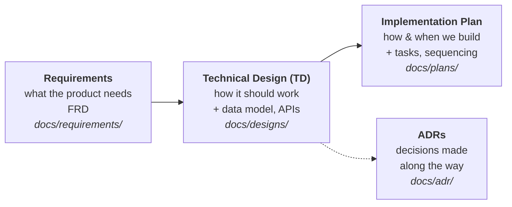

# Documentation

This is the documentation hub for **Fillando** — an online shop for 3D-printing
consumables. Everything that is *about* the system — rather than the code
itself — lives here.

## Map

| Area | Folder | What goes here |
|------|--------|----------------|
| Requirements | [`requirements/`](requirements/) | The FRD — single source of truth for implemented behaviour. |
| Architecture | [`architecture/`](architecture/) | The big picture: domain model, state machines. |
| Decisions (ADR) | [`adr/`](adr/) | Architecture Decision Records — one file per significant decision and its rationale. |
| Designs (TD) | [`designs/`](designs/) | Technical Designs — the *what & why* of a feature before it is built. |
| Plans | [`plans/`](plans/) | Implementation plans — the *how & when* of building a specific piece of work. |
| Runbooks | [`runbooks/`](runbooks/) | Operational guides: deployment, env template. |
| Templates | [`templates/`](templates/) | Starting points for new FRDs, TDs, plans and ADRs. |
| Git workflow | [`git-workflow.md`](git-workflow.md) | Branching model, commits, PR rules. |
| Environments | [`environments.md`](environments.md) | local / staging / production, config & secrets. |
| Glossary | [`glossary.md`](glossary.md) | Shared definitions of domain terms. |

## How documents relate

## TD vs. Implementation Plan

These two are easy to confuse. Keep them separate:

- A **Technical Design (TD)** answers *"what are we building and why, and how
  should it work?"* — scope, requirements, proposed solution, data model, APIs,
  trade-offs, alternatives. Written **before** implementation and reviewed.
- An **Implementation Plan** answers *"how do we actually deliver this, step by
  step?"* — the breakdown into tasks, sequencing, which repos change, and risks.
  It usually follows an approved TD.

Small changes may need neither. Larger features get a TD first, then a plan.

## Workflow

1. **Start from a template.** Copy the relevant file from
   [`templates/`](templates/) into `designs/`, `plans/` or `adr/`.
2. **Name the file** `NNNN-short-slug.md`, where `NNNN` is the next free number
   in that folder. Numbers are shared per folder and never reused.
3. **Fill in the front-matter** (status, owner, date, related links).
4. **Open it for review** — move status from `Draft` → `In Review` → `Approved`.
5. **Link related documents.** A plan links its TD; a TD links any ADRs it
   depends on.
6. **Keep it current.** When reality diverges, update the document or mark it
   `Superseded` and link the replacement. After shipping a feature, update the
   [FRD](requirements/FRD.md).
7. **Retire finished plans.** Once a plan's feature has shipped and its status
   is `Done`, delete the plan file — git history is the record. Don't leave
   completed plans in `docs/plans/`.

## Index

Keep a running index of substantial documents here as they are created:

### Requirements
- [Fillando — FRD](requirements/FRD.md) — implemented functionality (source of truth).

### Architecture
- [Domain model](architecture/domain-model.md)
- [State machines](architecture/state-machines.md)

### Architecture Decision Records
See the full list with statuses in [`adr/README.md`](adr/README.md).

### Runbooks
- [Backend deploy (LXC)](runbooks/deploy-backend-lxc.md) · [Frontend deploy (LXC)](runbooks/deploy-frontend-lxc.md)
- [Env template](runbooks/env-template.env)
