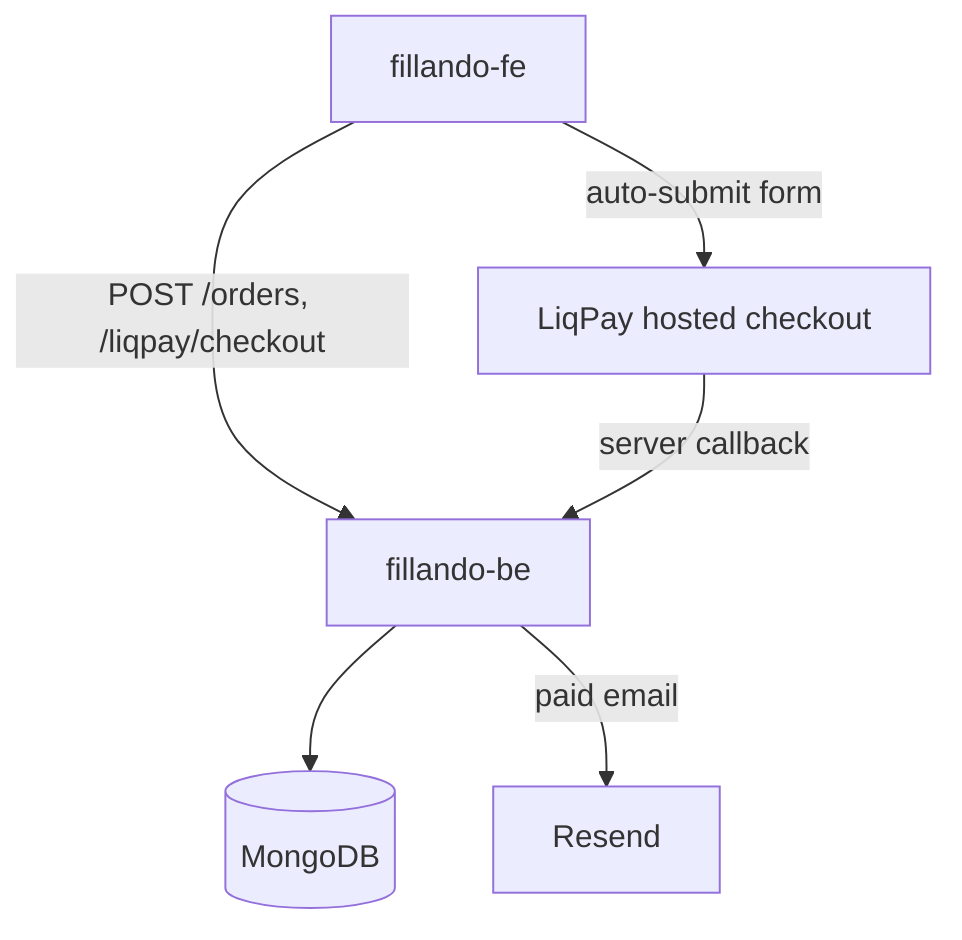
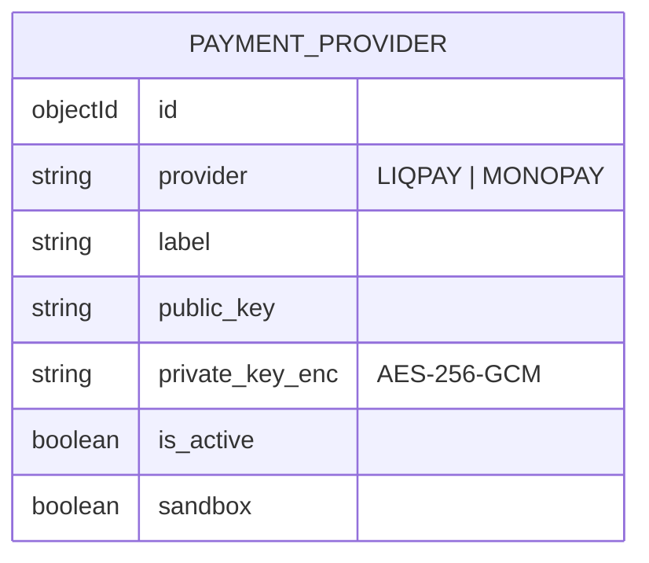
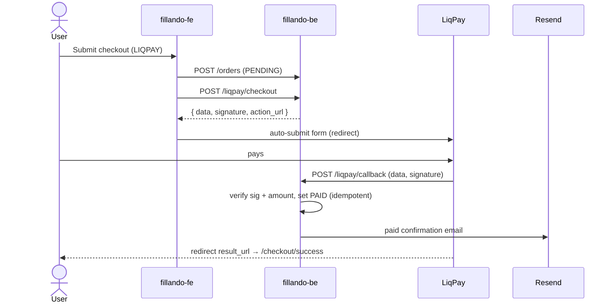

# TD-0001 — LiqPay online payment integration

- **Status:** Implemented
- **Author:** Fillando team
- **Reviewers:** —
- **Date:** 2026-07-23
- **Components:** both
- **Related:** [ADR-0009](../adr/0009-online-payment-liqpay.md), [Plan-0001](../plans/plan-0001-liqpay.md), FRD §7, §14, §18

## 1. Summary

Enable card payment at checkout via LiqPay (PrivatBank). The order is created as
`PENDING`, the browser is redirected to LiqPay's hosted checkout page, and a
server-to-server callback flips the order to `PAID` and emails a confirmation.
Merchant credentials are managed by admins and stored encrypted at rest.

## 2. Goals / Non-goals

**Goals**
- Card payment via LiqPay with automatic confirmation.
- Admin-managed, encrypted merchant credentials; one active set per provider.
- Provider-generic data model ready for MonoPay.

**Non-goals**
- MonoPay checkout flow (credentials storage is in scope; the pay flow is not).
- Refunds / partial captures / subscriptions.
- Storing card data (all handled on LiqPay's hosted page — no PCI scope).

## 3. Background & context

Today payment is IBAN/CASH with manual admin confirmation (ADR-0007). `LIQPAY`
and `MONOPAY` already exist in the `PaymentMethod` enum but were UI-disabled.
The admin panel already has an active-record pattern for "Реквізити оплати"
(`payment-details`), reused here for provider credentials.

## 4. Requirements

- **Functional:** FRD §7 (checkout payment method), §14 (admin credentials),
  §18 (data model). Auto-confirm on gateway callback (state-machines.md).
- **Non-functional:** no PCI scope; secrets encrypted at rest; callback must
  verify signature + amount/currency and be idempotent; UAH only; UK locale.

## 5. Proposed design

### 5.1 Architecture / components

New backend modules: `payment-providers` (admin CRUD + encrypted secrets) and
`liqpay` (checkout builder + callback handler). Frontend: checkout enables the
LiqPay option and redirects; admin pages `/admin/payment-details/liqpay` and
`/monopay` manage keys.

### 5.2 Data model

New collection `payment_providers`:

At most one `is_active` record per `provider` (activating one deactivates the
others of the same provider). `order.payment_transaction_id` stores the LiqPay
transaction id on success. No migration/backfill required.

### 5.3 API / interfaces

- `GET /payment-providers` — admin list (secrets masked).
- `GET /payment-providers/active/:provider` — public; active record or null
  (no secrets); used to gate the checkout option.
- `POST /payment-providers`, `PATCH /:id`, `DELETE /:id`, `PATCH /:id/activate`
  — admin.
- `POST /liqpay/checkout` — public; body `{ order_number }` → `{ data,
  signature, action_url }`.
- `POST /liqpay/callback` — public webhook (form-urlencoded `data`,`signature`);
  always returns 200.

LiqPay v3: `data = base64(JSON(params))`,
`signature = base64(sha1(private_key + data + private_key))`.

### 5.4 Key flows

## 6. Alternatives considered

- **Embedded LiqPay widget** — richer UX but needs their client script and more
  moving parts; rejected for the simpler, PCI-free hosted redirect.
- **Create order only after payment** — avoids `PENDING` rows but risks losing
  order data mid-payment and complicates the existing create flow; rejected.
- **Keys in env** — simplest, but the user must switch merchant accounts from
  the admin panel and support multiple providers; rejected in favor of
  encrypted DB storage.

## 7. Cross-cutting concerns

- **Security & privacy:** `private_key` AES-256-GCM at rest; encryption key from
  `PAYMENT_ENCRYPTION_KEY` (never logged/returned). Callback verifies signature,
  amount and currency. Admin endpoints behind `JwtAuthGuard + RolesGuard(ADMIN)`.
- **Performance & scale:** callback is O(1); no hot paths.
- **Migration / compatibility:** additive; IBAN/CASH unchanged; no data migration.
- **Observability:** callback logs rejects (bad signature, amount mismatch,
  unknown order, intermediate status) via pino.
- **Testing strategy:** unit-test signature + encryption; e2e via LiqPay sandbox
  with a tunnel for the callback.

## 8. Open questions

- Refund handling (`REFUNDED`) remains manual for now.
- MonoPay checkout flow to be specified when prioritized.

## 9. Rollout

Backend first (modules + `PAYMENT_ENCRYPTION_KEY` + `PUBLIC_API_URL` env, run
`yarn spec:export`), then frontend. Configure sandbox credentials in the admin
panel, verify end-to-end, then switch a production credential set to active.
