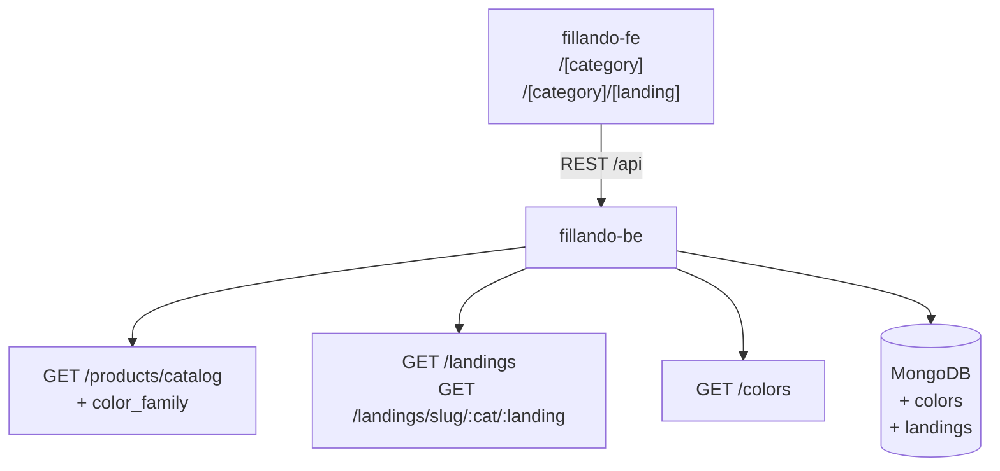
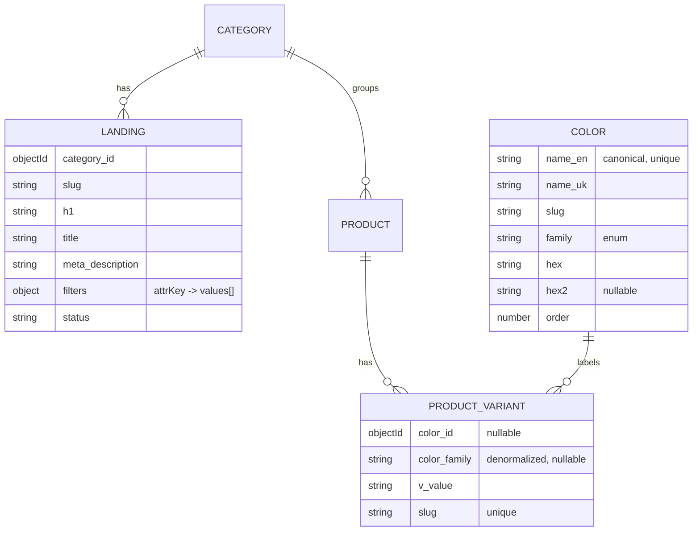
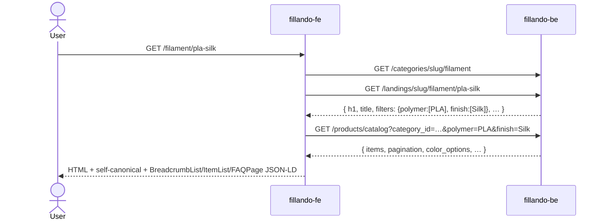

# TD-0002 — Таксономія каталогу, стандартизація кольорів та SEO-лендінги

- **Status:** Draft
- **Author:** vvbogdanovih
- **Reviewers:** —
- **Date:** 2026-08-17
- **Components:** both (fillando-be, fillando-fe)
- **Related:** [Plan-0002 roadmap](../plans/plan-0002-catalog-seo-roadmap.md) ·
  [FRD §4.1](../requirements/FRD.md) · [FRD §4.3](../requirements/FRD.md) ·
  [FRD §11](../requirements/FRD.md) · [FRD §18.3](../requirements/FRD.md) ·
  [ADR-0008](../adr/0008-frontend-stack.md)

## 1. Summary

Каталог філаменту зараз має один фільтр «Матеріал» із 29 плоскими значеннями,
не вміє фільтрувати за кольором узагалі, а найцінніші комерційні запити («PETG
філамент», «PLA Silk», «ABS пластик») існують лише як query-параметри, які
canonical схлопує на голу `/filament`.

Цей TD описує фазу 1 роадмапу: розкласти `material` на три ортогональні
атрибути, звести кольори до словника з канонічною англійською назвою виробника
та українським перекладом, і ввести окрему сутність «лендінг» — індексовану
сторінку `/{category}/{landing}` із закріпленими фільтрами та власним контентом.

## 2. Goals / Non-goals

**Goals**

- Замінити простиню з 29 матеріалів на три короткі фільтри: тип пластику, ефект
  поверхні, армування.
- Зробити колір фільтрованим і стандартизованим: канон від виробника
  англійською + український переклад, показ «Чорний (Black)».
- Дати кожному високочастотному запиту власний індексований URL із унікальним
  контентом (`/filament/pla`, `/filament/petg`, `/filament/pla-silk`, …).
- Замінити простиню як основний спосіб навігації плитками «Популярні види» на
  сторінці категорії.
- Зберегти категорії в БД плоскими — не повертати вкладеність, скасовану
  міграцією `flatten-categories.js`.

**Non-goals** (окремі фази роадмапу)

- Лічильники фасетів і звуження фасетів за активними фільтрами → фаза 2.
- Реалізація `filter_type: 'range'`, акордеон, пошук усередині фільтра, чипи
  обраного → фаза 2.
- Блог і модуль статей → фаза 3.
- Бренд-сторінки, категорія «Аксесуари», відгуки → фаза 4.
- Технічні SEO-фікси (пагінація-лінки, `ItemList`, динамічна навігація) →
  фаза 0, робиться паралельно і незалежно.

## 3. Background & context

### 3.1 Як влаштовані дані сьогодні

`Product` — «абстрактний» товар, уся комерція на `ProductVariant`:

```ts
// product.schema.ts
name, category_id, vendor_id, description?: { json, html }
variant_type?: { key, label }     // вісь варіації, напр. { key: 'color', label: 'Колір' }
attributes: Attribute[]           // [{ k, l, v }] — k виводиться з l через generateAttrKey
```

```ts
// product-variant.schema.ts
product_id, category_id, name, slug (unique), sku (unique),
price, stock, images[], v_value: string | null, status
```

`Category` плоска, без SEO-полів:

```ts
name (unique), slug (unique), required_attributes[], image, order
// required_attributes: { key, label, filter_type: 'multi-select' | 'range', unit }
```

### 3.2 Три обмеження, з яких випливає весь дизайн

1. **`attributes` спільні для продукту, `v_value` — для варіанта.** Колір
   змінюється між варіантами, тому він фізично не може бути атрибутом продукту.
   А `filterOptionsPipeline` у `product-variant.repository.ts` будує фасети саме
   з `product.attributes` — звідси «колір не фільтрується».

2. **`v_value` вшитий у похідні поля.** `ProductService` генерує
   `name = ${product.name} — ${v_value}` і `slug = generateSlug(...)`. Отже
   стандартизація кольору неминуче змінює slug варіантів.

3. **Будь-який невідомий query-параметр трактується як атрибутний фільтр.**
   `ProductService.getCatalog` резервує тільки `category_id`, `page`, `limit`,
   `price_min`, `price_max`, `sort`; решта йде в `attrFilters`. Новий параметр
   на кшталт `color_family` треба явно додати до резервованих, інакше він
   потрапить у фільтр по `product.attributes` і не зматчить нічого.

### 3.3 Значення «Матеріалу», які треба розкласти

29 значень, усі — комбінації полімеру, ефекту, армування та серії:

```
ABS · ABS-GF · ASA · PA6 Nylon · PA6-CF · PET-CF · PETG · PETG High Speed ·
PETG-CF · PLA · PLA Dual-Silk · PLA Glow · PLA Gradient · PLA High Speed ·
PLA Lite · PLA Luminous · PLA Matte · PLA Matte Rainbow · PLA Rainbow ·
PLA Silk · PLA Silk Rainbow · PLA Silk+ · PLA Temperature Changing ·
PLA Transparent Rainbow · PLA Tri-silk · PLA+ · PLA-CF · TPU · Wood PLA
```

## 4. Requirements

**Функціональні**

- Фільтр «Матеріал» зникає з UI; з'являються «Тип пластику», «Ефект поверхні»,
  «Армування» (і, можливо, «Серія» — див. §8).
- Атрибут `material` **лишається в даних** як маркетингова назва товару і
  джерело для лендінгів; він просто виходить із `required_attributes`.
- Колір фільтрується за родиною (`color_family`) зі swatch-ами.
- Точна назва кольору лишається перемикачем варіантів на картці товару.
- Лендінг `/{category}/{landing}` віддає товари за закріпленими фільтрами,
  власні H1/title/description/intro/FAQ, self-canonical, breadcrumbs на 3 рівні.
- Закріплені фільтри лендінга не можна зняти в UI; додаткові — можна, і вони
  роблять сторінку `noindex, follow`.
- Плитки лендінгів на сторінці категорії.

**Нефункціональні**

- Каталожна агрегація не має отримати додаткових `$lookup` на гарячому шляху —
  тому родина кольору денормалізується на варіант (§5.2).
- Локалізація: український інтерфейс, UAH; англійська назва кольору
  показується в дужках, не замість.
- Міграції ідемпотентні й запускаються повторно без побічних ефектів.
- Незматчені кольори не втрачаються тихо — потрапляють у звіт.

## 5. Proposed design

### 5.1 Архітектура



Змінюється:

| Репо | Що |
|---|---|
| `fillando-be` | 2 нові колекції (`colors`, `landings`), `ProductVariant.color_id` + `color_family`, нова гілка фільтра в `findCatalogItems`, 3 міграції, admin CRUD |
| `fillando-fe` | новий роут `[category]/[landing]`, плитки на категорії, swatch-фільтр кольору, admin-екрани словника кольорів і лендінгів, sitemap |

### 5.2 Data model



#### 5.2.1 Таксономія матеріалів

**Принцип: нічого не видаляємо, тільки додаємо похідне.** Міграція
`derive-material-taxonomy.js` читає наявний атрибут `material` кожного продукту
і дописує в `Product.attributes` нові триплети. `material` лишається на місці.

Оскільки `attributes` — це масив `{k, l, v}`, багатозначність виражається
кількома записами з однаковим `k` (напр. `PLA Matte Rainbow` → два записи
`finish`). Наявний фільтр `$elemMatch: { k, v: { $in: values } }` це підтримує
без змін — OR усередині виміру працює як треба.

| # | material | polymer | finish | reinforcement | series |
|---|---|---|---|---|---|
| 1 | ABS | ABS | — | — | Standard |
| 2 | ABS-GF | ABS | — | GF | Standard |
| 3 | ASA | ASA | — | — | Standard |
| 4 | PA6 Nylon | PA6 | — | — | Standard |
| 5 | PA6-CF | PA6 | — | CF | Standard |
| 6 | PET-CF | PET | — | CF | Standard |
| 7 | PETG | PETG | — | — | Standard |
| 8 | PETG High Speed | PETG | — | — | High Speed |
| 9 | PETG-CF | PETG | — | CF | Standard |
| 10 | PLA | PLA | — | — | Standard |
| 11 | PLA Dual-Silk | PLA | Dual-Silk | — | Standard |
| 12 | PLA Glow | PLA | Glow | — | Standard |
| 13 | PLA Gradient | PLA | Gradient | — | Standard |
| 14 | PLA High Speed | PLA | — | — | High Speed |
| 15 | PLA Lite | PLA | — | — | Lite |
| 16 | PLA Luminous | PLA | Luminous | — | Standard |
| 17 | PLA Matte | PLA | Matte | — | Standard |
| 18 | PLA Matte Rainbow | PLA | Matte, Rainbow | — | Standard |
| 19 | PLA Rainbow | PLA | Rainbow | — | Standard |
| 20 | PLA Silk | PLA | Silk | — | Standard |
| 21 | PLA Silk Rainbow | PLA | Silk, Rainbow | — | Standard |
| 22 | PLA Silk+ | PLA | Silk | — | Plus |
| 23 | PLA Temperature Changing | PLA | Temperature Changing | — | Standard |
| 24 | PLA Transparent Rainbow | PLA | Rainbow | — | Standard |
| 25 | PLA Tri-silk | PLA | Tri-Silk | — | Standard |
| 26 | PLA+ | PLA | — | — | Plus |
| 27 | PLA-CF | PLA | — | CF | Standard |
| 28 | TPU | TPU | — | — | Standard |
| 29 | Wood PLA | PLA | Wood | — | Standard |

Результат: `polymer` — 7 значень, `finish` — 10, `reinforcement` — 2 (+«немає»),
`series` — 4. Замість одного списку на 29 позицій.

Українські лейбли для `required_attributes`:

| key | label | unit |
|---|---|---|
| `polymer` | Тип пластику | — |
| `finish` | Ефект поверхні | — |
| `reinforcement` | Армування | — |
| `series` | Серія | — |

Значення `reinforcement` показуються як «Вуглеволокно (CF)» / «Скловолокно (GF)».

Примітка про `PLA Transparent Rainbow` (#24): «Transparent» — це властивість
кольору, не поверхні, тому в таблиці воно не йде у `finish`, а має покритися
`color.family = transparent`. Див. §8.

Рядок 15 (`PLA Lite`) і рядок 22 (`PLA Silk+`) — найменш однозначні, див. §8.

Міграція також оновлює `required_attributes` категорії «Філамент»: прибирає
`material`, додає чотири нові.

#### 5.2.2 Кольори

Нова колекція `colors`:

```ts
@Schema({ collection: 'colors', timestamps: true })
class Color {
  name_en: string   // канон від виробника, unique — 'Black', 'Bambu Green'
  name_uk: string   // 'Чорний', 'Зелений Bambu'
  slug: string      // з name_en — 'black', 'bambu-green'
  family: ColorFamily
  hex: string       // '#111111'
  hex2: string | null   // друга точка для градієнтних / dual-silk
  order: number
}
```

`ColorFamily` (15 значень) — саме вони стають фільтром:

```
black · white · gray · red · orange · yellow · green · blue ·
purple · pink · brown · gold · silver · transparent · multicolor
```

`ProductVariant` отримує два поля:

```ts
color_id: ObjectId | null        // ref Color; null для безкольорових категорій
color_family: string | null      // денормалізовано з Color.family
```

**Чому денормалізація.** Каталожна агрегація вже робить `$lookup` у `products`
на кожен запит. Другий `$lookup` у `colors` заради фільтра — зайвий; родина
змінюється лише при редагуванні словника. Тому `color_family` лежить на
варіанті й індексується разом із категорією:

```ts
ProductVariantSchema.index({ category_id: 1, status: 1, color_family: 1 })
```

Зміна `family` у словнику тягне за собою backfill варіантів — це робить сервіс
кольорів у тій самій транзакції, що й `PATCH /colors/:id`.

**Міграція `normalize-variant-colors.js`:**

1. Бере всі варіанти продуктів, де `variant_type.key === 'color'` (замість
   крихкого regex `pickColor`).
2. Нормалізує `v_value`: trim, згортання пробілів, зняття слів «колір»/«цвет»,
   зведення регістру.
3. Матчить зі словником за таблицею синонімів:
   `Чорна | Чорний | Черный | Black | black → Black`.
4. Записує `color_id`, `color_family`, `v_value = color.name_en`,
   `name = ${product.name} — ${color.name_uk}`, `slug = generateSlug(EN)`.
5. Зберігає попереднє значення у `v_value_legacy` на один реліз (дешевий
   rollback) і пише два файли: `color-report.json` (незматчені значення з
   лічильниками — для ручного розбору) і `slug-map.json` (old → new).

**Slug перегенеровуються без 301** — рішення власника. `slug-map.json` пишеться
все одно, бо це нуль додаткової роботи і залишає можливість додати редиректи
пізніше, якщо Search Console покаже втрати.

Побічний ефект: `ProductService.pickColor` із регексами
`[/колір/i, /цвіт/i, /color/i]` більше не потрібен — `getPriceSheet` бере колір
із `color_id`.

#### 5.2.3 Лендінги

```ts
@Schema({ collection: 'landings', timestamps: true })
class Landing {
  category_id: ObjectId
  slug: string                  // unique у межах category_id
  h1: string
  title: string                 // <title>
  meta_description: string
  intro_html: string            // над сіткою, коротко
  bottom_html: string           // під сіткою, основний SEO-текст
  faq: { q: string; a: string }[]
  filters: Record<string, string[]>   // закріплені: { polymer: ['PLA'], finish: ['Silk'] }
  price_min: number | null
  price_max: number | null
  image: string | null
  order: number
  status: 'draft' | 'active'
}
```

Категорії лишаються плоскими — лендінг це окрема сутність із закріпленими
фільтрами, а не вкладена категорія.

Стартовий набір:

| URL | filters | H1 |
|---|---|---|
| `/filament/pla` | `polymer: [PLA]` | PLA філамент |
| `/filament/petg` | `polymer: [PETG]` | PETG філамент |
| `/filament/abs` | `polymer: [ABS]` | ABS пластик для 3D-друку |
| `/filament/asa` | `polymer: [ASA]` | ASA філамент |
| `/filament/tpu` | `polymer: [TPU]` | TPU (Flex) філамент |
| `/filament/nylon` | `polymer: [PA6]` | Нейлон (PA6) для 3D-друку |
| `/filament/pla-silk` | `polymer: [PLA], finish: [Silk]` | PLA Silk філамент |
| `/filament/pla-matte` | `polymer: [PLA], finish: [Matte]` | PLA Matte філамент |
| `/filament/carbon` | `reinforcement: [CF]` | Філамент з вуглеволокном |
| `/filament/pla-cf` | `polymer: [PLA], reinforcement: [CF]` | PLA-CF філамент |
| `/filament/petg-cf` | `polymer: [PETG], reinforcement: [CF]` | PETG-CF філамент |
| `/filament/wood` | `polymer: [PLA], finish: [Wood]` | Філамент під дерево |
| `/filament/glow` | `finish: [Glow, Luminous]` | Філамент, що світиться |

Заповнює `seed-landings.js`; контентні поля (`intro_html`, `bottom_html`, `faq`)
пишуться вручну через адмінку.

### 5.3 API / interfaces

**Змінений `GET /products/catalog`**

Резервовані ключі в `ProductService.getCatalog` доповнюються `color_family`
(інакше він потрапить в `attrFilters` і не зматчить нічого — див. §3.2.3):

```
GET /products/catalog?category_id=…&polymer=PLA&finish=Silk&color_family=black,red
```

Відповідь доповнюється списком доступних родин кольорів:

```jsonc
{
  "items": [ … ],
  "pagination": { … },
  "price_range": { … },
  "filter_options": { "polymer": ["ABS", …], "finish": [ … ] },
  "color_options": [                       // нове
    { "family": "black", "name_uk": "Чорний", "hex": "#111111" }
  ]
}
```

**Нові endpoint-и** (шляхи → `endpoints.constant.ts`, тексти →
`api-operation.constant.ts`, як вимагає `API_AND_SWAGGER.md`):

| Метод | Шлях | Доступ |
|---|---|---|
| `GET` | `/colors` | public |
| `POST` `PATCH` `DELETE` | `/colors`, `/colors/:id` | ADMIN |
| `GET` | `/landings?category_id=` | public |
| `GET` | `/landings/slug/:categorySlug/:landingSlug` | public |
| `POST` `PATCH` `DELETE` | `/landings`, `/landings/:id` | ADMIN |
| `GET` | `/landings/slugs` | public — для sitemap |

Після змін — `yarn spec:export`, бо фронт живе з `openapi.json`.

**Фронт**

- Новий роут `src/app/(root)/[category]/[landing]/page.tsx` — SSR, як і
  `[category]/page.tsx`: резолвить лендінг, тягне каталог із закріпленими
  фільтрами, віддає в `CatalogPage` з новим пропом `pinnedFilters`.
- `CatalogPage` не рендерить чекбокси для закріплених вимірів і не дає їх зняти.
- `FilterSidebar` отримує блок `ColorFilter` зі swatch-кружечками (`hex`,
  градієнт `hex → hex2`, якщо є).
- `sitemap.ts` додає лендінги (`/landings/slugs`).

### 5.4 Ключові потоки



Невідомий `landing` → `notFound()`. Як і в `[category]/page.tsx`, стрімлена
відповідь комітить 200 раніше, ніж `notFound()` встигає змінити статус, тому
`generateMetadata` для невідомого слага має віддавати `robots: noindex` —
той самий патерн, що вже застосовано для категорій.

Політика індексації:

| URL | canonical | robots |
|---|---|---|
| `/filament` | self | index |
| `/filament?page=2` | self із `?page=2` (фаза 0) | index |
| `/filament/pla-silk` | self | index |
| `/filament/pla-silk?color_family=black` | `/filament/pla-silk` | noindex, follow |
| `/filament?polymer=PLA` (є лендінг) | `/filament/pla` | noindex, follow |

## 6. Alternatives considered

**Повернути вкладені категорії.** `/filament` → підкатегорія `PLA`. Відкинуто:
вкладеність щойно прибрали міграцією `flatten-categories.js`, а лендінг як
окрема сутність дає ту саму навігацію без реструктуризації товарів і дозволяє
перетини вимірів (`/filament/carbon` через усі полімери).

**Плоскі URL `/pla-filament`.** Трохи кращий exact-match під ключ, але
конфліктує з catch-all `/[category]`, ламає breadcrumbs і не масштабується на
`/aksesuary/*`. Відкинуто.

**Лишити query-параметри й дозволити їх індексацію через self-canonical.**
Найдешевше, але сторінки лишаються без унікального контенту (H1 = назва
категорії, нуль тексту) і слабко ранжуються. Відкинуто.

**Тримати колір як атрибут продукту.** Неможливо: `attributes` спільні для всіх
варіантів продукту, а колір за визначенням між ними змінюється.

**`$lookup` у `colors` замість денормалізації `color_family`.** Завжди свіжі
дані, але другий lookup на гарячому шляху каталогу. Відкинуто на користь
денормалізації з backfill при редагуванні словника.

**Замінити `material` замість того, щоб додавати похідні.** Відкинуто: `material`
— це маркетингова назва товару («PLA Silk»), потрібна в картці, прайс-листі й
для назв лендінгів. Дешевше лишити її в даних і прибрати з фільтрів.

## 7. Cross-cutting concerns

**Security & privacy.** Нового чутливого даних немає. Admin-endpoint-и — під
`JwtAuthGuard` + `RolesGuard(ADMIN)`, як решта адмінки. `intro_html` /
`bottom_html` / `faq` редагуються адміном через Quill і рендеряться як HTML —
санітизувати на записі тим самим шляхом, що й описи товарів.

**Performance & scale.** Каталожна агрегація не отримує нових `$lookup`.
Додається індекс `{ category_id, status, color_family }`. Лендінги й словник
кольорів — малі колекції, кешуються на фронті через `serverFetch` із
`revalidate: 3600`, як категорії.

**Migration / compatibility.** Три міграції, суворо в порядку:

1. `derive-material-taxonomy.js` — адитивна, повністю зворотна.
2. `seed-colors.js` → `normalize-variant-colors.js` — переписує `v_value`,
   `name`, `slug` варіантів. Rollback через `v_value_legacy` + `slug-map.json`.
   **Slug змінюються без 301** (рішення власника).
3. `seed-landings.js` — адитивна.

Усі ідемпотентні. Кроки 1 і 3 безпечні для повторного запуску; крок 2 пропускає
варіанти, у яких уже проставлено `color_id`.

Зворотна сумісність API: `filter_options` і `material` лишаються у відповіді,
тому старий фронт не ламається під час розкату.

**Observability.** Міграції пишуть звіти у `scripts/migrations/reports/`:
`color-report.json` (незматчені значення з частотами), `slug-map.json`,
`taxonomy-report.json` (значення `material`, яких немає в таблиці §5.2.1).
Незматчене значення — це помилка, яку треба розібрати руками, а не тихо
пропустити.

**Testing strategy.**

- Unit: нормалізатор кольорів (синоніми, регістр, зайві слова), маппер
  `material → (polymer, finish, reinforcement, series)` за таблицею §5.2.1.
- Integration: `findCatalogItems` із `color_family`, комбінація закріплених і
  користувацьких фільтрів, порожня видача.
- e2e: `/filament/pla-silk` віддає 200 із коректним canonical; невідомий
  лендінг — 404 і `noindex`; закріплений фільтр не знімається в UI.
- Ручна перевірка: кожен лендінг зі стартового набору дає непорожню видачу.

## 8. Open questions

1. **Чи потрібен атрибут `series` окремо?** Альтернатива — згорнути
   `High Speed` / `Lite` / `Plus` у `finish`. Це рішення про товарну лінійку.
2. **`PLA Lite` (#15)** — це економ-лінія чи полегшений (низької щільності)
   філамент? Від відповіді залежить і значення `series`, і текст лендінга.
3. **`PLA Silk+` (#22)** — «+» тут той самий маркер, що в `PLA+`, чи це окрема
   назва виробника? Зараз у таблиці трактується як `series: Plus`.
4. **`Dual-Silk` / `Tri-Silk` (#11, #25)** — лишити окремими значеннями `finish`
   чи звести до `finish: Silk` + новий атрибут «кількість кольорів у нитці»?
5. **`PLA Transparent Rainbow` (#24)** — «Transparent» винесено з `finish` у
   розрахунку на `color.family = transparent`. Підтвердити, що всі варіанти
   цього товару справді прозорі.
6. **Розбіжності регістру у вихідних даних** (`PLA Tri-silk` vs
   `PLA Dual-Silk`, `PLA Silk+`) — міграція нормалізує їх до канонічної форми;
   потрібен фінальний список канонічних написань.
7. **Незматчені кольори** — скільки їх реально, з'ясується лише на прогоні
   `color-report.json` на копії продакшн-бази. Розбір ручний.
8. **Стартовий список лендінгів** (§5.2.3) — підтвердити, чи всі 13 мають
   достатньо товарів, і чи не бракує очевидних (наприклад, за діаметром 1.75).

## 9. Rollout

| Крок | Репо | Що |
|---|---|---|
| 1 | be | Схеми `Color`, `Landing`, поля `color_id` / `color_family` на варіанті, індекс. Модулі + admin CRUD. `yarn spec:export` |
| 2 | be | Фільтр `color_family` у `findCatalogItems`, `color_options` у відповіді, `color_family` у резервованих ключах `getCatalog` |
| 3 | be | Прогін `derive-material-taxonomy.js` на копії бази → рев'ю `taxonomy-report.json` → прод |
| 4 | be | `seed-colors.js` → `normalize-variant-colors.js` на копії → ручний розбір `color-report.json` → прод |
| 5 | fe | Admin-екрани: словник кольорів, лендінги |
| 6 | be | `seed-landings.js`, наповнення контенту через адмінку |
| 7 | fe | Роут `[category]/[landing]`, `pinnedFilters` у `CatalogPage`, `ColorFilter` зі swatch-ами, плитки на категорії, sitemap |

Один PR = один репо. Кроки 3 і 4 — обов'язково спершу на копії продакшн-бази:
саме там з'ясується реальна якість вихідних даних.

Після впровадження: оновити [FRD](../requirements/FRD.md) §4.1 (фільтри),
§4.3 (SEO та breadcrumbs), §11 (категорії), §18.3 (моделі даних) і додати нові
колекції в [domain-model.md](../architecture/domain-model.md).
