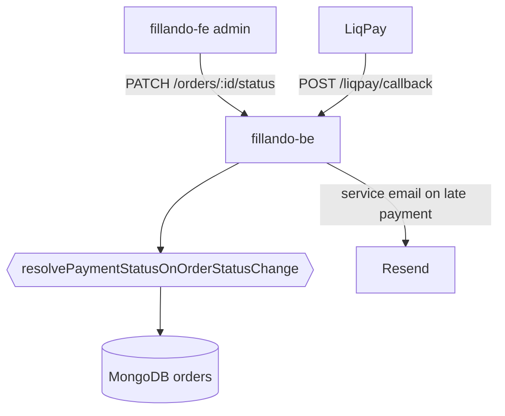
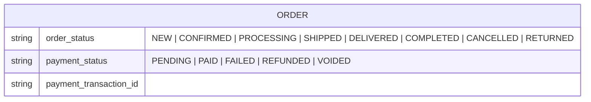
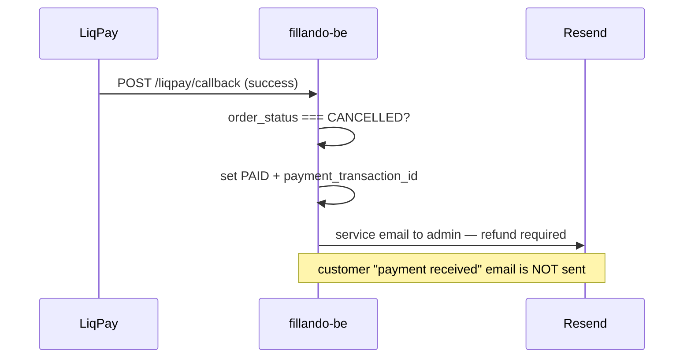

# TD-0003 — Payment status for cancelled orders (`VOIDED`)

- **Status:** Approved
- **Author:** Fillando team
- **Reviewers:** —
- **Date:** 2026-08-19
- **Components:** both
- **Related:** [ADR-0009](../adr/0009-online-payment-liqpay.md), [TD-0001](TD-0001-liqpay-integration.md), [state-machines](../architecture/state-machines.md), FRD §8, §9, §18.8

## 1. Summary

A cancelled order still displays «Очікує оплату». `order_status` and `payment_status` are two fully independent state machines with no rule linking them, and `PaymentStatus` has no terminal value meaning "payment is no longer expected". This design adds `VOIDED`, sets it automatically when an unpaid order is cancelled, and guards the payment gateway callback against confirming a cancelled order.

## 2. Goals / Non-goals

**Goals**
- A cancelled unpaid order reads «Скасовано», not «Очікує оплату» — in the customer account, the admin panel, reports and the PDF invoice.
- Cancelled orders stop matching the «Очікує оплату» filter and stop polluting reports.
- A late gateway callback can no longer email the customer "payment received" for an order that was cancelled.
- Existing cancelled orders are backfilled, not left inconsistent.

**Non-goals**
- Automating refunds (`REFUNDED`) — still manual, as deferred in [TD-0001 §8](TD-0001-liqpay-integration.md).
- Validating `order_status` transitions in general — still unimplemented (see [state-machines](../architecture/state-machines.md)); this design adds one side effect, not a transition guard.
- A customer-facing "cancel my order" flow — cancellation stays admin-only via `PATCH /orders/:id/status`.

## 3. Background & context

- `PaymentStatus` is `PENDING | PAID | FAILED | REFUNDED` (`src/common/types/enums.ts`). Every order starts at `PENDING` regardless of payment method.
- `updateOrderStatus` (`src/modules/order/order.service.ts`) is a blind write: `$set: { order_status }`. Nothing else reacts to cancellation — there is no `cancelOrder` method anywhere in the backend.
- `REFUNDED` cannot be reused: it means money was received and returned, and per [state-machines](../architecture/state-machines.md) it is only reachable from `PAID`.
- The frontend renders payment status on six surfaces (profile list, profile details ×2, admin list, admin details ×2) with no `CANCELLED` special-casing, and `PAYMENT_STATUS_LABELS` is duplicated between the customer and admin areas.
- The Ukrainian labels are also duplicated on the backend: `formatPaymentStatus` (`src/modules/order/helpers/format.helpers.ts`) is copy-pasted verbatim into four email templates and consumed by the PDF invoice.
- `applyGatewayPaymentResult` never reads `order_status`, so a late LiqPay callback flips a cancelled order to `PAID` and sends the customer a paid-confirmation email.

## 4. Requirements

- **Functional:** FRD §8 (customer order pages), §9 (admin orders, status filters, invoice, reports), §18.8 (order data model). The rule is normative in [state-machines](../architecture/state-machines.md#крос-машинне-правило-скасування-замовлення).
- **Non-functional:** no data loss for money actually received; additive enum change deployable without downtime; UK locale label «Скасовано»; existing records backfilled.

## 5. Proposed design

### 5.1 Architecture / components



No new modules or endpoints. The change is one enum value, one pure decision function in `OrderService`, a guard in `applyGatewayPaymentResult`, and label plumbing in both repos.

### 5.2 Data model

`order.payment_status` gains a fifth value. No schema restructuring, no new collection, no index change (`payment_status` is already indexed).



**Backfill** (one-off, after the backend deploy):

```js
db.orders.updateMany(
  { order_status: 'CANCELLED', payment_status: { $in: ['PENDING', 'FAILED'] } },
  { $set: { payment_status: 'VOIDED' } }
)
```

### 5.3 API / interfaces

No new routes. `PATCH /orders/:id/status` now also mutates `payment_status`; `PATCH /orders/:id/payment-status` accepts `VOIDED` as an additional `@IsEnum` value. `yarn spec:export` regenerates `openapi.json`, which the frontend depends on.

### 5.4 Key flows

The decision is a pure function so it is unit-testable without a database:

`resolvePaymentStatusOnOrderStatusChange(currentPayment, currentOrder, nextOrder) → PaymentStatus | null`

| Condition | Result |
|-----------|--------|
| `next === CANCELLED` and payment ∈ {`PENDING`, `FAILED`} | `VOIDED` |
| `next === CANCELLED` and payment === `PAID` | `null` + `logger.warn` (manual refund needed) |
| `current === CANCELLED`, `next !== CANCELLED`, payment === `VOIDED` | `PENDING` |
| otherwise | `null` (no change) |

Late gateway callback on a cancelled order:



On `failure`/`error` for a cancelled order nothing is written — `VOIDED` is preserved rather than being overwritten with `FAILED`.

## 6. Alternatives considered

- **UI-only: hide the payment status when the order is cancelled.** Cheapest, no migration. Rejected: the database keeps `PENDING`, so the admin «Очікує оплату» filter, the reports and the PDF invoice stay wrong — the problem is in the data, not only in the rendering.
- **UI-only: render «Скасовано» for payment when the order is cancelled.** Looks correct on all six surfaces, but it is a display-layer fiction; filters and reports remain inaccurate. Rejected for the same reason.
- **Reuse `REFUNDED`.** No enum change, but it would claim money was returned when none was ever taken — corrupts reporting. Rejected.
- **Name it `NOT_REQUIRED` / `CANCELLED`.** `CANCELLED` collides with the `OrderStatus` value of the same name in code and logs; `NOT_REQUIRED` reads poorly in an order list. `VOIDED` is the payment-industry term for annulling an unsettled payment and is unambiguous in code, with the Ukrainian label «Скасовано» carrying the meaning in the UI.
- **Set `REFUNDED` automatically when a paid order is cancelled.** Rejected: it would record "money returned" before the refund actually happens. The admin gets a hint in the panel instead.

## 7. Cross-cutting concerns

- **Security & privacy:** no change; cancellation stays behind `JwtAuthGuard + RolesGuard(ADMIN)`.
- **Performance & scale:** `updateOrderStatus` becomes read-modify-write (one extra `findById` per admin status change) — negligible, no hot path.
- **Migration / compatibility:** additive. **Frontend must ship first** — its `payment_status` is a zod `z.enum`, so a backend emitting `VOIDED` to an older frontend fails parsing on the order pages. Rollback = stop writing `VOIDED`; already-written rows still render correctly on the shipped frontend.
- **Observability:** `logger.warn` when a `PAID` order is cancelled (refund needed); `logger.log` when a gateway callback lands on a cancelled order.
- **Testing strategy:** unit tests for all four branches of the decision function and for `applyGatewayPaymentResult` on a cancelled order (asserting the customer email is not sent); manual end-to-end regression across both repos before merge.

## 8. Open questions

- Full `order_status` transition validation remains unimplemented and unscheduled.
- Whether a cancelled-but-paid order should surface anywhere beyond the admin hint (e.g. a "pending refunds" list) — not needed at current volume.

## 9. Rollout

Docs (this TD + state-machines/FRD/glossary) → frontend PR to `dev` → backend PR to `dev` → run the backfill after the backend is deployed. One PR per repo.
