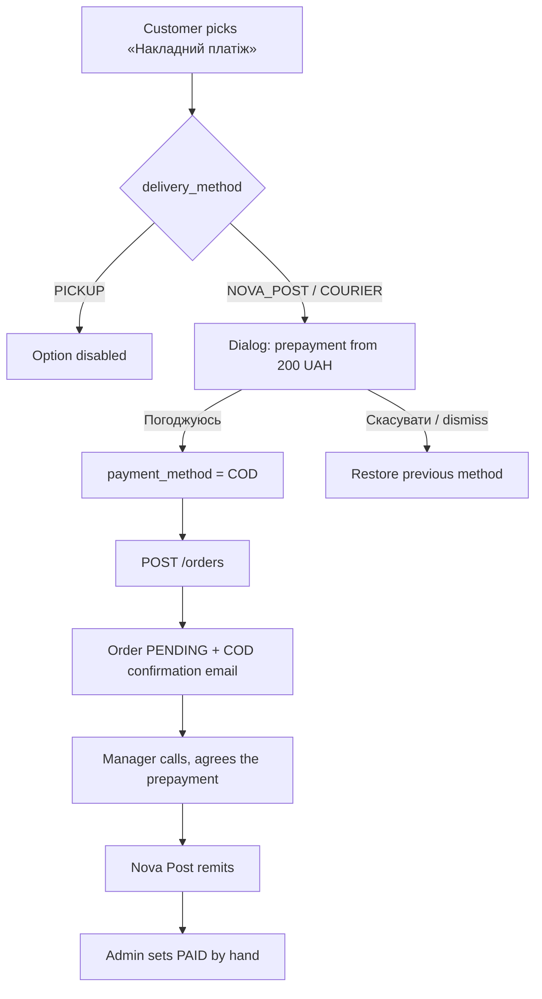

# TD-0004 — Накладний платіж (cash on delivery)

- **Status:** Implemented
- **Author:** Fillando team
- **Reviewers:** —
- **Date:** 2026-08-23
- **Components:** both
- **Related:** [ADR-0006](../adr/0006-delivery-integration.md), [ADR-0009](../adr/0009-online-payment-liqpay.md), FRD §7, §9.2, §17.2, §18.8

## 1. Summary

Fillando offers four payment methods and none of them covers the most common Ukrainian scenario — післяплата via Nova Post. This design adds a fifth method, `COD` («Накладний платіж»), available only when the parcel travels with Nova Post, and gates its selection behind a confirmation dialog that states the partial-prepayment condition before the order is placed.

## 2. Goals / Non-goals

**Goals**
- A customer can pay on pickup at a Nova Post branch, parcel locker, or on courier delivery.
- The prepayment condition (from 200 ₴, agreed by phone) is shown *before* checkout completes, and the customer has to accept it explicitly.
- The pair «payment method ↔ delivery method» cannot be broken from any surface — storefront, admin panel, or a raw API call.
- A COD order gets its own confirmation email; it must not fall through the existing IBAN/CASH branch and send nothing.

**Non-goals**
- Recording the prepayment amount. The manager agrees it by phone; no `prepayment_amount` field, no minimum cart total.
- Automating `PENDING → PAID` from delivery events or the TTN. Nova Post remits the money days later; the admin flips the status by hand.
- Passing a COD flag to the Nova Post API. The integration is directory-lookup only (`ADR-0006`) — it does not create shipments.
- Enforcing the existing `CASH → PICKUP` rule on the backend. It lives on the frontend today; switching it on would reject admin edits of already-stored orders.

## 3. Background & context

- `PaymentMethod` is `CASH | IBAN | LIQPAY | MONOPAY` (`src/common/types/enums.ts`); `DeliveryMethod` is `NOVA_POST | COURIER | PICKUP`.
- Both `NOVA_POST` and `COURIER` are Nova Post shipments — the storefront labels `COURIER` as «Кур'єр Нова Пошта (адресна доставка)». Only `PICKUP` is off-carrier.
- **There is no payment↔delivery coupling on the backend at all.** The single cross-field rule is delivery↔address (`OrderService.validateDeliveryData`). The `CASH → PICKUP` rule exists only in the checkout zod schema, so `PATCH /orders/:id` can already produce any combination.
- `create()` sends a confirmation email only for `IBAN` and `CASH`; `LIQPAY` sends one from the gateway callback instead. A new method added without touching this branch is silently email-less.
- `formatPaymentMethod` (`src/modules/order/helpers/format.helpers.ts`) is the only label source for the PDF invoice and reports; a missing case prints `—`.
- The frontend keeps three independent copies of the payment-method value list and label dictionary (checkout, admin orders, profile orders) — there is no codegen from `openapi.json`.

## 4. Requirements

**Functional** (FRD §7.1 «Метод оплати», §7.2, §7.3, §9.2, §17.2, §18.8)
- `COD` is offered when `delivery_method ∈ {NOVA_POST, COURIER}` and blocked for `PICKUP`.
- Selecting `COD` on `/checkout` opens a confirmation dialog; only «Погоджуюсь» commits the choice, any other dismissal restores the previous method.
- `POST /orders` and `PATCH /orders/:id` reject an invalid pair with 400.
- Creating a COD order sends a dedicated confirmation email to the customer and the service address.

**Non-functional**
- No data migration: the enum only gains a value, and no existing order can hold it.
- The frontend must tolerate an unknown `payment_method` from the API so a deploy-order mismatch does not break the customer order page.

## 5. Proposed design

### 5.1 Architecture / components

One new enum value threaded through both repos. The only genuinely new logic is a declarative allow-list on the backend and a dialog gate on the frontend.

### 5.2 Data model

`PaymentMethod` gains `COD = 'COD'`. `order.payment_method` already stores `enum: PaymentMethod`, so the Mongoose schema needs no edit. No new fields, no migration.

### 5.3 API / interfaces

No new endpoints. `CreateOrderDto` and `AdminUpdateOrderDto` validate with `@IsEnum(PaymentMethod)` and accept the value automatically; `openapi.json` is refreshed with `yarn spec:export`.

Validation lives in `OrderService`:

```ts
private static readonly ALLOWED_DELIVERY_BY_PAYMENT: Partial<
	Record<PaymentMethod, DeliveryMethod[]>
> = {
	[PaymentMethod.COD]: [DeliveryMethod.NOVA_POST, DeliveryMethod.COURIER]
}
```

A method absent from the map is unrestricted. `validatePaymentDeliveryCombination` runs in `create()` right after `validateDeliveryData`, and in `update()` against the **effective** pair (`dto.payment_method ?? order.payment_method` × `dto.delivery_method ?? order.delivery_method`) — so changing only one side of a valid pair is rejected too.

### 5.4 Key flows



## 6. Alternatives considered

- **Informational dialog instead of a confirmation.** Rejected: the customer could dismiss it unread and still place the order, which is exactly the risk the prepayment rule exists to cover.
- **`preventDefault()` on the radio click to keep it unchecked until agreement.** Rejected: it only intercepts pointer input, so arrow-key navigation inside the radio group would select COD without ever showing the dialog. The shipped version lets the selection happen and restores the previous method when the dialog is declined, which covers every input path.
- **Storing a `prepayment_amount` on the order.** Deferred — the amount is negotiated per order by phone, and a field nobody fills is worse than no field.
- **Blocking COD below a 200 ₴ cart total.** Deferred: the 200 ₴ is a floor on the prepayment, not on the order, and the manager can decide case by case.
- **A new ADR.** Not needed — ADR-0009 states that adding a payment method is an incremental change, not a new decision.

## 7. Cross-cutting concerns

**Security & privacy** — none: COD has no credentials, no gateway, and nothing to encrypt. Unlike LiqPay/MonoPay it needs no entry under FRD §14.1; its page in the admin «Реквізити оплати» group is informational only, mirroring the existing Cash stub.

**Performance & scale** — the allow-list check is an in-memory lookup on a path that already does several DB round-trips.

**Migration / compatibility** — additive. The risk is deploy order, and it points at the frontend: COD is a write path, so a storefront deployed before the backend would offer a method the API rejects with a 400. The backend ships first (see §9). Separately, the customer order page parsed `payment_method` with no fallback; `.catch('CASH')` was added to match what the admin schema already did, which matters only if an unknown method ever reaches an older client.

**Observability** — no new logging. A rejected pair surfaces as a 400 like any other validation error.

**Testing strategy** — backend unit tests on the combination guard through both `create()` and `update()`; frontend unit tests on the checkout zod rule and the availability helper; a jsdom component test on the dialog covering agree, decline, `NOVA_POST → COURIER` (COD survives) and `→ PICKUP` (COD is dropped).

## 8. Open questions

- Should the prepayment become a real field once volume justifies it (an amount plus a "prepaid" flag)? Revisit if managers start tracking it in a spreadsheet.
- Should `PAID` be prompted automatically when a COD order reaches `DELIVERED`? Today the money arrives later, so the prompt would be premature — but a reminder in the admin panel might be worth it.

## 9. Rollout

Merge the backend to `main` first, the frontend after — a backend that accepts `COD` while no client offers it is inert, whereas a frontend that offers `COD` to a backend that rejects it 400s on every such order. Each child repo auto-deploys from `main` via GitHub Actions, so pushing a feature branch changes nothing; the ordering applies at the `dev → main` merge. No feature flag, no backfill; rollback is reverting the two PRs, and any COD order created in between would need its method changed by hand.
