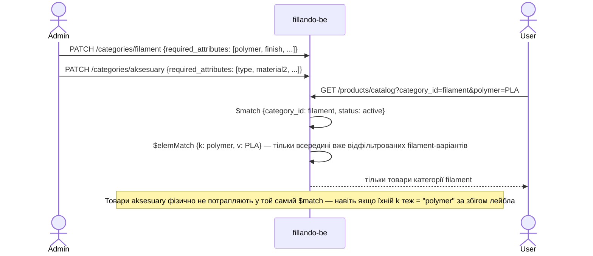

# TD-0005 — Ізоляція каталогу по категоріях

- **Status:** Draft
- **Author:** vvbogdanovih
- **Reviewers:** —
- **Date:** 2026-09-01
- **Components:** both (fillando-be, fillando-fe)
- **Related:** [Plan-0002 roadmap](../plans/plan-0002-catalog-seo-roadmap.md) · [TD-0002](TD-0002-catalog-taxonomy-and-landings.md) · [FRD §4.1](../requirements/FRD.md) · [FRD §11](../requirements/FRD.md)

## 1. Summary

Fillando сьогодні продає тільки філамент, але за роадмапом (Plan-0002, Фаза 4)
з'являться інші категорії — «Аксесуари» та інші супутні матеріали. У
довгостроковій перспективі сайт буде приблизно на 90%, не на 100%, про
пластик. TD-0002 (таксономія філаменту, кольори, лендінги) — перший TD, що
вводить структуровані атрибути на рівні категорії; при рев'ю виникло
питання, чи не заточені ці рішення під філамент настільки, що ускладнять
життя майбутнім категоріям.

Цей документ фіксує контракт ізоляції каталогу по категоріях: що вже
працює саме так у коді сьогодні (підтверджено аудитом `fillando-be`,
2026-09-01), що є навмисно спільним для всього каталогу, і одне відоме
прийняте обмеження. Мета — щоб TD-0002 і кожен наступний TD категорії
(«Аксесуари» тощо) посилались на один спільний контракт замість того, щоб
щоразу заново доводити, що нові атрибути нікуди не «протечуть».

## 2. Goals / Non-goals

**Goals**

- Один раз явно зафіксувати, які частини каталогу — per-category (незалежні
  для кожної категорії), а які — навмисно спільні для всього каталогу.
- Дати кожному майбутньому TD категорії одне посилання замість повторного
  доведення ізоляції.
- Явно задокументувати відоме прийняте обмеження (`generateAttrKey`) і
  умову, за якої його треба буде усунути.
- Зафіксувати виконувану (не тільки писану) гарантію: рекомендувати
  regression-тест, що ловить порушення ізоляції автоматично.

**Non-goals**

- Не проєктує атрибути/таксономію для «Аксесуарів» чи інших майбутніх
  категорій — окремий TD, коли буде відомий реальний асортимент (Plan-0002
  Фаза 4).
- Не змінює жодної схеми чи коду — архітектура вже задовольняє цей контракт
  (§3). Це задокументований контракт і guardrails, а не рефакторинг.
- Не вирішує, коли саме запускати нові категорії — це роадмап-рівень
  (Plan-0002).

## 3. Background & context

### 3.1 Що є сьогодні (аудит `fillando-be`, 2026-09-01)

`Category` — плоска, `required_attributes` це embedded-масив **на кожному
документі категорії**, не глобальний конфіг:

```ts
// database/mongoose/schemas/category.schema.ts
@Schema({ _id: false })
class RequiredAttribute { key; label; filter_type: 'multi-select' | 'range'; unit }

@Schema({ collection: 'categories', timestamps: true })
class Category {
  name: string       // unique
  slug: string        // unique
  required_attributes: RequiredAttribute[]   // default []
  image: string | null
  order: number
}
```

`Product.attributes` — масив `{k, l, v}`, `k` виводиться з `l` через
`generateAttrKey` (`common/utils/attribute.utils.ts:37-46`) — **тільки з
тексту лейбла**, без `category_id`:

```ts
export function generateAttrKey(label: string): string {
  return label.normalize('NFD').toLowerCase()
    .split('').map(ch => CYRILLIC_MAP[ch] ?? ch).join('')
    .replace(/[\s-]+/g, '_').replace(/[^a-z0-9_]/g, '')
}
```

Викликається лише з `attr.label`/`attr.l` — `category.service.ts:31`,
`product.service.ts:163,200`. Ніде не бере участі `category_id`.

Каталожна фільтрація (`product-variant.repository.ts:355-486`,
`findCatalogItems`) вимагає `category_id` як обов'язковий параметр і матчить
його в кожному під-пайплайні:

```ts
async findCatalogItems(params: { category_id: string; ...attrFilters }) {
  const variantMatch = { category_id: new Types.ObjectId(category_id), status: 'active' }
  // + той самий $match на category_id у priceRangePipeline і filterOptionsPipeline
  const attrConditions = Object.entries(attrFilters).map(([key, values]) => ({
    'product.attributes': { $elemMatch: { k: key, v: { $in: values } } }
  }))
}
```

`ProductService.getCatalog` (`product.service.ts:115-147`) кидає
`BadRequestException`, якщо `category_id` відсутній — атрибутна фільтрація
без категорії неможлива на рівні API, не тільки за конвенцією.

Виняток: `ProductService.search` (`product.service.ts:53-70`,
`findSearchResults`) — повнотекстовий/SKU-пошук без `category_id`,
крос-категорійний. Але він не робить атрибутної фільтрації/фасетів —
тільки текстовий метч, тому не порушує контракт нижче.

Колір сьогодні визначається евристикою за текстом лейбла
(`product-attribute.helpers.ts:1-34`, `COLOR_PATTERNS = [/колір/i, /цвіт/i,
/color/i]`), не за `variant_type.key`. TD-0002 §5.2.2 замінює це на
`color_id`/`variant_type.key === 'color'` — саме цей контракт фіксується
нижче як спільний для всіх категорій, не тільки філаменту.

У коді й скриптах (`scripts/migrations/`) немає жодної згадки «Аксесуари»
чи іншої категорії — сьогодні в базі фізично існує тільки філамент.
`Vendor` має лише `name` + `slug` (без `logo`/`description`/SEO-полів).

### 3.2 Чому це TD окремо від TD-0002

Контракт нижче стосується не тільки філаменту — він має діяти і для
«Аксесуарів», і для будь-якої наступної категорії. Якби він жив усередині
TD-0002, кожен наступний TD категорії мусив би або дублювати цей розділ,
або посилатись на TD про філамент, що семантично дивно. Тому — окремий,
короткий, стабільний документ.

## 4. Requirements

**Функціональні**

- Набір атрибутів (`required_attributes`), введений для однієї категорії,
  не вимагається і не мається на увазі для іншої категорії.
- Каталожний браузинг/фільтрація завжди працює в межах одного `category_id`;
  крос-категорійна атрибутна фільтрація — постійний non-goal, не тимчасове
  обмеження.
- Спільні словники (наприклад, `colors`) підтримують «неприйнятно» для
  категорій/товарів, де концепція не застосовується (nullable-поле).

**Нефункціональні**

- Без нових `$lookup` чи індексів на гарячому шляху — ізоляція вже
  забезпечується наявним `$match` по `category_id`, порожньо додавати
  нічого не треба.

## 5. Proposed design

### 5.1 Контракт: per-category vs спільне

| Що | Per-category чи спільне | Де це видно в коді |
|---|---|---|
| `required_attributes` (набір і значення атрибутів) | **Per-category** — embedded-масив на документі `Category` | `category.schema.ts` |
| Атрибутна фільтрація каталогу (`findCatalogItems`) | **Per-category** — `category_id` обов'язковий, матчиться в кожному під-пайплайні | `product-variant.repository.ts:355-486` |
| Одноразові міграції таксономії (напр. `derive-material-taxonomy.js` з TD-0002) | **Per-category за задумом**, хоч і не за фільтром у коді — безпечні сьогодні, бо іншої категорії не існує (§5.4) | `scripts/migrations/` (TD-0002 §9) |
| Лендінги (`Landing.category_id`, роут `[category]/[landing]`) | **Per-category** — колекція й роут вже параметризовані | TD-0002 §5.2.3 |
| Словник `colors` / `ColorFamily` | **Спільне навмисно** — колір як вимір шопінгу однаковий для будь-якої категорії; `color_id` nullable | TD-0002 §5.2.2 |
| Повнотекстовий пошук (`ProductService.search`) | **Спільне навмисно** — крос-категорійний за задумом, без атрибутних фасетів | `product.service.ts:53-70` |
| `variant_type.key === 'color'` як індикатор кольорової осі | **Спільний контракт** — діє для будь-якої категорії з кольоровими варіантами, не тільки філаменту | TD-0002 §5.2.2 |
| `generateAttrKey` (лейбл → `k`) | **Глобальна функція, без урахування категорії** — див. §5.3 (відоме обмеження) | `attribute.utils.ts:37-46` |

### 5.2 Ключовий потік — чому категорії не перетинаються



### 5.3 Відоме прийняте обмеження: колізія `k` між категоріями

`generateAttrKey` виводить `k` тільки з тексту лейбла. Якщо майбутня
категорія («Аксесуари» тощо) використає лейбл, що згенерує той самий `k`,
що й один з атрибутів філаменту (наприклад, «Серія» → `k: series` в обох
категоріях, але з різним сенсом значень) — це **не** ламає фільтрацію
(§5.1: вона все одно скопована по `category_id`), і **не** призводить до
показу чужих товарів. Практичний наслідок лише один: якщо колись знадобиться
агрегувати чи порівнювати атрибути *між* категоріями (сьогодні такої
потреби немає й не планується), однакові `k` не будуть надійно
розрізнювані без додаткового `category_id`.

Це те саме боргове місце, що вже описане в
[Plan-0002 §1.5](../plans/plan-0002-catalog-seo-roadmap.md) («друкарська
помилка в лейблі плодить новий фасет») і заплановане на Фазу 4 роадмапу.
**Тригер для виправлення:** коли з'явиться реальна потреба (Фаза 4) —
namespace `k` по категорії (`category_slug:attr_key`) тоді і там. Робити це
зараз — передчасно: другої категорії ще не існує, і поки нема кому
колізувати.

### 5.4 Чому одноразові міграції TD-0002 безпечні сьогодні

`derive-material-taxonomy.js` (TD-0002 §5.2.1, §9) читає `material` в
атрибутах товарів без явного фільтра по `category_id`. Це прийнятно, бо:

1. В базі сьогодні фізично немає інших категорій (аудит `scripts/`, §3.1).
2. Незматчені значення `material` не застосовуються тихо — потрапляють у
   `taxonomy-report.json` для ручного розбору (TD-0002 §9, Observability).
3. Це одноразовий скрипт фази 1 rollout, не частина рантайму.

**Guardrail на майбутнє:** якщо цей чи подібний скрипт колись треба буде
запустити повторно **після** появи інших категорій — на той момент
обов'язково додати явний фільтр `category_id` категорії «Філамент» у
запиті скрипта. Не робити це зараз про запас (YAGNI) — просто зафіксовано
як умову тут, щоб не забути.

## 6. Alternatives considered

**Namespace `k` по категорії вже зараз** (`category_slug:attr_key`).
Відкинуто: другої категорії ще немає, тому вигоди нуль, а вартість —
міграція існючих `k` і зміна `$elemMatch` по всьому каталогу. Зробити, коли
Фаза 4 дасть реальний другий приклад.

**Окремий словник `colors` на категорію.** Відкинуто: колір — універсальне
поняття для шопінгу, дублювання словника на кожну категорію — зайвий
адмін-тягар без вигоди.

**Тримати цей контракт усередині TD-0002.** Відкинуто на прохання власника
під час рев'ю TD-0002 — контракт стосується всіх майбутніх категорій, не
тільки філаменту, тож живе окремо і на нього посилаються всі TD категорій.

## 7. Cross-cutting concerns

- **Security & privacy:** без змін.
- **Performance & scale:** без змін — контракт лише підтверджує, що наявний
  `$match` по `category_id` достатній; нових `$lookup`/індексів не додає.
- **Migration / compatibility:** guardrail для одноразових скриптів (§5.4) —
  застосовується заднім числом до TD-0002 і до будь-якого майбутнього TD,
  що вводить подібну одноразову міграцію.
- **Observability:** без змін.
- **Testing strategy:** рекомендація — integration-тест, що створює дві
  категорії з однаковим лейблом атрибута і перевіряє, що
  `findCatalogItems` для категорії A ніколи не повертає товари категорії B.
  Перетворює контракт із «написано в доці» на «ловиться CI», якщо колізія
  колись випадково стане функціональною. Коли саме додати цей тест —
  відкрите питання нижче.

## 8. Open questions

1. Чи додавати integration-тест з §7 вже в рамках фази 1 (TD-0002), чи
   відкласти до Фази 4, коли з'явиться друга категорія і тест матиме що
   реально перевіряти?
2. Чи потрібно вже зараз резервувати в `Category` якесь поле на кшталт
   `attribute_namespace`, чи справді чекати Фази 4 (рекомендація цього TD —
   чекати, YAGNI)?

## 9. Rollout

Цей TD — лише документація, без змін коду. Після затвердження:

1. TD-0002 §2/§5 посилається на цей TD замість того, щоб повторювати
   аргументацію інлайн.
2. Кожен майбутній TD категорії (Фаза 4: «Аксесуари» тощо) посилається на
   цей TD у своєму розділі Related, замість повторного доведення ізоляції.
