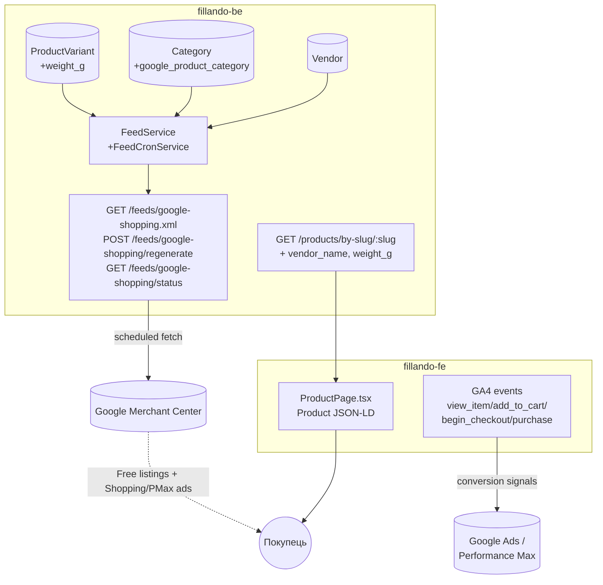

# TD-0006 — Google Merchant Center: продуктовий фід та збагачені structured data

- **Status:** Draft
- **Author:** vvbogdanovih
- **Reviewers:** —
- **Date:** 2026-09-01
- **Components:** both (fillando-be, fillando-fe)
- **Related:** [Plan-0002 roadmap, Фаза 5](../plans/plan-0002-catalog-seo-roadmap.md) · [TD-0002](TD-0002-catalog-taxonomy-and-landings.md) · [TD-0005](TD-0005-catalog-category-isolation.md) · [FRD §4.3, §5, §18.5, §18.6](../requirements/FRD.md)

## 1. Summary

Мета — успіх Fillando в Google Merchant Center: і безкоштовні лістинги
(Shopping tab), і платні Shopping/Performance Max кампанії з першого дня
(рішення власника, 2026-09-01).

Сьогодні єдиний сигнал для Google — Product JSON-LD на сторінці товару.
Аудит коду (2026-09-01) показав: жодного вихідного продуктового фіда не
існує (тільки вхідна синхронізація ціни/стоку з Prom.ua — зворотний
напрямок); наявна structured data має конкретні помилки (`brand`
захардкожений на "Fillando", `availability` ігнорує статус товару);
відсутні дані, потрібні для якісного фіда (вага, GTIN/MPN,
`google_product_category`); є Google Ads conversion pixel, але жодних
GA4-подій для Performance Max.

Цей документ проєктує: новий бекенд-модуль генерації Google Shopping
XML-фіда; мінімальний, обґрунтований набір нових полів даних; виправлення й
збагачення Product JSON-LD; розширення конверсійного трекінгу. Усе
спроєктовано під контракт ізоляції категорій із TD-0005 — жодне рішення не
хардкодить припущення "весь каталог = філамент".

## 2. Goals / Non-goals

**Goals**

- Публічний, актуальний Google Shopping XML-фід, придатний і для
  безкоштовних лістингів, і для платних Shopping/PMax кампаній
  (custom labels для сегментації кампаній).
- Виправити наявні помилки в Product JSON-LD (`brand`, `availability`,
  відсутні `sku`/`itemCondition`/`offers.url`/`priceValidUntil`) — вони
  підривають довіру Google і до фіда, і до сторінки.
- Дати Performance Max повний набір конверсійних сигналів (GA4 events), не
  тільки один conversion pixel — малий обсяг продажів робить PMax особливо
  залежним від допоміжних сигналів (`add_to_cart`, `begin_checkout`).
- Кожне нове per-category налаштування (`google_product_category`) живе на
  документі `Category`, за контрактом TD-0005 — ніякого глобального
  припущення чи спільної таблиці, keyed якось інакше.

**Non-goals**

- Content API for Shopping (push через OAuth2/service account) — інфраструктури
  немає (жодна наявна інтеграція — Prom, LiqPay, MonoPay, Nova Post — не
  використовує OAuth2/service account), і немає потреби, яку статичний
  фід не покриває (§6).
- `gtin`/`mpn` як обов'язкові поля — філамент сьогодні не штрихкодований;
  фід і так підтримує `identifier_exists: false`, валідний і не штрафований
  Google-ом стан.
- `condition` як поле в БД — завжди `'new'`, немає жодного flow для
  вживаних/повернених товарів; хардкод у білдері фіда.
- Таксономія/фід для "Аксесуарів" чи інших майбутніх категорій — окрема
  робота, коли Фаза 4 дасть реальний асортимент.
- Enforcement `Category.required_attributes` (зробити обов'язковим на
  запис) — фід дає видимість прогалин через звіт, не через блокування
  запису; окреме рішення, якщо колись знадобиться.

## 3. Background & context

### 3.1 Що вже є (аудит 2026-09-01)

Product JSON-LD, єдина точка генерації — `fillando-fe/src/app/(root)/products/[slug]/ProductPage.tsx:142-158`:

```js
brand: { '@type': 'Brand', name: SITE_NAME },   // завжди "Fillando"
offers: {
  price: variant.price, priceCurrency: 'UAH',
  availability: availableStock > 0 ? 'InStock' : 'OutOfStock',  // тільки stock, ніколи status
  shippingDetails: OFFER_SHIPPING_DETAILS,   // фіксовані ₴97, будь-яка вага
  hasMerchantReturnPolicy: MERCHANT_RETURN_POLICY
}
```

`OFFER_SHIPPING_DETAILS` / `MERCHANT_RETURN_POLICY` — статичні константи,
`fillando-fe/src/common/constants/seo.constants.ts:8-48`, вже узгоджені з
текстом `/returns` (14 днів, зворотну пересилку оплачує покупець за товар
належної якості) — окрім одного нюансу: `/returns` §3 описує ще
proportional-refund/replacement для дефектного товару, якого немає в
статичній константі (див. §5.4).

Google Ads tracking — вже працює: `Analytics.tsx` (consent-gated),
`gtag.ts` (helper, завжди через `dataLayer`, ніколи `window.gtag()`
напряму — це правило вже задокументоване в CLAUDE.md фронтенду), один
conversion event на сторінці успіху чекауту. **Жодного GA4-тега і жодних
ecommerce-подій немає.**

### 3.2 Дані сьогодні (backend)

`ProductVariant`: `product_id, category_id, name, slug, sku, price, stock,
images[], v_value, vendor_product_sku?, prom_id?, prom_base_price,
prom_discount_ratio, prom_discount_seen_at, price_updated_at,
stock_updated_at, status (DRAFT|ACTIVE|ARCHIVED)`.

Підтверджено відсутні будь-де в коді: `weight`/`dimensions`, `gtin`,
`mpn`, `condition`, явне поле `currency` (увесь каталог мовчки припускає
UAH), `diameter` як реальне поле.

`Vendor`: лише `name` (unique) + `slug` (unique) — саме це джерело для
`brand`.

`Category`: `name, slug, required_attributes[], image, order` — жодного
поля під Google-таксономію.

**`vendor_product_sku` — НЕ манфактурний код (MPN).** Перевірено
безпосередньо: `src/docs/DATA_MODELS.md:228` документує його як "external
SKU used to fetch stock from NicePrice" (мертва, ніде не підключена
інтеграція, `niceprice.service.ts`) — це чужий код звірки з постачальником,
не номер деталі виробника. Використовувати його як `mpn` означало б
публікувати в Google Merchant дані, що можуть розійтися з реальним MPN і
дати прапорець розбіжності ідентифікаторів. **Рішення: `mpn` не мапиться
нізвідки сьогодні, лишається відсутнім, як і `gtin`.**

Немає жодного вихідного фіда (Google/Meta/Prom/Rozetka) — підтверджено
порожнім grep по `feed|xml|csv|rss` в усьому `src/`. `PromModule` робить
протилежне: тягне ціну/сток **З** Prom.ua у власні `stock`/`price`, нічого
не публікує назовні. Його структурні патерни (axios-клієнт,
admin-gated SSE, `@nestjs/schedule` cron з `RUN_CRON` і overlap-guard) — це
корисний **структурний** приклад для нового модуля фіда, не пряме
перевикористання (напрямок даних протилежний).

`GET /products/variants/slugs` (джерело sitemap) не фільтрує по `status` —
підтверджений баг (`findAllSlugs()` в `product-variant.repository.ts`).

### 3.3 Категорійна ізоляція (TD-0005)

Будь-яке нове per-category налаштування в цьому TD (`google_product_category`)
живе embedded на документі `Category`, за тим самим патерном, що і
`required_attributes`/`image` — жодної спільної/глобальної таблиці. Фід
читає це поле per-`category_id`, так само, як каталог уже завжди фільтрує
по `category_id` (TD-0005 §5.1).

## 4. Requirements

**Функціональні**

- Публічний XML-фід, що містить тільки `status: ACTIVE` варіанти, з
  коректним `availability` (in stock / out of stock), правильним `brand`,
  `item_group_id` (групування варіантів одного товару).
- Фід і Product JSON-LD використовують ту саму логіку `availability`/
  `condition`/`weight` — Google не повинен бачити розбіжність між фідом і
  сторінкою (типова причина відхилення в Merchant).
- `google_product_category` — per-category, необов'язкове (не блокує запуск
  для категорії, де ще не встановлено).
- Performance Max отримує щонайменше: `add_to_cart`, `begin_checkout`,
  `purchase` (агреговано) на додачу до наявного Ads conversion pixel.

**Нефункціональні**

- Жодних нових `$lookup`/індексів на гарячому шляху каталогу — фід working
  set будується окремим, нечастим (щогодинним) job, не зачіпає
  `findCatalogItems`.
- Деградація без помилок: категорія/товар без вагового поля, кольору чи
  google_product_category просто не отримує відповідне поле у фіді/JSON-LD
  — ніколи не падає і не блокує решту рядка/сторінки.
- Дані з обох боків (фід і JSON-LD) деривуються з тих самих правил
  (однакова мапа `status`+`stock` → `availability`), не дубльованої окремо
  логіки, що може розійтися.

## 5. Proposed design

### 5.1 Архітектура



### 5.2 Data model changes

| Поле | Де | Тип | Обґрунтування |
|---|---|---|---|
| `weight_g` | `ProductVariant` | `number \| null`, default `null` | Варіант — це sku, що фізично відвантажується; вага двох розмірів котушки одного товару різна, тому не на `Product`. Грами, не кг — уникає float-помилок і робить одиницю частиною імені поля. Живить: JSON-LD `weight`, обчислювану доставку (замість фіксованих ₴97), `g:shipping_weight` у фіді, майбутні ваго-залежні тарифи Merchant shipping settings. |
| `google_product_category` | `Category` (embedded, `_id:false`) | `{ id: number, path: string } \| null` | Per-category, за контрактом TD-0005 — нова категорія отримує власне значення тим самим `PATCH /categories/:id`, без спільної таблиці. `id` — канонічний (стабільний при перейменуваннях таксономії Google), `path` — для адміна. `null` не блокує фід — рядок просто йде без цього поля, з попередженням у звіті. |

**Свідомо НЕ додається:**

- `gtin`/`mpn` на `ProductVariant` — сьогодні 100% значень були б `null`
  (визначення передчасного поля). Додати як тривіальний one-field PR, коли
  з'явиться перший штрихкодований товар (імовірно — категорія "Аксесуари",
  Фаза 4). Немає технічної вартості чекати: Mongoose не штрафує за пізніше
  додане nullable-поле.
- `condition` — завжди `'new'`; константа в білдері фіда, не поле в БД.
- `currency` — увесь застосунок (ціноутворення, LiqPay/MonoPay, Prom-sync)
  уже мовчки й послідовно припускає UAH; окреме поле дало б лише
  захаращення без користі.
- Enforcement `required_attributes` на запис — ризиковано вмикати заднім
  числом на неперевіреному масиві існючих товарів; замість цього — звіт
  про прогалини від самого фіда (§5.3), без блокування звичайного
  редагування адміном.

### 5.3 Feed generation module (backend)

**Механізм доставки: статичний фід за стабільним публічним URL,
регенерований за розкладом** (як уже працює `sitemap.xml`), НЕ Content API
for Shopping. Причина: Content API вимагає OAuth2/service account —
інфраструктури, якої немає в жодній наявній інтеграції цього бекенду (усі —
простий API-key/Bearer виклик). Апгрейд виправданий тільки при десятках
тисяч SKU або потребі push-оновлень у реальному часі (флеш-розпродажі) —
жодне не актуальне сьогодні.

**Формат: RSS 2.0 XML з `g:`-namespace**, не TSV — самоописовий, природно
підтримує повторювані теги (`additional_image_link`), той самий формат, що
й Bing Merchant Center та Meta Commerce Manager (переносимість без
переробки, якщо колись знадобиться). Два невеликі хендрolled-хелпери
(`xmlEscape`, `cdata`) — без нової npm-залежності, узгоджено з наявним
стилем репо (напр. `generateSlug` теж hand-rolled, не через пакет).

**Файлова структура** (`src/modules/feed/`):

```
feed.module.ts
feed.controller.ts              — 3 endpoints нижче
feed.service.ts                 — оркестрація: вибірка, виключення, кеш XML
feed-cron.service.ts            — @nestjs/schedule, RUN_CRON, щогодини
google-shopping-feed.builder.ts — чисті функції: рядок → <item>, availability/condition mapping, xmlEscape/cdata
product-type.resolver.ts        — ізольована точка апгрейду під лендінги TD-0002 (див. нижче)
feed.types.ts                   — FeedRow, FeedGenerationSummary, ExclusionReason
```

Нова репозиторна вибірка, поруч із наявним `findPriceListRows`
(`product-variant.repository.ts`): `findActiveForFeed()` — `$match
{status: ACTIVE}` → `$lookup products/categories/vendors` (усі —
`preserveNullAndEmptyArrays`, захист від висячого посилання) → проєкція
потрібних полів. Без нового індексу — це не гарячий шлях (щогодинний job,
не catalog browse), TD-0002's "без нових $lookup на гарячому шляху"
стосується саме каталогу, не цього.

**Ендпоінти** (`endpoints.constant.ts`):

| Метод | Шлях | Доступ |
|---|---|---|
| `GET` | `/feeds/google-shopping.xml` | публічний, як `sitemap.xml`/`robots.txt` — фід не чутливі дані, Merchant/Bing/Meta всі очікують просто фетчабельний URL |
| `POST` | `/feeds/google-shopping/regenerate` | ADMIN — синхронний (не SSE, як у Prom: агрегація кількох тисяч рядків не потребує progress stream), повертає `FeedGenerationSummary` |
| `GET` | `/feeds/google-shopping/status` | ADMIN — останній summary без перегенерації |

**Кеш і розклад**: один інстанс деплою (підтверджено — один `api`-контейнер
без реплік), тому in-memory кеш у `FeedService` (`cachedXml`, `lastSummary`,
`generatedAt`) — без окремої DB-колекції під кеш. `FeedCronService`
перевикористовує наявний `RUN_CRON` (його ж докстрінг уже узагальнює: "e.g.
Prom sync" — не заводимо другий подібний прапорець), щогодини,
overlap-guard як у `PromSyncService`.

**Мапінг полів:**

| Feed field | Джерело | Примітка |
|---|---|---|
| `g:id` | `ProductVariant.sku` | унікальний, обов'язковий уже сьогодні |
| `g:item_group_id` | `product_id` | групує варіанти одного товару — саме модель варіантів Google |
| `title` | `ProductVariant.name` | вже `"{product.name} — {v_value}"`. **Анти-вимога:** білдер не додає жодних суфіксів на кшталт «(рефіл)» — назва товару вже містить «Refill (без котушки)» (TD-0002 §5.2.1), тож суфікс дав би дубль |
| `description` | `Product.description.html`, HTML→текст, обрізано до 5000 символів | fallback на `title`, якщо відсутнє — не виключення, а попередження у звіті |
| `link` | `{FRONTEND_URL}/products/{variant.slug}` | збігається з фактичним `canonical` сторінки товару |
| `g:image_link` / `g:additional_image_link` | `images[0]` / `images[1..10]`, `-1280.webp` derivative | ця тіра гарантовано існує для кожного завантаженого зображення |
| `g:availability` | `status` + `stock` | таблиця нижче |
| `g:price` | `"{price.toFixed(2)} UAH"` | без `sale_price` — `price` уже фінальна ціна; `prom_base_price` внутрішня бухгалтерія, ніколи не показана покупцю — видавати її як "було" зі спотворило б реальність |
| `g:brand` | `Vendor.name` | |
| `g:google_product_category` | `Category.google_product_category.id` | пропускається (не виключення), якщо не встановлено — репортиться |
| `g:product_type` | `Category.name`, апгрейдиться до `"{Category.name} > {Landing.h1}"`, коли товар матчить закріплені фільтри лендінга | working baseline сьогодні — просто `Category.name`; `product-type.resolver.ts` викликається з `landings: []`, тому апгрейд не потребує редеплою фіда, коли TD-0002 додасть колекцію `landings` — досить підключити один lookup. **Товар може матчити кілька лендінгів** (PETG Refill → і `/filament/petg`, і `/filament/refill`): обирається найбільш специфічний — найбільше збігів у `filters`, за рівності менший `order` (правило зафіксоване в TD-0002 §5.2.3) |
| `g:condition` | константа `'new'` | |
| `g:identifier_exists` | константа `false` | доки немає gtin/mpn |
| `g:color` | наявний бекендовий хелпер `pickColor()` (вже в проді для прайс-листа) сьогодні; апгрейд на `Color.name_en`, коли TD-0002 додасть `color_id` | перевикористання наявного, а не новий хелпер |
| `g:material` | наявний `pickAttr(MATERIAL_PATTERNS)` сьогодні; апгрейд на `polymer`-атрибут із TD-0002 (семантично точніший за складену маркетингову назву) | те саме — перевикористання, не новий код |
| `g:shipping_weight` | `"{weight_g/1000} kg"` | пропускається, якщо `weight_g` відсутнє. Для рефілів (TD-0002 §5.2.1) вага реально менша на вагу котушки (~200–250 г) — саме `weight_g`, а не таксономія, моделює фізику посилки |
| `g:custom_label_0..4` | див. нижче | |

**Availability:**

| `status` | `stock` | Результат |
|---|---|---|
| `DRAFT` / `ARCHIVED` | будь-який | **виключено з фіда повністю** |
| `ACTIVE` | `> 0` | `in stock` |
| `ACTIVE` | `<= 0` | `out of stock` (лишається у фіді — так само, як вітрина сьогодні тримає такі товари видимими, просто відсортованими останніми) |

`preorder`/`backorder` — свідомий non-goal: немає жодних даних (дата
відновлення стоку абощо), що обґрунтовували б ці статуси; вигадування
ризикує прапорцем невідповідності політиці Google, гірше, ніж консервативний
`out of stock`.

**Custom labels** (усе з наявних даних, нічого нового не рахується, крім
label 4):

| Label | Значення |
|---|---|
| `custom_label_0` | `Category.name` |
| `custom_label_1` | `Vendor.name` |
| `custom_label_2` | Маржа з `prom_base_price` vs `price`: `high` (≥20%) / `medium` (10–20%) / `low` (<10%) / `unknown` |
| `custom_label_3` | Ціновий діапазон: `budget` (<500) / `mid` (500–1500) / `premium` (>1500) |
| `custom_label_4` | Швидкість продажів (bestseller/popular/standard) за 90 днів `PAID`-замовлень — **fast-follow, не блокер запуску** (потребує нового `OrderRepository`-агрегату) |

⚠️ **`custom_label_2` (маржа) буде видимий будь-кому, хто відкриє публічний
URL фіда** — грубо забакетовано (high/medium/low, не точні цифри), але це
свідомий компроміс, не побічний ефект. Винесено окремим відкритим питанням
у §8 — власник має свідомо погодитись, а не дізнатись постфактум.

**Виключення й звіт**: виключаються `status ≠ ACTIVE`, нуль зображень,
відсутня/`≤0` ціна, висяче посилання на product/category/vendor.
**Не** виключається `stock=0` (це `availability`, не виключення — інакше
губиться історія показів товару щоразу, як він закінчується). Звіт —
не JSON-файл на диск (це разова міграційна практика TD-0002, тут же —
рекурентна робота): структурований лог щозапуску (як у `PromSyncService`)
+ той самий `FeedGenerationSummary` у відповіді `POST /regenerate` і
`GET /status`. Звіт включає й "м'які" попередження (відсутній
`google_product_category`, опис, вага, невиконаний `required_attributes`
категорії) — саме тут `required_attributes` отримує видимість без
enforcement на запис.

**Жорсткої залежності від TD-0002 (Фаза 1) немає.** Фід запускається на
поточній схемі. `color`/`material`/`product_type` покращуються автоматично
або через одну малу зміну (`product-type.resolver.ts`), коли TD-0002
дасть `color_id`/`landings` — без редизайну модуля.

### 5.4 Product JSON-LD (frontend)

Виносимо з `ProductPage.tsx` у чисту функцію
`src/app/(root)/products/[slug]/product-jsonld.utils.ts` —
`buildProductJsonLd(data, displayName)` — об'єкт заріс достатньо, щоб
виправдати винесення (узгоджено з наявним патерном `price.utils.ts` тощо).

**Виправлення:**

- **`brand`** → `product.vendor_name` (нове поле на відповіді
  `GET /products/by-slug/:slug`, той самий патерн lookup'у, що вже
  використовується для `category_name`/`category_slug` у
  `findVariantWithProduct`), з фолбеком на `SITE_NAME`, якщо `null`.
- **`availability` + доступність сторінки** — статус тепер справді читається:
  - **DRAFT** → трактується як неіснуючий товар: `generateMetadata` віддає
    `robots: {index:false, follow:false}`, сторінка викликає `notFound()`
    — той самий патерн, що вже є для невідомого slug.
  - **ARCHIVED** → **не** 404. Живий беклінк чи ще не призупинена
    Shopping/PMax реклама можуть вести саме сюди — 404 зламав би посадкову
    сторінку діючої кампанії. Натомість: сторінка лишається 200,
    `availability: https://schema.org/Discontinued` (валідне значення
    schema.org саме під цей випадок), кнопка "у кошик" вимкнена,
    `robots: {index:false, follow:true}`. Це узгоджується з виключенням
    архівних товарів із фіда (§5.3): фід ніколи не порекомендує архівний
    товар як активний, а сторінка, якщо на неї все ж прийшли, чесно каже
    "знято з продажу" замість вдавати, що товар доступний.
  - **ACTIVE + stock≤0** → `OutOfStock` (як і сьогодні). **ACTIVE + stock>0**
    → `InStock`.
- **`sku`** — `variant.sku`, тривіально, дані вже є.
- **`itemCondition`** — константа `https://schema.org/NewCondition` під
  `offers.itemCondition` (не поле в БД — той самий YAGNI, що й на бекенді).
- **`gtin`/`mpn`** — **не додається зараз**, узгоджено з бекендовим
  рішенням не заводити ці поля, доки не з'явиться реальний штрихкод.
- **`offers.url`** — `{SITE_URL}/products/{slug}`, збігається з canonical.
- **`offers.priceValidUntil`** — рухоме вікно (`+90` днів від дати
  генерації), а не фіксована дата — безпечно під будь-яким кешуванням
  сторінки.
- **`productGroupID`** — `product.id`, тільки коли `siblings.length > 1`
  (той самий поріг, що вже вирішує показ перемикача варіантів у UI) —
  простіший, документований Google-ом механізм замість повної вкладеної
  `ProductGroup`/`isVariantOf`.
- **`color`/`material`/`weight`** — деградують за конструкцією, не через
  спеціальний прапорець: `color` тільки коли є резолвлений об'єкт кольору з
  бекенду (не відтворюємо на фронтенді color-эвристику, яку TD-0002 якраз
  прибирає з бекенду — інакше повертаємо ту саму крихкість регексом);
  `material` тільки коли існує атрибут `k === 'polymer'`; `weight` тільки
  коли `weight_g != null`. Жодна умова не специфічна для філаменту — код
  для майбутньої категорії без цих концепцій просто ніколи їх не покаже,
  без помилки чи заглушки (пряме виконання контракту TD-0005).
- **`shippingDetails`** — обчислюється з `weight_g` через невелику таблицю
  вагових діапазонів (ставки — **плейсхолдери**, потребують звірки з
  реальними тарифами Нової Пошти перед продом, див. §8), а не фіксовані
  ₴97. Немає інтеграції з тарифним API перевізника — і не варто її зараз
  будувати (YAGNI): проста таблиця відповідає тому ж рівню точності, що й
  наявна константа, просто чутлива до ваги.
- **`hasMerchantReturnPolicy`** — додається `itemDefectReturnFees:
  https://schema.org/FreeReturn` (schema.org-поле саме під випадок
  дефектного товару з `/returns` §5, де пересилку оплачує продавець, на
  відміну від стандартного випадку). "Заміна АБО пропорційне повернення
  АБО повний рефанд" (`/returns` §3) свідомо не моделюється —
  `refundType` schema.org не має "пропорційного" значення, а `FullRefund`
  лишається правдивим описом одного з трьох законних варіантів.

### 5.5 Conversion tracking — GA4 (frontend)

**Рішення: додати повноцінну GA4-властивість**, не намагатися видушити
більше сигналу з самого лише Ads. Вартість — майже нульова (той самий
`Analytics.tsx`, той самий consent-гейт, ще один `gtag('config', 'G-XXX')`
поруч із наявним). Для Performance Max при малому обсязі продажів
`purchase`-сигналу замало для Smart Bidding — `add_to_cart`/
`begin_checkout` як допоміжні сигнали (і аудиторії ремаркетингу через
зв'язку Ads↔GA4) — це саме те, що Google рекомендує при низькому обсязі
конверсій. Замінити нічого не потрібно — наявний Ads conversion pixel
лишається як є, GA4 — додатково.

Новий `GOOGLE_ANALYTICS_ID` (env, без хардкодженого фолбеку — на відміну
від Ads, реального значення поки нема, код просто не активується, доки
власник не створить property).

Новий тонкий модуль `src/common/lib/ga4-events.ts` — типізовані обгортки
над наявним `gtag()`, не новий механізм трекінгу:
`trackViewItem`/`trackAddToCart`/`trackBeginCheckout`/`trackPurchase`.

Точки виклику (усі — існючі компоненти, existing hooks/handlers):

| Подія | Де | Коли |
|---|---|---|
| `view_item` | `ProductPage.tsx` | новий `useEffect`, keyed на `variant.id` (не тільки mount — перемикання варіанта через dropdown не ремаунтить компонент) |
| `add_to_cart` | `ProductPage.tsx`, `handleAddToCart` | одразу після успішного `addItem()` |
| `begin_checkout` | `CheckoutPage.tsx` | один раз за відвідування чекауту, з `displayItems`/`total` |
| `purchase` | `CheckoutSuccessContent.tsx` | поруч із наявним Ads conversion event |

`purchase` — **свідомо агрегований, без `items[]`**: сторінка успіху
досяжна і через параметризований редирект (готівка/накладений
платіж/переказ), і через LiqPay-редирект, який конструює бекенд — немає
єдиного способу дотягнути товарні рядки в обох напрямках без додаткового
бекендового lookup-ендпоінта; кошик до того ж уже очищений
(`clearAfterOrder()`) до будь-якого з редиректів. Агрегована `value`/
`currency`/`transaction_id` — усе одно найважливіший сигнал для
value-based bidding у PMax; товарна деталізація — можливий наступний крок,
не зараз.

**Супутнє виправлення**: `docker-compose.prod.yml` не прокидає
`NEXT_PUBLIC_GOOGLE_ADS_ID`/`NEXT_PUBLIC_GOOGLE_ADS_PURCHASE_CONVERSION`
(оголошені в `Dockerfile.prod`, відсутні в `args:` docker-compose) —
виправляється в тому ж PR, що додає `NEXT_PUBLIC_GOOGLE_ANALYTICS_ID` і
`NEXT_PUBLIC_GOOGLE_SITE_VERIFICATION` (§5.6) тими самими build-args.

### 5.6 Search Console verification + sitemap

- `layout.tsx`: `metadata.verification.google = process.env.NEXT_PUBLIC_GOOGLE_SITE_VERIFICATION`
  — Next.js не рендерить тег, якщо значення `undefined`, тож це безпечно
  мерджиться зараз і активується, коли власник пройде верифікацію в Search
  Console.
- `sitemap.ts`: додати `/contacts`, `/offer`, `/returns`, `/privacy`,
  `/price-sheet` (уже узгоджено з Plan-0002 Фазою 0, просто виконується
  тут заразом, бо той самий файл).

## 6. Alternatives considered

**Content API for Shopping замість статичного фіда.** Точніший контроль,
можливість push-оновлень у реальному часі. Відкинуто зараз: жодна наявна
інтеграція не має OAuth2/service-account інфраструктури, а масштаб
каталогу (низькі тисячі SKU) не вимагає real-time push. Апгрейд-шлях
лишається відкритим, якщо каталог чи потреби зростуть.

**TSV замість XML.** Простіший парсинг, але позиційно крихкий (опціональна
колонка зсуває решту) і незручний для повторюваних полів
(`additional_image_link`). XML/RSS — самоописовий і портативний на
Bing/Meta без переробки.

**`vendor_product_sku` як `mpn`.** Розглянуто й відкинуто — це код звірки
з мертвою інтеграцією NicePrice, не номер деталі виробника (§3.2).

**Enforcement `required_attributes` зараз.** Відкинуто — ризик заблокувати
звичайне редагування адміном на неперевіреному масиві старих товарів;
замість цього видимість через звіт фіда (§5.3), enforcement — окреме
рішення, якщо звіт покаже, що проблема реальна й велика.

**Реалізувати color/material-евристику на фронтенді як тимчасовий міст до
TD-0002.** Відкинуто: відтворило б ту саму крихкість (регекс за
регістром/синонімами), яку TD-0002 якраз усуває на бекенді. Бекендовий фід
може перевикористати наявний production-хелпер без цього ризику (він уже
є і вже в проді для прайс-листа); фронтенд — ні, тому чекає.

## 7. Cross-cutting concerns

- **Security & privacy**: фід — публічний URL без чутливих персональних
  даних (тільки каталог), як `sitemap.xml`. Єдиний нюанс — `custom_label_2`
  (маржа), див. §8.
- **Performance & scale**: фід будується окремим, нечастим (щогодинним)
  job, не додає жодного навантаження на гарячий шлях каталогу
  (`findCatalogItems`). In-memory кеш — GET-запит фіда ніколи не тригерить
  повну агрегацію.
- **Migration/compatibility**: `weight_g` — нове nullable-поле, без
  міграції-блокера (бекфіл окремо, § Rollout). `google_product_category`
  — нове nullable-embedded поле. Жодних змін до наявних обов'язкових полів.
- **Observability**: `FeedGenerationSummary` (виключення + попередження)
  логується щозапуску і доступний адміну через `GET /status`.
- **Testing strategy**: unit — `google-shopping-feed.builder.ts` (мапінг
  availability, xmlEscape, custom labels), `product-jsonld.utils.ts`
  (усі гілки graceful degradation). Integration — `findActiveForFeed`
  виключає DRAFT/ARCHIVED. e2e — фід валідний XML, товар з `weight_g=null`
  не ламає жоден рядок, ARCHIVED-сторінка віддає 200 з `Discontinued`, DRAFT
  — 404.

## 8. Open questions

1. **`custom_label_2` (маржа) публічно видимий у фіді** — грубо
   забакетовано (high/medium/low), але технічно доступний будь-кому, хто
   відкриє URL. Власник має явно погодитись або попросити прибрати/
   замінити цей label на щось інше (напр. лише категорія+бренд, без маржі).
2. **Вагові діапазони для обчислюваної доставки** (§5.4) — тільки якір
   ~1.3кг/₴97 реальний, решта — плейсхолдери. Потрібна звірка з актуальними
   тарифами Нової Пошти перед продом.
3. **Точний `google_product_category` (id + path) для категорії
   "Філамент"** — це вибір із опублікованої таксономії Google, не технічне
   рішення; власник підбирає значення при рол-ауті.
4. **Обробка ARCHIVED-товару** — узгоджено 200+Discontinued замість 404,
   щоб не зламати діючу рекламу. Якщо процес власника — завжди
   призупиняти кампанію одразу з архівацією SKU, простіший плоский 404
   (як DRAFT) теж прийнятний — сказати, якщо так зручніше.

## 9. Rollout

| # | Репо | Що |
|---|---|---|
| 1 | be | `ProductVariant.weight_g`, `Category.google_product_category` + DTOs, `yarn spec:export` |
| 2 | be | Ride-along фікс: `findAllSlugs()` фільтр по `status: ACTIVE` |
| 3 | be | `vendor_name` + `weight_g` у відповіді `by-slug` (lookup, за патерном `category_name`) і в `CartService.populateItems` |
| 4 | be | Бекфіл `backfill-variant-weight.js` (dry-run → звіт → apply) — паралельно, не блокер |
| 5 | be | Модуль `feed/` повністю: схема → репозиторій → білдер → контролер → крон; реєстрація в `app.module.ts` |
| 6 | be | Одноразовий `PATCH /categories/:id` — власник встановлює `google_product_category` для "Філамент" (адмін-UI не потрібен для однієї категорії) |
| 7 | fe | Batch 1 (без залежності від беку): `sku`, `itemCondition`, `offers.url`/`priceValidUntil`, `productGroupID`, оновлений `hasMerchantReturnPolicy`, DRAFT/ARCHIVED guard, sitemap-доповнення, verification-хук, повна GA4-обвʼязка (property + 4 події), фікс `docker-compose.prod.yml`/`Dockerfile.prod` |
| 8 | fe | Batch 2 (після кроку 3): фікс `brand`, обчислювана доставка з `weight_g` |
| 9 | fe | Batch 3 (написано зараз, активується само собою після TD-0002): `color`/`material` |
| 10 | be | Fast-follow: `custom_label_4` (`OrderRepository`-агрегат продажів за 90 днів) |
| 11 | owner | Search Console: верифікація сайту, значення в `NEXT_PUBLIC_GOOGLE_SITE_VERIFICATION` |
| 12 | owner | Merchant Center: акаунт, верифікація домену, реєстрація URL фіда, розклад фетчу ≥ щогодини, налаштування shipping/return-policy на рівні акаунта |
| 13 | owner | Google Ads ↔ Merchant Center лінк; GA4-property, `NEXT_PUBLIC_GOOGLE_ANALYTICS_ID`; GA4 ↔ Ads лінк; запуск Performance Max кампанії |
| 14 | be | `src/docs/MERCHANT_FEED.md` (за патерном `PROM_AVAILABILITY_SYNC.md`) |
| 15 | both | Оновити FRD (§4.3, §5, §18.5/§18.6) після реалізації |

Кроки 11–13 — операційні дії власника в дашбордах Google, поза кодом; усе
інше — implementation plan, який пишеться окремо, після рев'ю цього TD.
