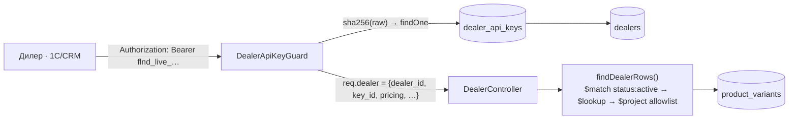

# TD-0007 — Дилерське (B2B) API: товар за артикулом

- **Status:** Draft
- **Author:** vvbogdanovih
- **Reviewers:** —
- **Date:** 2026-09-03
- **Components:** both (fillando-be, fillando-fe)
- **Related:** [TD-0006](TD-0006-google-merchant-feed-and-structured-data.md) ·
  [TD-0005](TD-0005-catalog-category-isolation.md) ·
  [FRD §10.5](../requirements/FRD.md) · [FRD §21](../requirements/FRD.md) ·
  [ADR-0003](../adr/0003-authentication-strategy.md) ·
  `fillando-be/src/docs/todo/AUDIT_CRITICAL.md`

## 1. Summary

Власник хоче давати дилерам (оптовим покупцям) доступ до API, щоб вони
витягували будь-який товар **за артикулом** і бачили **свою** ціну. Це
перша машинна інтеграція Fillando зі сторонніми системами (1С, CRM,
магазини дилерів), тому вона потребує того, чого в проєкті ще немає:
machine-to-machine автентифікації, версіонованого контракту й обмеження
частоти запитів.

Дизайн свідомо мінімальний за обсягом і сталий за контрактом: дві нові
колекції, opaque API-ключ, чотири read-only ендпоінти під префіксом
`/dealer/v1`, ціна як **об'єкт** (а не число), і жорсткий allowlist полів
у відповіді — щоб комерційно чутливі дані фізично не могли просочитись.

**Аудит коду під цей дизайн виявив три активні вразливості, які роблять
дилерський ключ безглуздим, доки не закриті** — вони входять у скоуп
(§6), а одна з них критична й не має стосунку до дилерів узагалі.

## 2. Goals / Non-goals

**Goals**

- `GET /dealer/v1/products/:sku` — точний матч за внутрішнім артикулом.
- Bulk-запит за списком артикулів і повний прохід асортименту (для
  початкового завантаження в 1С).
- Дилер бачить свою ціну; маржа й дані постачальника не віддаються
  **ніколи**.
- Контракт `v1` стабільний: у межах версії — тільки аддитивні зміни.
- Ідентичність дилера живе **окремо** від `User` і потрапляє в
  `req.dealer`, ніколи в `req.user` — щоб наявна дірка в RBAC
  (§6, AUDIT_CRITICAL #3) не стала дірою для дилерів.
- Миттєве відкликання доступу.

**Non-goals** (з тригерами в §7)

- Замовлення за дилерською ціною — API read-only; кошик і замовлення
  читають `variant.price` без контексту користувача, і зміна цього —
  окремий проєкт на тижні, не дні.
- Вебхуки, push про зміну ціни/наявності.
- OAuth2 client_credentials, scopes, квоти й тарифікація.
- Per-SKU контрактні ціни, price-lock, обсягові рівні «від 50/100 кг».
- Окремий staging, кабінет дилера, кредитні лімiти.
- Глобальне `enableVersioning` (переписало б усі шляхи фронтенду).

## 3. Background & context

### 3.1 Що вже є

- **Автентифікація** — рівно дві passport-стратегії (`auth.module.ts`),
  JWT читається **тільки з cookie**
  (`jwt.strategy.ts`: `jwtFromRequest: req => req?.cookies?.[…] ?? null`).
  Machine-to-machine механізму немає жодного.
- **Ролі** — `enum Role { USER, ADMIN }` (`common/types/enums.ts`).
- **Rate limiting** — немає взагалі (`@nestjs/throttler` відсутній у
  `package.json`).
- **Версіонування** — `setGlobalPrefix`/`enableVersioning` не
  викликаються; шляхи плоскі, `/api` додає Nginx.
- **Опт сьогодні** — PDF-прайс (`price-list.service.ts`): оптова ціна
  **не існує в даних**, вона обчислюється в момент рендеру як
  `price * (1 - tier/100)`, де відсотки приходять у тілі POST (дефолти
  10/15 у `generate-price-list.dto.ts`). Пороги «від 50/100 кг» —
  текстові літерали в шапці шаблону.
- **Вибірка за SKU** — `findBySku` існує, але повертає сирий Mongoose-
  документ (з `prom_*`) і **не фільтрує статус**; для дилерів
  непридатна.
- **Індекс** — `{ sku: 1 }` unique уже є, нових індексів дизайн не
  потребує.

### 3.2 Три активні вразливості, знайдені під час аудиту

Перелічені тут, бо **дилерський ключ без їх закриття — театр**: те, що
ми ховаємо за ключем, уже лежить у відкритому доступі.

1. **`prom_id` і `vendor_product_sku` віддаються публічно** у відповіді
   `GET /products/by-slug/:slug`
   (`product-variant.repository.ts`, проєкція `findVariantWithProduct`).
   `prom_id` — прямий ідентифікатор лістингу на Prom.ua, тобто будь-хто
   анонімно виходить на **постачальника власника**. Це не зайве поле, це
   комерційна таємниця.
2. **`GET /products/price-sheet` — без guard і без ліміту**, віддає
   артикули, ціни й **точні залишки** по всьому асортименту, включно з
   `draft`/`archived` (немає `$match` по статусу), сторінками до 200.
   Це фактична поверхня скрейпінгу.
3. **AUDIT_CRITICAL #3 — write-ендпоінти каталогу без перевірки ролі.**
   `POST /products`, `PATCH`/`DELETE /products/:id`, увесь variant CRUD і
   `PATCH` зображень мають **тільки** `@UseGuards(JwtAuthGuard)` без
   `RolesGuard`/`@Roles(ADMIN)`. Єдиний write-ендпоінт із коректним
   стеком — `PRICE_LIST_PDF`, і поруч із ним у коді стоїть коментар
   «unlike the write endpoints below, this one is genuinely admin-only».
   Тобто **будь-який зареєстрований покупець магазину може створювати,
   редагувати й видаляти товари.** Це вже задокументовано в
   `src/docs/RBAC.md` і `src/docs/todo/AUDIT_CRITICAL.md`, але не
   виправлено.

### 3.3 Коригування факту про prom-крон

Prom-синк **не** перезаписує `price` без потреби — порівняння перед
записом там є (`if (newPrice !== variant.price)`). Але
`updatedAt`, `stock_updated_at`, `price_updated_at` і `prom_base_price`
штампуються **кожні 30 хвилин** для кожного варіанта з `prom_id`.

Наслідок для дизайну: **delta-синк по `updatedAt` або `price_updated_at`
сьогодні непрацездатний** — він віддавав би весь prom-синкований каталог
двічі на годину. Тому `updated_since` у фазі 1 не випускається, а курсором
пагінації служить `sku` (§5.3). І `price_updated_at` у відповіді означає
«коли крон перевірив», а не «коли ціна змінилась» — це фіксується в
документації дилера саме так.

## 4. Requirements

**Функціональні**

- Автентифікація ключем у заголовку; доступ відкликається миттєво.
- Точний матч за `sku`; неактивний товар і неіснуючий SKU дають
  **однаковий** 404 (інакше перебір артикулів викриває чернетки).
- Дилерська ціна — з персистованої ставки дилера, поруч із роздрібною,
  з відміткою часу.
- Bulk до 100 артикулів за запит; keyset-пагінація по `sku`.
- Стабільний enum кодів помилок.

**Нефункціональні**

- Жодне з полів `prom_id`, `prom_base_price`, `prom_discount_ratio`,
  `prom_discount_seen_at`, `vendor_product_sku`, `vendor_id`, `status`,
  `_id` не серіалізується **ніколи** — allowlist на рівні `$project`, не
  фільтрація в мапері.
- Обмеження частоти — по **ключу**, не по IP.
- Нових індексів нуль; нових npm-залежностей одна (`@nestjs/throttler`).

## 5. Proposed design

### 5.1 Автентифікація



| Рішення | Обґрунтування |
|---|---|
| Дилер — **окрема сутність**, не `User`, не нова `Role` | Видати дилеру principal у `req.user` за наявної дірки §3.2.3 = видати право видаляти каталог |
| Guard кладе ідентичність у **`req.dealer`** | Фізичне розділення просторів імен; страховка коштує нуль рядків |
| Звичайний `CanActivate`, не passport-стратегія | Passport автоматично присвоює `req.user` — прямий конфлікт з рядком вище |
| **Не** додаємо Bearer-екстрактор у `JwtStrategy` | Зробило б кожен викрадений access-cookie універсальним заголовком до всього API (за відсутнього CSRF) |
| Ключ `flnd_live_<32B CSPRNG base64url>` (+ `flnd_test_*`) | Префікс — grep-абельність і secret-scanning |
| Зберігається `sha256(raw)` hex, unique-індекс | 256 біт CSPRNG — офлайн-перебір неможливий; pepper захищає від rainbow-table, що для random безглуздо. Argon2 не індексується (перебір усіх ключів) + ~80 мс на запит. Патерн уже є для refresh-токенів |
| Верифікація б'є в БД щоразу, без кешу | 1 indexed `findOne` при 2–5 дилерах; дає **миттєве відкликання** — головний аргумент проти JWT, де `validate` не звіряється з БД |
| Scopes не вводимо | Можливість рівно одна — читати каталог. Диференціація видимості робиться **полем** `stock_visibility`, не скоупом |
| Default-deny в guard | Свідома протилежність `RolesGuard`, який при відсутніх метаданих робить `return true` |
| До 2 активних ключів на дилера | Вікно перекриття для перемикання 1С без простою |

Онбординг — через адмін-ендпоінти з першого дня, не руками в Mongo.
`ip_allowlist` — за тригером (`trust proxy` уже виставлений, тож поле
додається без інфраструктурних змін).

### 5.2 Ціноутворення

Оптової ціни в даних немає — є одне поле `price`. Дизайн **персистує той
самий відсоток, який уже є транзієнтним параметром PDF-прайсу**:

```ts
pricing: { mode: 'percent_off_retail', percent: number }
```

Це не нова цінова модель, а фіксація наявної практики («мінус N% від
роздрібу»). `price-list.service.ts` рефакториться на спільний
`resolveDealerPrice()`, щоб PDF і API не розійшлися (фаза 1a).

Ціна віддається **об'єктом**, а не числом — щоб поява рівнів,
контрактних цін чи валют була аддитивною:

```jsonc
"price": { "currency": "UAH", "retail": 890.00, "dealer": 783.20,
           "discount_percent": 12, "source": "PERCENT_OFF_RETAIL",
           "checked_at": "2026-09-03T04:12:00Z" }
```

**Ціна індикативна.** Крон перераховує її щопівгодини, price-lock не
існує — це фіксується в умовах API текстом, а не технікою (§8, питання 4).

### 5.3 Ендпоінти

Версіонування — **літералом у шляху**, без `enableVersioning` (глобальне
зламало б усі шляхи фронтенду). Порядок декларації обов'язково:
`GET /products` і `POST /products/lookup` — **до** `GET /products/:sku`.

| Метод | Шлях | Призначення |
|---|---|---|
| `GET` | `/dealer/v1/products/:sku` | головна вимога: точний матч, 60/хв |
| `POST` | `/dealer/v1/products/lookup` | bulk, `{skus: string[]}` до 100, один `$in`-запит, 10/хв |
| `GET` | `/dealer/v1/products?after=<sku>&limit=100` | прохід асортименту, keyset по `sku`, без `total`, 10/хв |
| `GET` | `/dealer/v1/me` | самоперевірка: знижка, ліміти, префікс ключа |
| `GET`/`POST`/`PATCH` | `/dealers`, `/dealers/:id` | адмін CRUD (`JwtAuthGuard, RolesGuard` + `@Roles(ADMIN)`, **у цьому порядку**) |
| `POST`/`GET`/`DELETE` | `/dealers/:id/keys[/:keyId]` | видача (сирий ключ **один раз**), список без секретів, відкликання через `revoked_at` |

**Канонічний ключ — внутрішній `sku`.** `vendor_product_sku` непридатний:
unique-індексу не має і дефолтиться до системного `sku` → колізії
неминучі.

**Keyset по `sku`, а не по `updatedAt`** — використовує наявний
unique-індекс, стабільний під churn'ом §3.3, нових індексів нуль.

Формат рядка — явний allowlist-DTO (`sku`, `name`, `product_name`,
`slug`, `url`, `category`, `brand`, `material`, `color`, `images`,
`price`, `availability`, `weight_g`, `moq: null`, `unit: null`).
`brand`/`material`/`color` обчислюються наявними хелперами
(`pickAttr`/`pickColor`), як це вже робить price-sheet; після TD-0006
кроку 3 `brand` перемикається на реальний `Vendor.name`.
`moq`/`unit` зарезервовані `null`, щоб поява була аддитивною.

Помилки — завжди `{ "error": { "code", "message" } }` зі стабільним enum:
`INVALID_KEY`, `KEY_REVOKED`, `DEALER_SUSPENDED`, `SKU_NOT_FOUND`,
`TOO_MANY_SKUS`, `RATE_LIMITED`, `INVALID_QUERY`. `INVALID_KEY` і
`KEY_REVOKED` мають **однаковий текст** — не даємо оракула на існування
ключа.

Локальний `ValidationPipe` з `forbidNonWhitelisted: true` — глобальний
його не має, тож сьогодні `?afterSku=` замість `?after=` дало б 200 з
тихо проігнорованим фільтром. Для машинної інтеграції це втрата даних.

**Видимість залишку — точна кількість.** Ховати від дилера те, що
price-sheet уже віддає анонімно (§3.2.2), — витрата складності без
вигоди. Але поле `stock_visibility: 'exact' | 'bucket'` закладається
одразу, щоб перемикання було конфігом, а не кодом.

### 5.4 Схема даних

```ts
@Schema({ collection: 'dealers', timestamps: true })
class Dealer {
  code: string          // unique, людиночитний — для логів і тікетів
  name: string
  tax_id?: string       // для звірки з 1С та інвойсів
  contact_email: string // куди слати ключ і сповіщення про зміни контракту
  contact_phone?: string
  status: 'active' | 'suspended'
  pricing: { mode: 'percent_off_retail'; percent: number }
  stock_visibility: 'exact' | 'bucket'   // default 'exact'
  rate_limit_per_min: number | null      // null = дефолт
  notes?: string
}

@Schema({ collection: 'dealer_api_keys', timestamps: true })
class DealerApiKey {
  dealer_id: ObjectId
  key_hash: string      // sha256 hex, unique index
  key_prefix: string    // 'flnd_live_a1b2' — показується в адмінці
  label: string         // '1С основна', 'тест'
  env: 'live' | 'test'
  last_used_at: Date | null
  last_used_ip: string | null
  revoked_at: Date | null
}
```

Індекси: `{ key_hash: 1 }` unique, `{ dealer_id: 1 }`.

### 5.5 Обмеження частоти й логування

`@nestjs/throttler` із підкласом, що рахує **по ключу**:

```ts
protected getTracker(req) { return Promise.resolve(req.dealer?.key_id ?? req.ip) }
```

Порядок: `@UseGuards(DealerApiKeyGuard, DealerThrottlerGuard)` — тротлер
читає `req.dealer`. Заголовки `X-RateLimit-*` і `429` з `Retry-After`
обов'язкові: без них 1С-конектори не вміють відкочуватись і просто
довбатимуть.

**Честна межа:** сховище in-memory, Redis у стеку немає — ліміти
коректні лише на одному інстансі (що відповідає поточному деплою: один
`api`-контейнер без реплік). Тригер на Redis — горизонтальне
масштабування.

Логування — наявний `nestjs-pino`, без нової підсистеми:
`last_used_at`/`last_used_ip` fire-and-forget (не частіше 1 запису на
ключ на хвилину), `customProps` → `{ dealer_id, key_id }`, і правило
рівнів: 2xx → `info`, **401/403/429 → `warn` синхронно** (це форензика
підбору ключів, її губити не можна).

### 5.6 Документація для дилера

**Окремий Swagger-документ** через `include: [DealerModule]` — групування
через `@ApiTags` недостатнє, теги приховують, але не виключають, і дилер
бачив би всю адмінську поверхню. Заразом виправити назву наявного
документа (`'Urban Tab API'` — чужа, у двох місцях: `main.ts` і
`scripts/export-spec.ts`) і додати security scheme, якої немає жодної.

Плюс рукописна `docs/dealer-api.md` українською: базовий URL
**виписаний повністю**, три готові `curl`, таблиця полів, enum помилок,
ліміти, політика змін контракту і три застереження: ціна індикативна;
`availability.quantity` довідковий, резервування немає; ключ не
використовувати з браузерного JS.

**Розбіжність базового URL закрити до першої інтеграції:** реальні шляхи
плоскі, внутрішні доки пишуть `/api/...`, runbook перевіряє деплой без
`/api`. Для внутрішньої доки це плутанина, для зовнішнього контракту —
помилка ціною breaking change.

**Тестування:** staging немає і будувати не варто. Тому два ключі при
онбордингу — `flnd_test_*` (ліміт 10/хв, тег `test` у логах) і
`flnd_live_*`, **обидва проти прод-даних**. Прийнятно рівно тому, що API
read-only. Це називається «тестовий ключ проти бойових даних», а не
«sandbox».

**Контрактні тести обов'язкові** — snapshot/JSON-schema на кожен
ендпоінт. Причина конкретна: дилерська відповідь збирається з тих самих
проєкцій, які TD-0006 планує чіпати.

## 6. Ride-along фікси — у скоупі

| # | Що | Чому саме тут |
|---|---|---|
| 1 | Прибрати `prom_id` і `vendor_product_sku` з публічної відповіді `by-slug` | §3.2.1 — витік постачальника, вже відкритий анонімно |
| 2 | `findPriceSheet` — `$match { status: ACTIVE }` першою стадією | §3.2.2 — публічний прайс включає чернетки |
| 3 | Throttler на `/products/price-sheet` | єдина реальна поверхня скрейпінгу; без цього ключ нічого не захищає |
| 4 | `Roles = (...roles: Role[])` замість `string[]` | `@Roles('ADMN')` з опечаткою компілюється і **мовчки закриває ендпоінт для всіх**; адмін-ендпоінти видачі ключів на цьому стоять |
| 5 | `findAllSlugs` — фільтр по статусу | **не дублювати** — це крок 2 rollout'у TD-0006; узгодити, хто перший |

**Блокує запуск адмінки ключів** (ланцюг довіри: компрометація
адмін-сесії = видача ключа собі), тому мусить бути закрите до фази 1b:
AUDIT_CRITICAL #1 (`secure: false` хардкодом на cookie),
AUDIT_HIGH #11 (немає CSRF), AUDIT_HIGH #9 (немає ліміту на логін —
закривається тим самим throttler'ом), і окремий баг: access-cookie
отримує `maxAge` **рефреш**-токена, тобто живе значно довше за сам JWT.

**AUDIT_CRITICAL #3** (§3.2.3) наш дизайн обходить через `req.dealer`,
але дірку однаково треба закрити — вона експлуатується будь-яким
зареєстрованим покупцем магазину **сьогодні**.

## 7. Cross-cutting concerns

- **Security & privacy:** маржа й дані постачальника в deny-list
  назавжди. Ключ — 256 біт CSPRNG, зберігається хешованим, відкликається
  миттєво. Ліміти по ключу. 401/403/429 логуються синхронно.
- **Performance & scale:** нових індексів нуль (keyset використовує
  наявний unique `sku`). Bulk — один `$in`-запит, не N `findOne`.
  Верифікація ключа — 1 indexed `findOne` на запит.
- **Migration / compatibility:** дві нові колекції, жодних змін наявних
  полів. Ride-along фікси 1 і 2 **звужують** публічні відповіді — це
  breaking change для гіпотетичного стороннього споживача, але таких
  немає, а поля були витоком.
- **Observability:** `last_used_at`/`last_used_ip` в адмінці, `dealer_id`
  у кожному лог-рядку.
- **Testing strategy:** unit — `resolveDealerPrice`, `toAvailability`,
  хеш/префікс ключа, default-deny в guard. Integration — 404 для
  неактивного товару, deny-list полів у відповіді, ліміт по ключу, а не
  по IP. Contract — snapshot на кожен ендпоінт.

## 8. Open questions

1. **Дилер має ЗАМОВЛЯТИ за своєю ціною, чи API — лише довідник?**
   Фаза 1 read-only: дилер бачить свою ціну в API, але замовлення
   рахується за **роздрібом** (`cart.service.ts` і `order.service.ts`
   читають `variant.price` без контексту). Автоматичне замовлення за
   дилерською ціною — окремий проєкт на тижні. Відповідь визначає, чи це
   «7 днів», чи «5 тижнів».
2. **Одна ставка % на дилера — достатньо?** Дорожчі варіанти: ставки по
   категоріях (+30 рядків), фіксовані ціни за SKU з періодом дії (нова
   підсистема), справжні обсягові рівні «від 50/100 кг» — **сьогодні
   неможливі**: ні `unit`, ні `min_order_qty` у схемі; потрібен
   `weight_g` із TD-0006 плюс бекфіл.
3. **`GET /products/price-sheet` лишаємо публічним?** Зараз конкурент
   анонімно вигрібає весь прайс із точними залишками. Це живий публічний
   екран сайту, тож закриття = регрес UX. Варіанти: **(а)** лишити, але
   прибрати точний `stock` (лише boolean) і не віддавати не-`active`;
   **(б)** закрити за автентифікацією; **(в)** лишити як є. Доки
   відповідь = (в), дилерський ключ ховає **лише знижку**, а не каталог.
   Рекомендація: (а), у тому ж релізі.
4. **Ціна індикативна чи зафіксована на період?** Price-lock не існує:
   дилер, який назвав клієнту ціну вранці, ввечері побачить іншу. Або
   фіксуємо в умовах API «тверда ціна — на момент замовлення» (коштує 0),
   або будуємо прайси з періодом дії (фаза 3). Це договірне
   зобов'язання, не технічний вибір.

## 9. Rollout

| Фаза | Що | Оцінка |
|---|---|---|
| **1** | 2 схеми + репозиторії; `DealerApiKeyGuard`; адмін CRUD ключів; 4 ендпоінти + `findDealerRows` + мапер + `resolveDealerPrice`; throttler; локальний ValidationPipe; окремий Swagger + `openapi-dealer.json`; `docs/dealer-api.md`; контрактні тести; ride-along 1, 2, 3, 4 | 5–7 днів |
| **1a** | Рефактор `price-list.service.ts` на спільний `resolveDealerPrice` | 0.5 дня |
| **1b** | Адмін-екран (дилери, ключі, знижка) — до нього ключі видаються руками, що прийнятно для 2–3 дилерів | 2–3 дні |
| **2** | За тригером: compare-then-patch у `prom-sync` + індекс `{status, updatedAt, _id}` + `updated_since` | 1.5–2 дні |
| **3** | Окремий проєкт: `resolvePriceFor(actor, variant)` у кошику/замовленні, дилерські замовлення, вебхуки, обсягові рівні | тижні |

**Послідовність із TD-0006:** дилерське API варто робити **після кроків
1–5 TD-0006** або в узгодженій гілці — тоді `weight_g` і `vendor_name`
уже є, `availability`-мапер уже єдиний, `findAllSlugs` уже пофікшено, а
спільний білдер `$lookup + $project` пишеться один раз. Якщо дилерське
API йде першим — обов'язково винести білдер одразу і зафіксувати
контрактним тестом, інакше TD-0006 зламає дилерів тихо.

### Ризики, які не закриваються технічно

- **Авторизований дилер у межах лімітів за 20–30 днів легально викачає
  весь каталог із цінами.** Ліміти роблять це повільним і помітним, не
  неможливим. Захист тут наполовину юридичний — NDA / умови використання
  API в договорі.
- **Витік ключа — найімовірніший реальний інцидент** (конфіги 1С,
  макроси Excel, скріншоти в чатах). Мітигації: `last_used_ip`, миттєве
  відкликання, `ip_allowlist` за тригером. Гарантій нуль.
- **Дилер, який замовить через сайт, заплатить роздріб** — найбільший
  розрив очікувань, тому фаза 1 фіксується як read-only **письмово**,
  щоб «додайте замовлення» приходило як новий проєкт, а не як баг-репорт.
