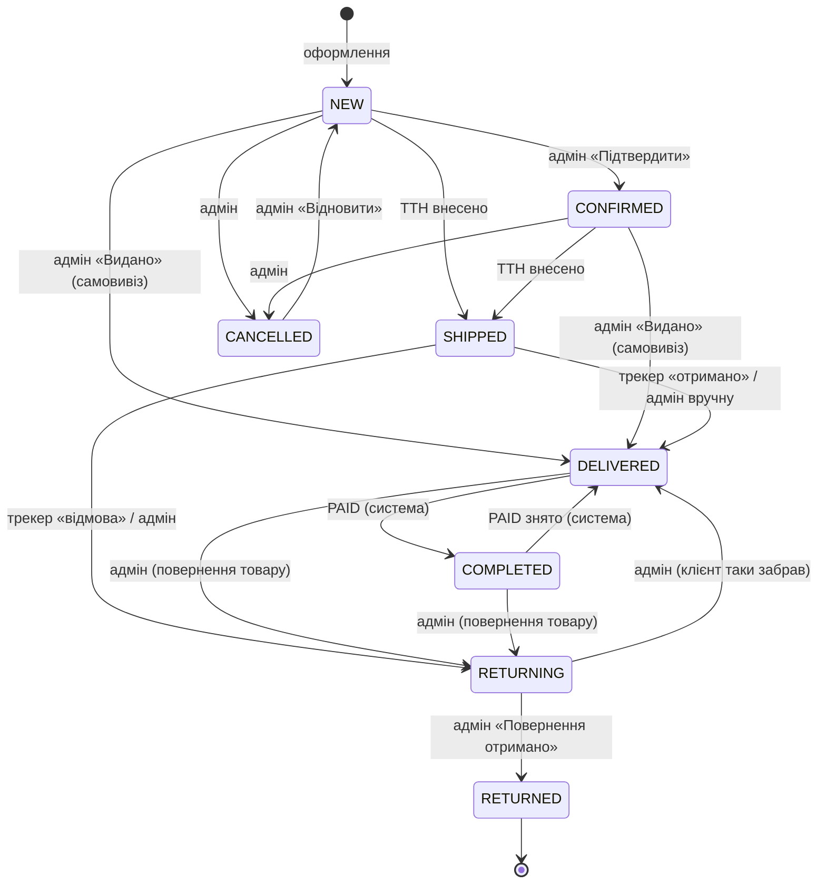
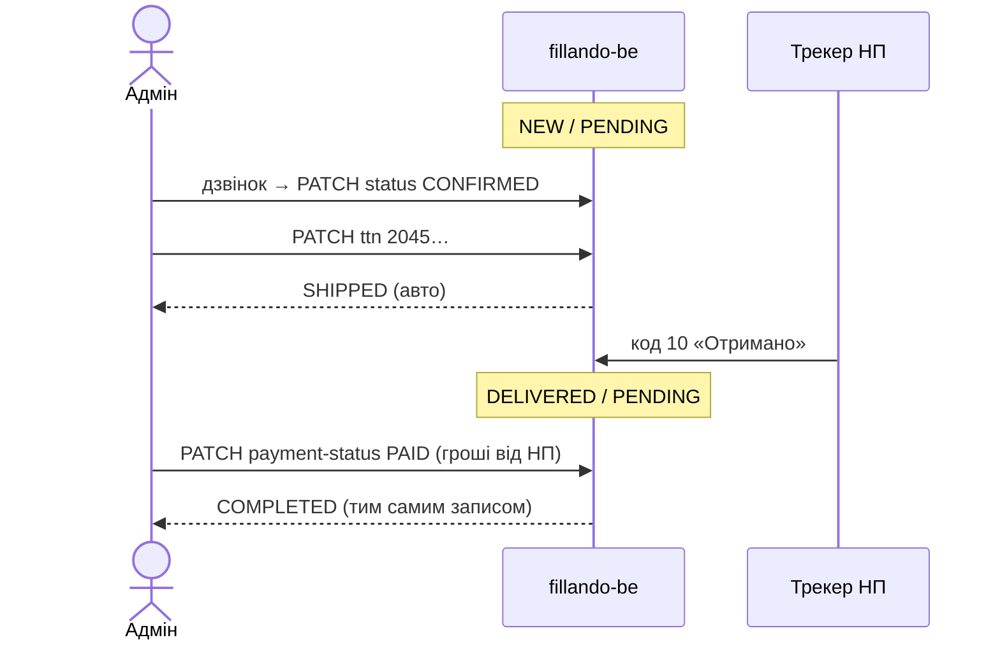

# TD-0011 — Спрощений життєвий цикл замовлення: статуси рухають факти

- **Status:** Implemented locally (2026-10-03) — гілки `feature/order-status-flow` у fillando-be і fillando-fe, не закомічено; міграція не прогнана. Пройшло рецензію коду (8 + 9 зауважень, усі виправлені; §8a)
- **Author:** vvbogdanovih
- **Reviewers:** власник погодив флоу 2026-10-03 (дефолти §8 прийняті без змін)
- **Date:** 2026-10-03 (аудит коду проти `feature/manual-order-discount` обох репо)
- **Components:** both (fillando-be, fillando-fe)
- **Related:** [state-machines](../architecture/state-machines.md) · [TD-0003](TD-0003-order-cancellation-payment-status.md) · [TD-0004](TD-0004-cash-on-delivery.md) · [TD-0009](TD-0009-customer-payment-method-change.md) · FRD §9.2 (відстеження НП), §9.4 (звіт продажів)

> **Уточнення власника 2026-10-03 (після реалізації):** `PROCESSING` не видаляється, а стає
> «Очікує підтвердження» *перед* `CONFIRMED` (адмін написав клієнту й чекає); адмінка — випадаючий
> список з неактивними недозволеними пунктами, а не кнопки. Деталі й що саме з тексту нижче
> втратило чинність — [§8a](#8a-відхилення-реалізації-від-тексту-вище). Решта дизайну в силі.

## 1. Summary

Сьогодні адмін вручну проклацує чотири статуси замовлення, два з яких дублюють те, що система
вже знає (ТТН, трекінг НП), а переходи взагалі не перевіряються: `PATCH /orders/:id/status`
приймає будь-яке значення. Цей TD лишає вручну одну дію — «Підтвердити» після дзвінка, —
прибирає статус `PROCESSING`, прив'язує `SHIPPED` до ТТН, а `COMPLETED` робить похідним від
«доставлено + оплачено». Усі записи статусу йдуть через одну таблицю переходів, і кожен
перехід лишає слід в історії замовлення.

## 2. Goals / Non-goals

**Goals**
- Флоу власника: `NEW` → дзвінок → **«Підтвердити»** → ТТН → посилка сама їде далі.
- Видалити `PROCESSING` (без побічних ефектів, крім блокування зміни способу оплати — див. §5.4.4).
- ТТН для `NOVA_POST`/`COURIER` автоматично переводить `NEW`/`CONFIRMED` → `SHIPPED`.
- `COMPLETED` виставляє тільки система: щойно замовлення `DELIVERED` і `PAID` — незалежно від
  того, що настало першим. Адмін не клацає «Виконано» і не чекає наступного проходу трекера.
- Новий статус `RETURNING` («Повертається»): відмова/припинення зберігання в НП більше не
  ховається під `SHIPPED`.
- Одна таблиця дозволених переходів у BE для всіх джерел (адмінка, ТТН, трекер, LiqPay);
  недозволений адмінський перехід → `409`.
- `status_history[]` на замовленні: хто, коли, з чого, на що.
- Адмінка: кнопки дозволених дій замість випадаючого списку з восьми статусів.

**Non-goals**
- Прибрати `FAILED` з `payment_status` (результат спроби, а не стан) — окремий TD, зачіпає
  логіку клейму LiqPay (TD-0009).
- Валідація переходів `payment_status` — лишається як є (TD-0003); сюди входить лише запис в історію.
- Листи покупцю про зміну статусу (напр. «Відправлено, ТТН …»). Тепер `SHIPPED` — це подія,
  тож це природне продовження, але окремою задачею.
- Повернення коштів / часткові повернення.

## 3. Background & context

Як працює зараз (код, не документація):

| Крок | Хто | `order_status` |
|---|---|---|
| Оформлення | система | `NEW` |
| Дзвінок, підтвердження | адмін, dropdown | → `CONFIRMED` |
| Збірка | адмін, dropdown | → `PROCESSING` |
| ТТН внесено (`setTtn`) | адмін | **без змін** |
| Віддали на пошту | адмін, dropdown | → `SHIPPED` |
| Отримано (НП 9/10/11/106) | трекер | `PAID` → `COMPLETED`, інакше → `DELIVERED` |
| Гроші за COD | адмін | `payment_status` → `PAID` |
| Наступний прохід трекера | трекер | `DELIVERED` → `COMPLETED` |

Проблеми:

1. **Переходи не валідуються.** `OrderService.updateOrderStatus` пише `dto.order_status` як є;
   `COMPLETED → NEW` чи `CANCELLED → SHIPPED` проходять (і друге ще й мовчки повертає
   `VOIDED → PENDING`). Таблиця в `state-machines.md` існує лише на папері.
2. **`PROCESSING` нічого не означає для системи.** Єдине місце, де він важить, —
   `PAYMENT_METHOD_CHANGEABLE_ORDER_STATUSES` (`NEW`, `CONFIRMED`): «від `PROCESSING` посилка може
   вже нести накладну COD». Але накладна з'являється разом із ТТН, а не зі статусом.
3. **ТТН не рухає статус** — подвійна робота, `SHIPPED` легко забути, і тоді замовлення з
   живою посилкою читається як «в обробці».
4. **`COMPLETED` = `DELIVERED` + `PAID`**, але збережений як окремий стан, який рахує лише трекер
   (`receivedOrderStatus`). Тому `DELIVERED` тримається в `TRACKED_ORDER_STATUSES` — щоб
   «доклацати» `COMPLETED` після того, як адмін поставив `PAID`, з затримкою до години.
5. **Відмова не видна.** Коди `102/103/105` дають лист адміну, статус лишається `SHIPPED`.
6. **Немає історії** — не видно, адмін, трекер чи LiqPay змінив статус.

Обмеження: Mongo standalone, транзакцій немає — усе, що пишеться разом, має бути одним
умовним `update` одного документа (так і є: статус + історія живуть в замовленні).

## 4. Requirements

**Функціональні**
- F1. Статуси: `NEW`, `CONFIRMED`, `SHIPPED`, `DELIVERED`, `COMPLETED`, `RETURNING`, `RETURNED`, `CANCELLED`.
- F2. Внесення ТТН у `NEW`/`PROCESSING`/`CONFIRMED` → `SHIPPED` **для будь-якого способу
  доставки**. Для інших статусів ТТН статус не змінює. *(Уточнено 2026-10-04: початково `PICKUP`
  був винятком, але в проді 23 з 39 «самовивозів» мають ТТН — оптовий покупець за рахунком, якого
  власник відправляє Новою Поштою; виняток лишав їх без трекера і без автозакриття.)*
- F3. Інваріант: `order_status ∈ {DELIVERED, COMPLETED}` ⇒ `COMPLETED` тоді й лише тоді, коли
  `payment_status = PAID`. Перевіряється після **кожного** запису будь-якого зі статусів.
- F4. Трекер: «отримано» → `DELIVERED` (далі F3); «відмова/припинено зберігання» → `RETURNING` + лист.
- F5. Адмін може робити лише переходи з §5.1 (стовпець «адмін»). Інакше
  `409 INVALID_STATUS_TRANSITION`. `COMPLETED` вручну не ставиться ніколи.
- F5a. → `RETURNED` при `payment_status ∈ {PENDING, FAILED}` ставить `VOIDED` (розширення TD-0003).
- F6. Кожна зміна `order_status` і `payment_status` дописує запис у `status_history`.
- F7. Відповідь адмінського `GET /orders/:id` містить `allowed_status_transitions` — FE не
  дзеркалить правило (той самий підхід, що `can_change_payment_method`).

**Нефункціональні**
- Усі автоматичні записи — умовні (guard на прочитаний `order_status`), як уже робить трекер.
- Міграція наявних замовлень ідемпотентна, без даунтайму.

## 5. Proposed design

### 5.1 Машина станів



Повна таблиця — одна константа `ORDER_TRANSITIONS` у
`src/modules/order/helpers/order-status.rules.ts`:

| З | В | Адмін | ТТН | Трекер | Інваріант F3 |
|---|---|:-:|:-:|:-:|:-:|
| `NEW` | `CONFIRMED` | ✓ | | | |
| `NEW`, `CONFIRMED` | `SHIPPED` | | ✓ | | |
| `NEW`, `CONFIRMED` | `DELIVERED` | ✓ лише `PICKUP` | | | |
| `NEW`, `CONFIRMED` | `CANCELLED` | ✓ | | | |
| `SHIPPED` | `DELIVERED` | ✓ (запасний шлях, коли трекер не бачить посилку) | | ✓ | |
| `SHIPPED` | `RETURNING` | ✓ | | ✓ | |
| `DELIVERED` ↔ `COMPLETED` | | | | | ✓ |
| `DELIVERED`, `COMPLETED` | `RETURNING` | ✓ | | | |
| `RETURNING` | `RETURNED` | ✓ | | | |
| `RETURNING` | `DELIVERED` | ✓ | | | |
| `CANCELLED` | `NEW` | ✓ | | | |

Свідомі рішення:
- **`SHIPPED → CANCELLED` заборонено.** Посилка вже в дорозі — це повернення (`RETURNING`), а не
  скасування. Щоб неоплачений повернений COD не висів `PENDING` вічно, крос-машинне правило
  TD-0003 розширюється: **→ `RETURNED` при `PENDING`/`FAILED` дає `VOIDED`**, так само як
  → `CANCELLED`. `PAID` не чіпається — адмін повертає гроші й ставить `REFUNDED` вручну.
- **`CANCELLED → NEW`, а не «в будь-який активний».** Відновлене замовлення проходить флоу знову;
  правило `VOIDED → PENDING` з TD-0003 лишається без змін.
- **Адмін не ставить `DELIVERED → COMPLETED`** — для цього є `PAID`.
- `DELIVERED → COMPLETED` для `PAID`-замовлення відбувається **тим самим записом**, яким
  настало друге з двох: трекер пише одразу `COMPLETED`, якщо вже `PAID`; `PATCH payment-status`
  на `DELIVERED`-замовленні пише `PAID` і `COMPLETED` разом.

### 5.2 Data model

`Order` (Mongoose):

```ts
order_status: OrderStatus            // enum без PROCESSING (після фази 2), + RETURNING
status_history: StatusHistoryEntry[] // default []

interface StatusHistoryEntry {
  field: 'order_status' | 'payment_status'
  from: string | null      // null для першого запису при створенні
  to: string
  at: Date
  actor: 'admin' | 'customer' | 'tracker' | 'gateway' | 'system'
  admin_id?: ObjectId      // для actor = 'admin'
  note?: string            // напр. «НП 103 Відмова одержувача», «ТТН 2045…»
}
```

Історія пишеться `$push` у тому самому `update`, що й `$set` статусу, тому атомарна без
транзакцій. Розмір не обмежуємо: на замовлення — одиниці записів.

Мітки: `RETURNING` — «Повертається» (BE `status-label.utils.ts`, FE обидва `orders.constants.ts`).

### 5.3 API / interfaces

Єдина точка запису — `OrderStatusService.transition(order, to, actor)` (або метод у
`OrderService`): перевіряє `ORDER_TRANSITIONS` для актора, застосовує F3, крос-машинне правило
TD-0003, формує `$set` + `$push status_history`, пише умовно на прочитаний `order_status`.
Через неї йдуть `updateOrderStatus`, `setTtn`, `updatePaymentStatus`,
`applyGatewayPaymentResult`, `DeliveryTrackingService`.

| Ендпоінт | Зміна |
|---|---|
| `PATCH /orders/:id/status` | Валідує перехід для актора `admin`. Недозволений → `409 { code: 'INVALID_STATUS_TRANSITION', from, to, allowed }`. `COMPLETED`/`PROCESSING` у DTO → `400`. Розскасування `CANCELLED → NEW` лишає побічний ефект TD-0003. Контролер передає id адміна з JWT |
| `PATCH /orders/:id/ttn` | Для `NOVA_POST`/`COURIER` у `NEW`/`CONFIRMED` додатково ставить `SHIPPED` (+ історія `note: 'ТТН …'`). Повертає оновлене замовлення, як і зараз |
| `PATCH /orders/:id/payment-status` | Після запису застосовує F3 (`DELIVERED`+`PAID` → `COMPLETED`; `COMPLETED` без `PAID` → `DELIVERED`). Пише історію |
| `POST /liqpay/callback` | `applyGatewayPaymentResult` застосовує F3 і пише історію з `actor: 'gateway'` |
| `GET /orders/:id` (адмін) | + `allowed_status_transitions: OrderStatus[]`, + `status_history` |
| `GET /orders/me*`, lookup | Без історії; `RETURNING` з'являється як нове значення |

OpenAPI (`openapi.json`) і Swagger-описи в `api-operation.constant.ts` оновлюються разом.

### 5.4 Key flows

#### 5.4.1 Нова Пошта, накладний платіж (типовий випадок)



#### 5.4.2 LiqPay, оплачено до дзвінка
`NEW/PAID` → «Підтвердити» → ТТН → `SHIPPED` → трекер «отримано» → одразу `COMPLETED`.

#### 5.4.3 Самовивіз
`NEW` → «Підтвердити» → клієнт прийшов → «Видано» → `DELIVERED` (або одразу `COMPLETED`, якщо
вже `PAID`) → готівка → `PAID` → `COMPLETED`.

#### 5.4.4 Блокування зміни способу оплати (TD-0009)
`PAYMENT_METHOD_CHANGEABLE_ORDER_STATUSES` лишається `[NEW, CONFIRMED]`, але міняється сенс:
раніше межею був «`PROCESSING`», тепер — «внесена ТТН» (ТТН ⇒ `SHIPPED`). Це точніше, ніж було:
накладна COD з'являється саме з ТТН. Оновлюється лише коментар у `payment-status.helpers.ts`
і текст у `api-operation.constant.ts`. FE (`OrderDetails.tsx`, `PAYMENT_CHANGEABLE_ORDER_STATUSES`)
без змін.

#### 5.4.5 Трекер
- `TRACKED_ORDER_STATUSES = [SHIPPED]` (після міграції `NEW`/`CONFIRMED` з ТТН уже не буває;
  `DELIVERED` більше не треба доганяти — F3 спрацьовує в момент `PAID`).
- `decideTracking`: «отримано» → `DELIVERED` (F3 підніме до `COMPLETED`); `102/103/105` →
  `RETURNING` + лист (одноразовість через `nova_post_alerted_code` зберігається); `2/3`
  (видалено / не знайдено — найчастіше помилка в ТТН) → лише лист, статус без змін.
- Guard лишається: умовний запис на прочитані `order_status` і `nova_post_ttn`.

### 5.5 Адмінка (fillando-fe)

`/admin/orders/[id]`: dropdown статусу замінюється рядком кнопок із
`allowed_status_transitions` (мітки дій, не статусів):

| Перехід | Кнопка |
|---|---|
| → `CONFIRMED` | «Підтвердити» (primary) |
| → `DELIVERED` з `NEW`/`CONFIRMED` | «Видано» |
| → `DELIVERED` з `SHIPPED` | «Позначити доставленим» (secondary) |
| → `DELIVERED` з `RETURNING` | «Клієнт забрав» |
| → `RETURNING` | «Повернення» |
| → `RETURNED` | «Повернення отримано» |
| → `CANCELLED` | «Скасувати» (destructive, з підтвердженням) |
| → `NEW` | «Відновити» |

Поле ТТН лишається на місці; після збереження бейдж стає «Відправлено» без додаткового кліку.
Нова картка «Історія» — список `status_history` (дата, «Статус: Підтверджено → Відправлено»,
актор: «Адмін» / «Нова Пошта» / «LiqPay» / «Покупець», примітка).

Список замовлень і фільтр звіту беруть значення з `orderStatusValues` — додається `RETURNING`,
прибирається `PROCESSING` (фаза 2).

### 5.6 Звіт продажів

`NON_REVENUE_STATUSES` у `report.builder.ts`: + `RETURNING` (поки посилка їде назад, це не
виручка; примітка звіту це вже пояснює для `RETURNED`). FRD §9.4 оновлюється.

## 6. Alternatives considered

- **Лишити `PROCESSING`, прибрати `CONFIRMED`.** Відхилено: дзвінок — реальна подія з людським
  рішенням, а «збираю» нічого не змінює ні для покупця, ні для системи.
- **Прибрати `COMPLETED` зовсім, обчислювати «закрито» на льоту.** Чистіше, але ламає фільтри
  адмінки, профіль покупця, звіт і наявні дані. Інваріант F3 дає те саме без міграції сенсу.
- **Валідація лише на FE (показувати тільки дозволені пункти).** Відхилено: API відкритий, а
  трекер і LiqPay пишуть повз UI. Правило має жити в BE, FE його лише відображає (F7).
- **Окрема колекція `order_events`.** Відхилено: без транзакцій запис статусу й події в різні
  колекції не атомарний; історія в документі замовлення — один `update`.

## 7. Cross-cutting concerns

- **Security:** `PATCH status`/`ttn`/`payment-status` лишаються ADMIN-only. `admin_id` в історії
  береться з JWT, не з тіла запиту. Історія не віддається покупцю.
- **Performance:** історія — одиниці записів на замовлення; список замовлень її не проектує.
- **Migration / compatibility** (Railway, гілка `production`):
  - **Фаза 1** — код, що читає `PROCESSING` (enum ще містить значення, позначене deprecated),
    але не дозволяє в нього переходів. Скрипт міграції (ідемпотентний, впорядкований, без транзакцій):
    1. `{ order_status: { $in: [NEW, CONFIRMED, PROCESSING] }, nova_post_ttn: { $nin: [null, ''] } }` → `SHIPPED` (без фільтра за способом доставки, див. F2);
    2. решта `PROCESSING` → `CONFIRMED`;
    3. `DELIVERED` + `PAID` → `COMPLETED`; `COMPLETED` без `PAID` → `DELIVERED`
       (останнє — лише звіт у лог для ручного розбору; автоматично не міняємо);
    4. кожен змінений документ отримує запис історії `actor: 'system', note: 'TD-0011 migration'`.
    Перед прогоном — dry-run з лічильниками по кожному кроку.
  - **Фаза 2** — прибрати `PROCESSING` з enum у BE (`enums.ts`) і FE (`orders.schema.ts` ×2,
    `orders.constants.ts` ×2), коли запит `{ order_status: 'PROCESSING' }` повертає 0.
  - Rollback фази 1: стара версія читає всі нові значення, крім `RETURNING` — його треба
    вручну повернути в `SHIPPED` перед відкатом (лічені документи).
- **Observability:** лог трекера вже пише `from → to`; історія замінює ручний розбір логів.
- **Testing:**
  - unit: `ORDER_TRANSITIONS` — таблиця з §5.1 як параметризований тест (кожна пара × актор);
    F3 у всіх чотирьох точках запису; `decideTracking` для `RETURNING`;
  - int-spec: `setTtn` → `SHIPPED` лише для `NOVA_POST`/`COURIER` і лише з `NEW`/`CONFIRMED`;
    гонка трекер vs адмін (guard); `order-payment-method.int-spec.ts` — замінити кейс
    `PROCESSING` на `SHIPPED`;
  - FE: кнопки з `allowed_status_transitions`, картка історії.

## 8. Open questions

1. **Трекати `RETURNING`?** Якщо після відмови НП усе ж повідомить «отримано» за тим самим ТТН
   (клієнт передумав і забрав), трекер міг би сам повернути `DELIVERED`. Повернення до
   відправника НП зазвичай оформлює новою ЄН, тож хибного «отримано» не очікуємо, але
   перевірено не на реальних посилках. **Дефолт:** не трекати, адмін тисне «Клієнт забрав».
2. **ТТН на непідтвердженому (`NEW`) замовленні** → одразу `SHIPPED`, пропускаючи
   «Підтвердити». **Дефолт:** дозволено — адмін міг підтвердити в месенджері й не клацнути.
3. **Видалення ТТН** API зараз не підтримує (`nova_post_ttn` `IsNotEmpty`). Якщо ТТН внесли
   помилково на не тому замовленні — `SHIPPED` назад не відкотиш. **Дефолт:** адмін вносить
   правильну ТТН (статус лишається `SHIPPED`) або скасовує через «Повернення → Повернення
   отримано». Якщо на практиці болітиме — окремий `DELETE /orders/:id/ttn` з `SHIPPED → CONFIRMED`.

## 8a. Відхилення реалізації від тексту вище

**Рішення власника 2026-10-03 (після реалізації), яке змінює §2, §5.1 і §5.5:**

- **`PROCESSING` не видаляється, а змінює зміст.** Було «В обробці» (підтверджено, збирається)
  після `CONFIRMED`; стало **«Очікує підтвердження»** — адмін написав клієнту і чекає відповіді —
  *перед* `CONFIRMED`. Флоу: `NEW → PROCESSING → CONFIRMED → ТТН → SHIPPED …`. Три статуси до
  відправки міняються вільно в будь-який бік. Фаза 2 (видалення enum-значення) скасована.
  Міграція переводить лише *старі* `PROCESSING` (без запису в `status_history`): з ТТН →
  `SHIPPED`, без — `CONFIRMED`.
- **Покупець може міняти спосіб оплати і в `PROCESSING`** — межа тепер «внесена ТТН»
  (`PAYMENT_METHOD_CHANGEABLE_ORDER_STATUSES = [NEW, PROCESSING, CONFIRMED]`), §5.4.4 відповідно.
- **Адмінка — випадаючий список, не кнопки.** Усі статуси видно, недозволені з поточного
  неактивні за `allowed_status_transitions`; `SHIPPED` і `COMPLETED` неактивні завжди. Без
  діалогів підтвердження. Старий бекенд без поля нічого не обмежує.
- **Міграційний скрипт у репо не зберігається.** Одноразовий, власник запускає його локально
  (`--dry-run`, потім справжній прогін, зі своїм `DATABASE_URL`) і видаляє. У репо лишаються лише
  правила переходу (§7) і цей запис.
- **Накладний платіж закриває трекер.** «Отримано» від НП для `COD` з оплатою `PENDING` ставить
  `PAID` і `COMPLETED` одним записом (`decideTracking` → `markPaid`): покупець заплатив на
  відділенні, це і є факт оплати. Скасовує правило §4 F4 / FRD «робот оплату не чіпає» — тепер
  воно діє для всіх способів, крім `COD`. Сценарій §5.4.1 скорочується: ручного `PAID` немає.

- **Трекер стежить не лише за `SHIPPED`** (§5.4.5): `TRACKED_ORDER_STATUSES = [NEW, CONFIRMED,
  PROCESSING, SHIPPED]`, щоб замовлення з ТТН, записані до міграції, не випали з трекінгу.
  Після міграції перші три з ТТН не трапляються; прибрати разом із `PROCESSING` у фазі 2.
- **Трекер пінить ще й `payment_status`** — від нього залежить, чи «отримано» дасть
  `DELIVERED` чи `COMPLETED`.
- **Відмова (`102/103/105`) рухає статус лише після листа.** Якщо лист не пішов, наступний прогін
  повторює і лист, і перехід — інакше `RETURNING` вивело б замовлення з трекінгу непоміченим.
- **Клейм повтору LiqPay (`FAILED → PENDING`) пишеться в історію pipeline-оновленням**
  (`updateWithPipeline`, `$cond` на збереженому `payment_status`) — тим самим атомарним записом,
  без попереднього читання. Mongoose 9 вимагає для цього окремої опції, тож у базовому
  репозиторії з'явився окремий метод.
- **Записи LiqPay-callback прив'язані до всього прочитаного стану** (метод, обидва статуси),
  бо несуть похідний `order_status`: інакше callback, що наздогнав трекер, міг би поставити
  `COMPLETED` поверх `RETURNING`. Промах → один перечит і повтор зі свіжого стану; другий
  промах — лише лог.
- **Поточний статус у запиті — no-op**, а не 409 (подвійний клік не помилка). Виняток —
  повторне `CANCELLED` на старому замовленні з `PENDING`: лікувальний перехід у `VOIDED`
  із TD-0003 збережено.
- **`ADMIN_SETTABLE_ORDER_STATUSES` виводиться з таблиці переходів**, тож `SHIPPED` (лише через
  ТТН) у DTO не приймається — 400, а не 409.
- **`GET /orders/:id` віддає `ships_on_ttn`** — підказка в адмінці про авто-`SHIPPED` береться
  з того самого правила, що й запис, а не дублюється на фронті.
- **Створення замовлення** пише в історію два перші записи (`from: null`, `actor: customer`).

## 9. Rollout

По два PR у кожному репо (один PR = один repo):

1. **BE PR-1** (фаза 1): `order-status.rules.ts` + `transition()`, `status_history`, `RETURNING`,
   авто-`SHIPPED` у `setTtn`, F3 у payment/gateway/трекері, `allowed_status_transitions`,
   скрипт міграції, OpenAPI.
2. **FE PR-1**: кнопки дій, картка історії, `RETURNING` у мітках/кольорах/схемах.
3. Порядок: деплой BE → dry-run → міграція → деплой FE. FE йде після BE, тож
   `allowed_status_transitions` у відповіді вже є і запасний dropdown не потрібен.
4. **BE PR-2 / FE PR-2** (фаза 2): прибрати `PROCESSING` з enum-ів.
5. Документація: `state-machines.md` (нова діаграма й таблиця, правило `RETURNED → VOIDED` у
   крос-машинному розділі, прибрати Note про відсутню валідацію), FRD §9.2 (флоу і трекер), §9.4 (`RETURNING` у звіті), глосарій.
