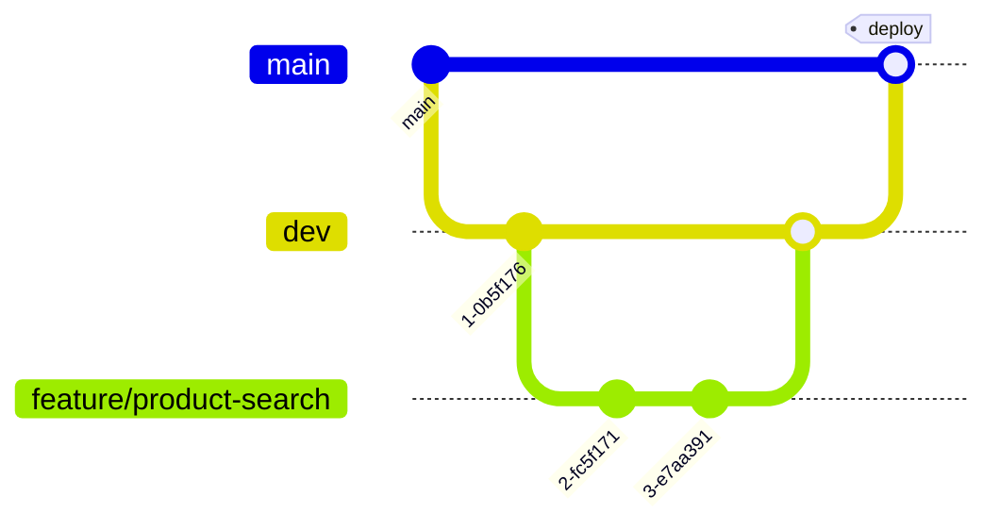

# Git Workflow

How we branch, commit, and merge across the Fillando repositories. Both
application components (`fillando-be`, `fillando-fe`) follow the same model.

## Branching model

`dev` is the integration branch — everyday work targets it. `main` stays
production-ready and receives `dev` only when we are about to deploy.

> GitHub's **default branch stays `main`** in both component repos. That only
> affects what a fresh clone lands on and what a new PR pre-selects as its base:
> when opening a PR, switch the base to `dev` yourself.



| Branch | Purpose | Created from | Merges into |
|--------|---------|--------------|-------------|
| `main` | Production-ready, always deployable; deploys run from here. | — | — |
| `dev` | Integration branch; target for all feature PRs. | `main` | `main` (release) |
| `feature/<slug>` | A single feature or task. | `dev` | `dev` |
| `fix/<slug>` | Bug fix. | `dev` | `dev` |
| `hotfix/<slug>` | Urgent production fix. | `main` | `main` **and** `dev` |

`hotfix/*` is the one exception: it is cut from `main` so the fix can ship
without waiting for `dev`, then merged into **both** branches so `dev` does not
lose it.

## Day-to-day flow

```bash
cd repos/fillando-be                    # or repos/fillando-fe
git checkout dev && git pull
git checkout -b feature/product-search  # start work
# ...commit...
git push -u origin feature/product-search   # open a PR into dev
```

1. Branch off `dev` **inside the component repo** — each component has its own
   remote and history.
2. Keep branches small and short-lived.
3. Open a Pull Request into `dev`. At least one review before merge.
4. Squash or rebase to keep history clean; delete the branch after merge.
5. **One PR = one repo.** Never mix backend and frontend changes in one PR.

## Releasing

```bash
git checkout main && git pull
git merge --no-ff dev
git push origin main
```

Deploy from `main`. Keep `main` linear-ish: `dev` is what absorbs the messy
history, `main` records releases.

## Commit messages

Use [Conventional Commits](https://www.conventionalcommits.org/):

```
<type>(<scope>): <short summary>
```

Common types: `feat`, `fix`, `docs`, `refactor`, `test`, `chore`, `ci`.
Scope is optional (the module/area). Examples:

```
feat(catalog): add product search with filters
fix(cart): merge guest cart on login
docs: update FRD with wholesale inquiries
```

## Pull Requests

- Target `dev` (`hotfix/*` targets `main`). GitHub pre-selects `main` as the
  base — change it to `dev` before opening.
- Describe **what** changed and **why**; link the related FRD section / TD / plan.
- Keep them reviewable — prefer several small PRs over one large one.
- CI must be green before merge.

## Meta repository

This meta repo uses a single `main` branch — it holds docs and tooling, not
application code, so it has no `dev`. Its commits use `docs:`, `scripts:`,
`chore:` prefixes.

`repos/` is git-ignored, so components are committed and pushed from inside their
own folders as usual. The branch each component is checked out to is declared in
[`repos.manifest`](../repos.manifest) (currently `dev` for both) and applied by
`scripts/checkout-all.sh`.
