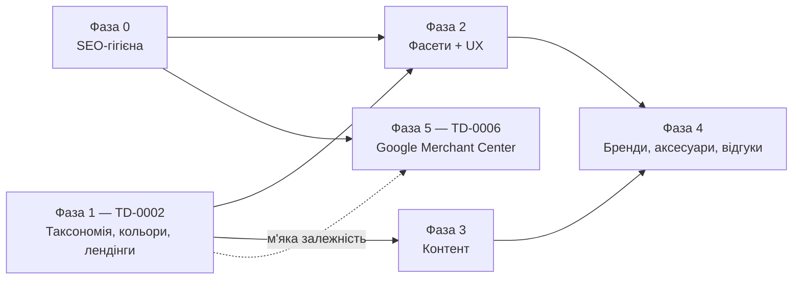

# Plan-0002 — Catalog SEO & UX roadmap

- **Status:** In Progress — Фази 0 і 1 написані й лежать у `dev` (Plan-0004),
  не задеплоєні; Фази 2–5 не розпочаті. Приймання — [Plan-0005](plan-0005-catalog-target-state.md)
- **Owner:** vvbogdanovih
- **Date:** 2026-08-17
- **Components:** both (fillando-be, fillando-fe)
- **Related:** [FRD §4.1, §4.3, §11, §18.3](../requirements/FRD.md),
  [TD-0002](../designs/TD-0002-catalog-taxonomy-and-landings.md),
  [ADR-0008](../adr/0008-frontend-stack.md),
  [TD-0005](../designs/TD-0005-catalog-category-isolation.md),
  [TD-0006](../designs/TD-0006-google-merchant-feed-and-structured-data.md)

> Це програмний роадмап на кілька фаз, а не звичайний implementation plan під один
> TD. Кожна фаза отримує власний TD перед реалізацією; TD-0002 покриває фазу 1.

**Стан фаз на 2026-09-05** (перевірено звіркою макета з кодом; деталі —
[Plan-0005 §3](plan-0005-catalog-target-state.md)):

| Фаза | TD | План | Стан |
|---|---|---|---|
| 0 — SEO-гігієна | — | Plan-0004 PR-3 | код у `dev`, не в проді |
| 1 — Таксономія, кольори, лендінги | TD-0002 Approved | Plan-0004 | код у `dev`; 5 міграцій не прогнані на проді; 14 лендінгів без тексту |
| 2 — Фасети і UX фільтрів | **немає** | **немає** | не розпочато, хоч елементи намальовані в макеті |
| 3 — Контент (блог) | немає | немає | не розпочато |
| 4 — Розширення каталогу | немає | немає | не розпочато |
| 5 — Google Merchant | TD-0006 **Draft** | **немає** | не розпочато; блокують 4 відкриті питання TD-0006 §8 |

---

## 1. Навіщо

Fillando зараз продає філамент, у планах — інші категорії витратників
(«Аксесуари»). Поточна структура каталогу одночасно блокує органічний трафік і
ускладнює вибір товару. Аудит обох репо (17.08.2026) виявив п'ять кореневих
проблем.

### 1.1 Найцінніші комерційні запити не мають URL

«PETG філамент», «PLA Silk», «ABS пластик для 3D принтера» існують лише як
query-параметри (`/filament?material=PETG`), а `generateMetadata` у
`fillando-fe/src/app/(root)/[category]/page.tsx` жорстко ставить canonical на
голу категорію:

```ts
const canonical = `${SITE_URL}/${category}`
```

Тобто весь середньочастотний попит зводиться до однієї сторінки `/filament`, яка
не може ранжуватись за 29 різними матеріалами одночасно.

### 1.2 Фільтр «Матеріал» — простиня з 29 значень

`AttributeFilter.tsx` рендерить плоский список чекбоксів без акордеона, пошуку,
лічильників, «показати ще» і чипів обраного. Значення (`PLA`, `PLA Silk`,
`PLA Matte Rainbow`, `PLA-CF`, `PETG-CF`, `ABS-GF`, `Wood PLA`, …) — це
насправді готова 3-вимірна таксономія (полімер × ефект × армування), зліплена в
один рядок.

### 1.3 Колір не фільтрується взагалі

`filter_options` будується з `product.attributes`
(`product-variant.repository.ts`, `filterOptionsPipeline`), а колір фізично живе
в `ProductVariant.v_value` — бо він змінюється між варіантами, а `attributes`
спільні для продукту. Найголовніший спосіб вибору філаменту недоступний.

Дані до того ж нестандартизовані: подекуди англійський оригінал виробника,
подекуди переклад, подекуди тільки переклад. Це видно навіть у внутрішніх доках
беку — `DATA_MODELS.md` показує `'Red'`, `PRICE_SHEET.md` — `"Червоний"`,
`CART_FLOW.md` — `"Чорна"`. Система вгадує «чи це колірна вісь» регексом:

```ts
const colorPatterns = [/колір/i, /цвіт/i, /color/i]   // product.service.ts
```

### 1.4 Немає куди класти органіку

Серед 17 модулів беку немає жодного контентного — ні статей, ні блогу.
Category не має полів `description` / `seo_title` / `meta_description`, тому
сторінка категорії рендерить лише `<h1>{category.name}</h1>` і нуль тексту.

### 1.5 Технічні SEO-дірки

| Проблема | Де | Наслідок |
|---|---|---|
| Пагінація — `<button onClick>`, не `<a href>` | `[category]/components/Pagination.tsx` | сторінки 2+ не краулятся |
| Навігація хардкодить `/filament` | `common/constants/navigation.constants.ts` | «Аксесуари» будуть сиротою |
| Видимих breadcrumbs на каталозі немає | `CatalogPage.tsx` — тільки JSON-LD | |
| Товарні breadcrumbs: 2 видимі проти 3 у JSON-LD | `ProductPage.tsx` | розсинхрон структурованих даних |
| Немає `ItemList`, `WebSite` + `SearchAction` | | втрачені rich results і sitelinks searchbox |
| Сортування є на беку, немає в UI | `sort=price_asc\|price_desc\|newest` | |
| Фасети не звужуються, без лічильників | `filterOptionsPipeline` ігнорує активні фільтри | «0 товарів» після кліку |
| `filter_type: 'range'` оголошений, не реалізований | `AttributeFilter.tsx` повертає `null` | діаметр/вага не фільтруються |
| Ренейм товару перегенеровує slug варіантів без 301 | `product.service.ts` | тиха втрата проіндексованих URL |

### 1.6 Немає виходу в Google Merchant Center (виявлено 01.09.2026)

Попри вже додану Product JSON-LD (offers, shippingDetails,
hasMerchantReturnPolicy — націлено на Google Merchant listings), жодного
продуктового фіда не існує, а наявна розмітка має помилки (`brand`
захардкожений на "Fillando" замість реального вендора, `availability`
ігнорує статус товару). Без фіда безкоштовні лістинги залежать від
нестабільного автоматичного краулінгу, а платні Shopping/Performance Max
кампанії взагалі неможливі.

---

## 2. Прийняті рішення

| Питання | Рішення |
|---|---|
| URL SEO-лендінгів | `/filament/pla` — підсегмент у межах категорії |
| Простиня матеріалів | Одразу розділити на кілька атрибутів + міграція |
| Органічний контент | Власний модуль статей у Mongo + адмінка |
| Назва кольору на сайті | «Чорний (Black)» — укр із EN-оригіналом |
| Slug після стандартизації кольорів | Перегенерувати без 301 |

Категорії в БД **лишаються плоскими**. Лендінг — це окрема сутність із
закріпленими фільтрами, а не повернення вкладеності, скасованої міграцією
`flatten-categories.js`.

---

## 3. Фази

### Фаза 0 — SEO-гігієна

Дешево, тільки `fillando-fe`, без змін даних і без залежності від інших фаз.
Можна робити паралельно з фазою 1.

- Пагінація: `<button onClick>` → `<Link href>`; `router.replace` → `push`
  (компонент спільний із `/search`).
- Self-canonical із `?page=N` для пагінованих сторінок замість схлопування на
  першу сторінку.
- Довільні комбінації фільтрів → `robots: noindex, follow`.
- Категорії в хедері й футері динамічно з `GET /categories`.
- Видимі breadcrumbs на каталозі; вирівняти товарні з JSON-LD.
- `ItemList` JSON-LD на каталозі, `WebSite` + `SearchAction` на головній.
- Sitemap: додати `/contacts`, `/offer`, `/returns`, `/privacy`, `/price-sheet`.
- UI сортування.

**Оцінка:** 1 PR у `fillando-fe`, ~1–2 дні.

### Фаза 1 — Таксономія, кольори, лендінги

Ядро роботи. Спроектовано в
[TD-0002](../designs/TD-0002-catalog-taxonomy-and-landings.md):

1. Похідні атрибути `polymer` / `finish` / `reinforcement` замість одного
   `material` у фільтрах.
2. Словник кольорів `colors` + `ProductVariant.color_id` + фільтр за
   `color_family` зі swatch-ами.
3. Колекція `landings` + роут `/{category}/{landing}` + плитки «Популярні види»
   замість простині.

**Оцінка:** 3 міграції, ~4 PR (2 be, 2 fe), ~1.5–2 тижні.

### Фаза 2 — Фасети і UX фільтрів

- Лічильники фасетів із виключенням власного виміру (стандартний патерн
  `$facet` per attribute) — щоб фасети звужувались і показували `(24)`.
- Реальні range-фільтри (діаметр, вага) + числове сортування значень (зараз
  `$toString` → лексикографія).
- Акордеон, пошук усередині фільтра при >10 значень, «показати ще», чипи
  обраного + «очистити все», sticky «Показати N товарів» на мобілці.

**Оцінка:** 2 PR, ~1 тиждень. Залежить від фази 1 (нові атрибути).

### Фаза 3 — Контент

- BE: модуль `article` (Mongo + Quill, як описи товарів), адмінка CRUD.
- FE: `/blog`, `/blog/[slug]`, ISR, `BlogPosting` JSON-LD.
- Перелінковка блог ↔ лендінги ↔ товари.
- Кандидати на старт: «PLA vs PETG vs ABS», «температура друку», «як зберігати
  філамент», «що таке CF-армування».

**Оцінка:** ~3 PR, ~1.5 тижня. Незалежна від фаз 1–2, крім перелінковки.

### Фаза 4 — Розширення каталогу

- Бренд-сторінки `/brands/[slug]` (Vendor зараз має лише `name` + `slug` — треба
  `logo`, `description`, SEO-поля).
- Категорія «Аксесуари» з власними `required_attributes`.
- Відгуки → `AggregateRating` для rich snippets.
- Словник атрибутів: зараз `key` виводиться з довільного `label` через
  `generateAttrKey`, тому друкарська помилка в лейблі плодить новий фасет.

**Оцінка:** окремий TD на кожен пункт.

### Фаза 5 — Google Merchant Center (фід + збагачені structured data)

Спроєктовано в
[TD-0006](../designs/TD-0006-google-merchant-feed-and-structured-data.md):

1. Новий бекенд-модуль `feed`: публічний Google Shopping XML-фід
   (`GET /feeds/google-shopping.xml`), з status=active варіантів, з
   custom labels для сегментації Shopping/PMax кампаній.
2. Нові поля: `ProductVariant.weight_g`, `Category.google_product_category`
   — per-variant/per-category, без глобальних припущень (TD-0005).
3. Виправлення й збагачення Product JSON-LD (fe): реальний `brand` замість
   захардкодженого "Fillando", коректний `availability` (враховує
   `status`), `sku`, `productGroupID`, обчислювана доставка за вагою
   замість фіксованих ₴97.
4. GA4-трекінг (`view_item`/`add_to_cart`/`begin_checkout`/`purchase`) на
   додачу до наявного Google Ads conversion pixel — під Performance Max.

**Оцінка:** 2 PR (be: модуль фіда + поля; fe: JSON-LD + tracking),
~1–1.5 тижні. М'яка залежність від Фази 1 (кольори/полімери збагачують
`color`/`material` у фіді й JSON-LD, але не блокують запуск — фід і
виправлення JSON-LD працюють на поточній схемі).

---

## 4. Прибирання боргу

**Закрито 2026-09-04 (Plan-0004, блок PR-6).** Перелік нижче лишається як запис
того, що виявилось насправді — він відрізнявся від того, що тут було написано.

Виправлено ще до Plan-0004, пізнішими комітами:

- [`architecture/domain-model.md`](../architecture/domain-model.md) — ER-діаграми
  з `subcategories[]` і `products.subcategory_id` уже не було; `wholesale_inquiries`
  і `payment_providers` уже були в таблиці.
- [`glossary.md`](../glossary.md) — «hierarchical grouping» і «category-path» уже
  прибрані.

`fillando-be/src/docs/DATA_MODELS.md` — **опис боргу тут був хибний**. Файл не
описував вбудованих `variants[]`: він з самого початку каже, що товар — це
«спільний заголовок» своїх варіантів, а slug, SKU, ціна й статус живуть в окремій
колекції. Реальна розбіжність, знайдена звіркою кожного `@Prop` із таблицями,
була інша: три колекції (`numbers`, `payment_details`, `payment_providers`) не
описані взагалі, а в `nova_post_warehouses` бракувало двох полів. Це виправлено
комітом `72d5075` у fillando-be.

---

## 5. Послідовність



Фази 0 і 1 стартують паралельно. Фаза 3 може йти паралельно з фазою 2.
Фаза 5 не блокує і не блокується фазами 2–4 — може стартувати одразу після
Фази 0, з м'якою залежністю від Фази 1 (кольори/полімери збагачують фід,
але не є передумовою запуску).

**Пам'ятати:** один PR = один репо. План, що зачіпає обидва компоненти, все одно
розпадається на окремі PR.
