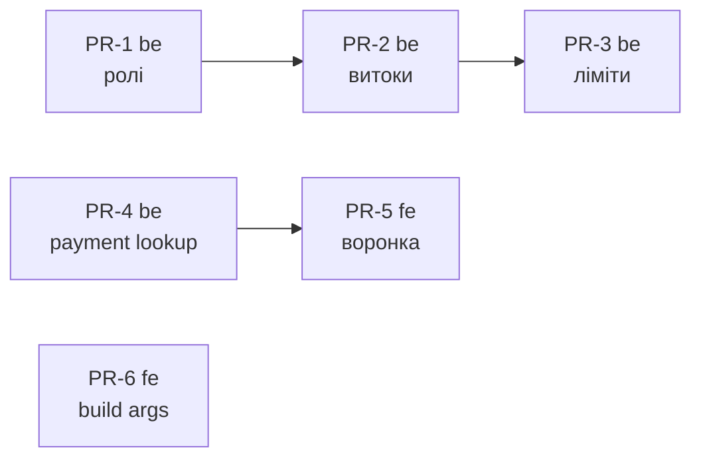

# Plan-0003 — Вразливості та воронка замовлення

- **Status:** In Progress — код усіх 23 задач змерджено в `dev` обох репо (2026-09-04); лишається реліз `dev → main`, деплой і ручні LiqPay-сценарії
- **Owner:** vvbogdanovih
- **Date:** 2026-09-03
- **Target:** перед стартом Plan-0004
- **Design (TD):** немає — це виправлення дефектів. Джерела:
  `fillando-be/src/docs/todo/AUDIT_CRITICAL.md`, `AUDIT_HIGH.md`,
  `RBAC.md`; аудити 2026-09-01 і 2026-09-03; ride-along-перелік
  [TD-0007 §6](../designs/TD-0007-dealer-api.md)
- **Components:** both (fillando-be, fillando-fe)

## 1. Objective

Закрити дефекти, що експлуатуються **сьогодні**: авторизаційні дірки,
витоки комерційних даних і два дефекти воронки замовлення, які коштують
виручки й отруюють дані Google Ads.

Definition of done:
- звичайний акаунт покупця не має прав на каталог, вендорів і медіа
  (перевірено тестом);
- `prom_id`/`vendor_product_sku` не віддаються **жодним** публічним
  ендпоінтом;
- неопубліковані товари не потрапляють ні в публічний прайс, ні в sitemap;
- невдала оплата карткою не виглядає як успішна і **не** шле конверсію;
- помилка створення замовлення показується біля свого поля.

## 2. Scope

Усі дефекти підтверджені читанням коду. Найсерйозніший задокументований
у самому репо як `AUDIT_CRITICAL #3` і не виправлений.

Поза скоупом: `enableVersioning`, Redis, staging — див.
[TD-0007 §2](../designs/TD-0007-dealer-api.md).

## 3. Work breakdown

### PR-1 (be) — авторизація

| # | Task | Component | Depends on | Status |
|---|------|-----------|------------|--------|
| 1 | `RolesGuard` + `@Roles(Role.ADMIN)` на write-ендпоінти **каталогу**: `POST /products`, `PATCH`/`DELETE /products/:id`, увесь variant CRUD, `PATCH` зображень варіанта, `POST /products/validate`. Порядок guard-ів обов'язково `(JwtAuthGuard, RolesGuard)` | fillando-be | — | ☑ |
| 2 | Те саме на **вендорів**: `POST /vendors`, `PATCH /vendors/:id`, `DELETE /vendors/:id` (`vendor.controller.ts:33-48` — зараз голий `JwtAuthGuard`). Це та сама позиція `AUDIT_CRITICAL #3` | fillando-be | — | ☑ |
| 3 | Те саме на `UploadController` — зараз лише `JwtAuthGuard`, тож USER може стерти весь медіа-каталог у S3 (без версіонування = незворотно). Аватар не є upload-флоу (у профілі це текстове поле URL), окремого USER-шляху не треба | fillando-be | — | ☑ |
| 4 | `Roles` decorator: `(...roles: Role[])` замість `string[]` — зараз `@Roles('ADMN')` з опечаткою компілюється і **мовчки закриває ендпоінт для всіх** | fillando-be | — | ☑ |
| 5 | `RolesGuard`: default-deny замість `return true` при відсутніх метаданих + null-check на `user.role` | fillando-be | 4 | ☑ |
| 6 | Integration-тест guard-ів через `Test.createTestingModule` з мок-`Reflector` і мок-`user`: USER→403, ADMIN→200 на кожному ендпоінті задач 1–3 | fillando-be | 1, 2, 3 | ☑ |
| 7 | Оновити `src/docs/RBAC.md` (прибрати AUDIT_CRITICAL #3 зі списку відкритих) і `AUDIT_CRITICAL.md` | fillando-be | 6 | ☑ |

> **Задача 6 — навмисно integration, не e2e.** E2E-харнесу в репо не
> існує: `test/jest-e2e.json`, на який посилається скрипт `test:e2e`,
> **відсутній**, `mongodb-memory-server` не в залежностях, e2e-специфікацій
> нема жодної. Збирати харнес — окрема робота, і вона не має блокувати
> реліз PR-1 того ж дня. Тригер на повний e2e-харнес: перша задача, де
> потрібен реальний JWT-cookie флоу.

### PR-2 (be) — витоки даних

| # | Task | Component | Depends on | Status |
|---|------|-----------|------------|--------|
| 8 | Прибрати `prom_id` і `vendor_product_sku` з публічних поверхонь: `findVariantWithProduct` (`GET /products/by-slug/:slug`) — allowlist-проєкцією (`toPublicVariant`), не фільтрацією в мапері; `GET /products/:id/variants` і `GET /products/:id/variants/:variantId` — **закрити під ADMIN** (їх використовує лише адмінка, якій ці поля потрібні для редагування) | fillando-be | — | ☑ |
| 9 | `findPriceSheet` — `{ $match: { status: ACTIVE } }` першою стадією; заразом прибрати з її `$project` поля `prom_id` і `vendor_product_sku` (сьогодні від витоку рятує лише мапер у сервісі — крихко) | fillando-be | — | ☑ |
| 10 | `findAllSlugs` — фільтр `status: ACTIVE` (джерело `sitemap.xml`). **Єдиний власник цієї задачі — цей PR**; TD-0006 §9 крок 2 її не робить | fillando-be | — | ☑ |
| 11 | `GET /products` — **закрити під ADMIN** (`JwtAuthGuard, RolesGuard`). Рішення, не альтернатива: ендпоінт віддає всі продукти без пагінації й без фільтра статусу, а публічна вітрина його не використовує (каталог іде через `/products/catalog`) | fillando-be | 1 | ☑ |
| 12 | Перевірити відповіді на відсутність `prom_*` автотестом (snapshot на публічні проєкції) — інакше наступний споживач проєкції зіллє їх знову | fillando-be | 8, 9 | ☑ |

> Заміна рядкових літералів `'active'` на `ProductStatus.ACTIVE` в
> агрегаціях **свідомо перенесена** у [Plan-0004](plan-0004-catalog-phase-1.md)
> PR-2: три з чотирьох літералів лежать у `findCatalogItems` /
> `priceRangePipeline` / `filterOptionsPipeline`, які Plan-0004 переписує.
> Робити це тут = гарантований конфлікт злиття.

### PR-3 (be) — обмеження частоти

**Головне обмеження дизайну:** глобальний ліміт по IP **заріже власний
SSR-трафік**. `serverFetch` фронтенду ходить у бек через публічний домен
з одного контейнера, тож для беку весь рендер каталогу, товарів і sitemap
виглядає як один клієнт. Гірше: `serverFetch` схлопує будь-який не-ok у
`null`, тож `429` віддав би сторінку «нічого не знайдено» **зі статусом
200**, а ISR закешував би її на годину.

| # | Task | Component | Depends on | Status |
|---|------|-----------|------------|--------|
| 13 | `@nestjs/throttler` — підключити, але **без глобального ліміту на публічні GET каталогу** | fillando-be | — | ☑ |
| 14 | Секретний заголовок від фронтенду (`X-Internal-Token`, новий env у обох репо) → `@SkipThrottle` для SSR-трафіку. Альтернатива, якщо простіше: allowlist IP фронт-контейнера | both | 13 | ☑ |
| 15 | Ліміти по ендпоінтах із **конкретними числами**: `/auth/login` і `/auth/register` — 10/хв на IP; `/auth/refresh` — 30/хв; `/products/price-sheet` — 20/хв; `/discount-coupons/validate` — 20/хв; `POST /orders` — 10/хв | fillando-be | 13, 14 | ☑ |
| 16 | `serverFetch` має **кидати** на 429/5xx, а не повертати `null` — інакше тротлінг отруює ISR-кеш порожніми сторінками | fillando-fe | — | ☑ |

### PR-4 (be) + PR-5 (fe) — воронка замовлення

Пріоритет як у PR-1: це не гігієна, це втрачена виручка й фальшиві дані
в Google Ads, на яких навчається Smart Bidding.

| # | Task | Component | Depends on | Status |
|---|------|-----------|------------|--------|
| 17 | Публічний lookup статусу оплати за `order_number` + токеном (мінімальна відповідь: `order_number`, `payment_status`, `total`). Без нього фронт не має джерела правди: `result_url` LiqPay однаковий для успіху й відмови, а всі `GET /orders/*` під JWT — гість не прочитає | fillando-be | — | ☑ |
| 18 | Оновити `src/docs/` опис LiqPay-флоу | fillando-be | 17 | ☑ |
| 19 | Сторінка успіху: для `payment=LIQPAY` тягне фактичний `payment_status` (задача 17). `PAID` → «Дякуємо» + конверсія; `FAILED`/`VOIDED` → «Оплата не пройшла» з кнопкою повторити (`initLiqpayCheckout` уже існує); `PENDING` → «очікуємо підтвердження», **без конверсії** | fillando-fe | 17 | ☑ |
| 20 | Конверсія в Google Ads відправляється **лише** на `PAID` | fillando-fe | 19 | ☑ |
| 21 | `onError` створення замовлення: лишити `toast.error`; `setError('coupon_code')` викликати **тільки** для купон-специфічної помилки. Скрол до першої помилки | fillando-fe | — | ☑ |
| 22 | Перенести `clearAfterOrder()` **після** успішного `initLiqpayCheckout`, а сам виклик обгорнути в try/catch із тостом і посиланням на оплату замовлення. Зараз кошик чиститься до редіректу, і якщо виклик впаде — `onError` мутації не спрацює (він ловить лише `mutationFn`), користувач лишається на чекауті з порожнім кошиком і PENDING-замовленням | fillando-fe | — | ☑ |

### PR-6 (fe) — інфраструктурний фікс

| # | Task | Component | Depends on | Status |
|---|------|-----------|------------|--------|
| 23 | `docker-compose.prod.yml`: прокинути `NEXT_PUBLIC_GOOGLE_ADS_ID` і `NEXT_PUBLIC_GOOGLE_ADS_PURCHASE_CONVERSION` у build `args`. **Власник задачі — цей план**; [TD-0006 §5.5](../designs/TD-0006-google-merchant-feed-and-structured-data.md) додає до того самого блоку ще дві змінні пізніше, конфлікту немає | fillando-fe | — | ☑ |

## 4. Sequencing & milestones

- **PR-1 — реліз того ж дня.**
- PR-4/PR-5 — паралельно з PR-2/PR-3, інша частина коду.
- PR-3 задача 16 (`serverFetch`) мусить бути **задеплоєна разом або
  раніше** за задачу 15, інакше перший 429 отруїть ISR-кеш.
  *Знято 2026-09-05: перевіркою FE `main` і `dev` підтверджено, що жоден
  серверний fetch не ходить у throttled ендпоінт, тож реліз у порядку
  BE → FE безпечний.*
- PR-6 незалежний.

Свідомо **не** входить, але блокує адмінку дилерських ключів
([TD-0007](../designs/TD-0007-dealer-api.md) фаза 1b):
`AUDIT_CRITICAL #1` (`secure: false` хардкодом на cookie),
`AUDIT_HIGH #11` (немає CSRF), і баг, де access-cookie отримує `maxAge`
**рефреш**-токена, тобто живе значно довше за сам JWT.

## 6. Testing & rollout

- **PR-1** — integration-тест guard-ів (задача 6) обов'язковий до мержу.
  Без нього регресія повернеться непоміченою: `JwtAuthGuard` на місці, і
  ендпоінт «виглядає захищеним».
- **PR-2** — snapshot-тест публічних проєкцій (задача 12); ручна
  перевірка, що `/price-sheet` і `sitemap.xml` не містять неактивних SKU.
- **PR-3** — після деплою переконатись, що SSR-рендер каталогу не отримує
  429 (перевірити логи на `warn`), і що `/auth/login` віддає 429 з
  `Retry-After` на 11-й спробі.
- **PR-5** — три ручні сценарії LiqPay: успішна оплата, відхилена карта,
  закриття вікна на середині. Перевірити в Google Ads, що конверсія
  прийшла **лише** в першому.
- Міграцій даних немає, схема не змінюється. Rollback = revert.
- `yarn spec:export` після PR-1, PR-2 і PR-4.

## 7. Open questions

Немає. Єдине питання закрито власником 2026-09-03:

1. ~~**`GET /products/price-sheet` — лишаємо публічним?**~~ **Рішення:
   лишаємо публічним як є** (з точними залишками) — це живий екран сайту.
   Формат відповіді можна адаптувати пізніше під нові рішення (напр.
   дилерське API, [TD-0007 §8, питання 3](../designs/TD-0007-dealer-api.md)).
   Для price-sheet у цьому плані — лише задачі 9 і 15.

Файловий чекліст виконання —
[plan-0003-execution-checklist.md](plan-0003-execution-checklist.md).
