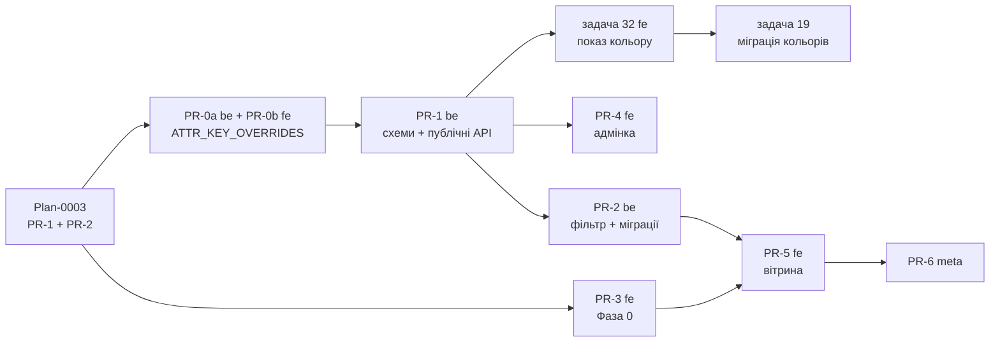

# Plan-0004 — Каталог: таксономія, кольори, лендінги (Фази 0 + 1)

- **Status:** In Progress — код усіх 42 задач змерджено в `dev` обох репо (2026-09-04), не задеплоєно; лишається реліз `dev → main` і прогін міграцій на проді за `fillando-be/src/docs/CATALOG_RELEASE.md`. `☑` = код у `dev`; `☐ прод` = скрипт готовий і прогнаний на копії бази, на продакшні ще не запускався
- **Owner:** vvbogdanovih
- **Date:** 2026-09-03
- **Target:** ~2–2.5 тижні після Plan-0003
- **Design (TD):** [TD-0002](../designs/TD-0002-catalog-taxonomy-and-landings.md)
  (Approved) · контракт ізоляції — [TD-0005](../designs/TD-0005-catalog-category-isolation.md)
- **Components:** both (fillando-be, fillando-fe)
- **Roadmap:** [Plan-0002](plan-0002-catalog-seo-roadmap.md) Фази 0 і 1

## 1. Objective

Замінити «простиню» з 29 матеріалів на чотири короткі фільтри плюс
«Котушка в комплекті», зробити колір фільтрованим і стандартизованим,
увести 14 SEO-лендінгів і закрити технічні SEO-дірки Фази 0.

Definition of done:
- на `/filament` працюють фільтри `polymer`/`finish`/`reinforcement`/
  `series`/`spool_included` — і `material` **прибрано** з
  `required_attributes`;
- працює swatch-фільтр кольору, назви показуються як «Чорний (Black)»;
- `/filament/pla-silk` віддає 200 з власним H1 і контентом; `draft`-лендінг
  недоступний публічно;
- сторінки 2+ каталогу краулятся.

## 2. Scope

Обсяг, ризики й альтернативи — у [TD-0002](../designs/TD-0002-catalog-taxonomy-and-landings.md).
Тут лише розбиття на PR-и й порядок.

**Передумова: [Plan-0003](plan-0003-security-hardening.md) PR-1 і PR-2
змерджені та задеплоєні.** Причина не формальна: Фаза 0 (PR-3, задача 26)
додає `/price-sheet` у sitemap, а Plan-0003 PR-2 прибирає звідти
чернетки — інакше ми проіндексуємо витік.

## 3. Work breakdown

### PR-0a (be) + PR-0b (fe) — БЛОКЕР, робиться першим

Два окремі PR-и (правило «один PR = один репо»). Без них міграція PR-2
запише ключі, які перше ж збереження товару в адмінці знищить —
див. [TD-0002 §5.2.1](../designs/TD-0002-catalog-taxonomy-and-landings.md).

| # | Task | Component | Depends on | Status |
|---|------|-----------|------------|--------|
| 1 | `ATTR_KEY_OVERRIDES` у `generateAttrKey` — мапа лейбл→ключ ДО транслітерації, 5 пар (`Тип пластику`→`polymer` … `Котушка в комплекті`→`spool_included`). Одна правка закриває всі три виклики | fillando-be | — | ☑ |
| 2 | Unit-тест на всі 5 пар — поломка мовчазна, без тесту регресію помітять лише через провал фільтра на проді | fillando-be | 1 | ☑ |
| 3 | Міграція `normalize-attr-keys.js`: перейменувати вже наявні в базі `k` під тими самими лейблами (`seriia`→`series` тощо), якщо такі є. Оверрайди **не лікують ретроспективно** | fillando-be | 1 | ☑ |
| 4 | Задокументувати мапу в `fillando-be/CLAUDE.md` | fillando-be | 1 | ☑ |
| 5 | Дзеркало тієї самої мапи в `toAttrKey` (`common/utils/slug.utils.ts`) + запис у `fillando-fe/CLAUDE.md`. Без дзеркала адмінка вважає атрибут «кастомним» і досіває порожній дубль | fillando-fe | — | ☑ |

### PR-1 (be) — схеми, модулі, публічні ендпоінти

| # | Task | Component | Depends on | Status |
|---|------|-----------|------------|--------|
| 6 | Схема `Color` (`name_en` unique, `name_uk`, `slug`, `family`, **`hex_stops: string[]`** 1–6, `order`) + модуль + admin CRUD. Валідація: масив непорожній, кожен елемент `#RRGGBB` | fillando-be | — | ☑ |
| 7 | `PATCH /colors/:id` при зміні `family` робить backfill `color_family` на всіх варіантах цього кольору **в тій самій транзакції** (вимога TD-0002 §5.2.2 — поле денормалізоване) | fillando-be | 6, 9 | ☑ |
| 8 | Схема `Landing` (`category_id`, `slug` unique у межах категорії, `h1`, `title`, `meta_description`, `intro_html`, `bottom_html`, `faq[]`, `filters`, `price_min/max`, `image`, `order`, `status`) + модуль + admin CRUD | fillando-be | — | ☑ |
| 9 | `ProductVariant.color_id` + `color_family` (денормалізовано) + індекс `{ category_id, status, color_family }` | fillando-be | — | ☑ |
| 10 | **Публічні** read-ендпоінти (TD-0002 §5.3): `GET /colors`, `GET /landings?category_id=`, `GET /landings/slug/:categorySlug/:landingSlug`, `GET /landings/slugs`. Усі **фільтрують `status: 'active'`** — інакше відтворюємо той самий дефект, що Plan-0003 закриває для товарів | fillando-be | 6, 8 | ☑ |
| 11 | Санітизація `intro_html`/`bottom_html`/`faq` на записі. **Взірця в репо немає** — описи товарів не санітизуються; тож це нова залежність (`sanitize-html`) + спільний хелпер, який заразом варто застосувати до описів товарів | fillando-be | 8 | ☑ |
| 12 | `color: { name_uk, name_en, family, hex_stops }` у відповідях `findVariantWithProduct`, `findCatalogItems`, `findPriceSheet` — замість `pickColor`. **Блокер для задачі 19**: без цього міграція перемикає весь український магазин на англійські назви | fillando-be | 9 | ☑ |
| 13 | `yarn spec:export` | fillando-be | 6, 8, 9, 10, 12 | ☑ |

### PR-2 (be) — фільтрація й міграції

| # | Task | Component | Depends on | Status |
|---|------|-----------|------------|--------|
| 14 | `color_family` у резервованих ключах `getCatalog` — інакше параметр піде в `attrFilters` і не зматчить нічого | fillando-be | 9 | ☑ |
| 15 | Гілка фільтра `color_family` у `findCatalogItems` + `color_options` у відповіді. Заразом — заміна 4 літералів `'active'` на `ProductStatus.ACTIVE` (перенесено з Plan-0003, щоб не було конфлікту злиття в цій же функції) | fillando-be | 14 | ☑ |
| 16 | `derive-material-taxonomy.js` — dry-run на копії прод-бази → рев'ю `taxonomy-report.json` → прод. Захисна нормалізація: зняти суфікс `Refill` перед лукапом | fillando-be | PR-0a | ☐ прод |
| 17 | Оновити `required_attributes` категорії «Філамент»: **прибрати `material`**, додати `polymer`/`finish`/`reinforcement`/`series` (вимога TD-0002 §5.2.1, останній абзац). `material` лишається в даних як маркетингова назва | fillando-be | 16 | ☐ прод |
| 18 | `backfill-spool-included.js` — усім товарам без атрибута → `Так`; **одним батчем** із додаванням `spool_included` у `required_attributes` (рядок у фільтрі без backfill збреше, бо `$elemMatch` не ловить відсутність) | fillando-be | 17 | ☐ прод |
| 19 | `seed-colors.js` → `normalize-variant-colors.js` на копії → **ручний розбір** `color-report.json` → прод. Зберігати `v_value_legacy` на один реліз, писати `slug-map.json` | fillando-be | 6, 9, **12, 27** | ☐ прод |
| 20 | `seed-landings.js` — 14 лендінгів; контентні лишаються `draft`, доки не написано текст | fillando-be | 8, 16, 18 | ☐ прод |

### PR-3 (fe) — Фаза 0, SEO-гігієна

| # | Task | Component | Depends on | Status |
|---|------|-----------|------------|--------|
| 21 | Пагінація: `<button onClick>` → `<Link href>`, `router.replace` → `push`. **Компонент спільний із `/search`** — перевірити обидва споживачі | fillando-fe | — | ☑ |
| 22 | Self-canonical із `?page=N`; довільні комбінації фільтрів → `robots: noindex, follow` | fillando-fe | — | ☑ |
| 23 | Категорії в хедері й футері динамічно з `GET /categories` | fillando-fe | — | ☑ |
| 24 | Видимі breadcrumbs на каталозі; товарні вирівняти з JSON-LD (2 видимі проти 3 у розмітці) | fillando-fe | — | ☑ |
| 25 | `ItemList` JSON-LD на каталозі, `WebSite` + `SearchAction` на головній; UI сортування (`sort=` на беку вже є) | fillando-fe | — | ☑ |
| 26 | Sitemap: `/contacts`, `/offer`, `/returns`, `/privacy`, `/price-sheet` | fillando-fe | **Plan-0003 #9, #10** | ☑ |
| 27 | Виправити `logo` в Organization JSON-LD (вказує на неіснуючий `/logo.png` → Google отримує 404); додати `contactPoint`/`sameAs`/`address` з наявних констант; `noindex` на `/checkout` і `/checkout/success` | fillando-fe | — | ☑ |

### PR-4 (fe) — адмін-екрани

| # | Task | Component | Depends on | Status |
|---|------|-----------|------------|--------|
| 28 | Словник кольорів: список + діалог із динамічним `hex_stops` (додати/видалити/перетягнути), прев'ю swatch за правилом «1 стоп — суцільний, 2+ — градієнт, `multicolor` — conic» | fillando-fe | PR-1 | ☑ |
| 29 | **Вибір кольору у формі варіанта товару** — без цього адмін не може проставити `color_id` новому товару, і денормалізований `color_family` розійдеться. Заразом бек має проставляти `color_family` на записі варіанта | both | PR-1 | ☑ |
| 30 | Лендінги: список + форма (адреса, заголовки з лічильниками символів, два Quill-поля, FAQ як динамічний масив, закріплені фільтри з лічильником товарів, публікація) | fillando-fe | PR-1 | ☑ |
| 31 | Пункти меню `Catalogue → Colors, Landings` | fillando-fe | 28, 30 | ☑ |

### PR-5 (fe) — вітрина

| # | Task | Component | Depends on | Status |
|---|------|-----------|------------|--------|
| 32 | **Показ кольору як «Чорний (Black)»** у `displayName`, `<title>`, перемикачі варіантів і рядку атрибута — усе це сьогодні читає `v_value` напряму (5 місць). Мусить бути задеплоєно **до** прогону задачі 19 на проді | fillando-fe | 12 | ☑ |
| 33 | `ColorFilter` зі swatch-кружечками; фон виводиться з `hex_stops`, тож компонент не треба чіпати при появі кольору на 5 точок | fillando-fe | PR-2 | ☑ |
| 34 | Роут `[category]/[landing]` — SSR, `pinnedFilters` у `CatalogPage`; закріплені фільтри не знімаються, додаткові роблять сторінку `noindex, follow` | fillando-fe | PR-2, 21 | ☑ |
| 35 | Невідомий **або `draft`** лендінг → `notFound()` + `robots: noindex` у `generateMetadata` (стрімлена відповідь комітить 200 раніше, ніж `notFound()` встигає) | fillando-fe | 34 | ☑ |
| 36 | Canonical для `/filament?polymer=PLA` → `/filament/pla`, `noindex, follow` — рядок із таблиці індексації TD-0002 §5.4, якого не покриває задача 22 | fillando-fe | 34 | ☑ |
| 37 | Плитки «Популярні види» на сторінці категорії | fillando-fe | PR-2 | ☑ |
| 38 | `sitemap.ts` додає лендінги (`/landings/slugs`, лише `active`) | fillando-fe | PR-2, 26 | ☑ |
| 39 | Callout `ATTR_NOTES` над кнопкою купівлі для `spool_included: Ні (рефіл)` — **над**, не в описі: опис рендериться нижче CTA | fillando-fe | PR-2 | ☑ |

### PR-6 (meta) — доки

| # | Task | Component | Depends on | Status |
|---|------|-----------|------------|--------|
| 40 | Оновити FRD §4.1, §4.3, §11, §18.3; додати `colors` і `landings` у `architecture/domain-model.md` | meta | PR-5 | ☑ |
| 41 | Виправити Plan-0002 §4: `domain-model.md` і `glossary.md` уже приведені до плоских категорій пізнішими комітами; реальний залишок боргу — лише `fillando-be/src/docs/DATA_MODELS.md` (описує embedded `variants[]`, яких у схемі немає) | meta | — | ☑ |
| 42 | Власне прибирання того боргу: переписати `DATA_MODELS.md` під фактичну схему | fillando-be | 41 | ☑ |

## 4. Sequencing & milestones

**Три критичні порядки, які не можна порушити:**

1. **PR-0a перед задачею 16.** Інакше міграція запише ключі, які перше
   збереження товару знищить.
2. **Задачі 12 і 32 задеплоєні перед задачею 19.** Міграція записує
   `v_value = color.name_en`; сьогодні `v_value` рендериться напряму в
   5 місцях, тож без цих двох задач прод у момент міграції перемикається
   на англійські назви кольорів — прямо проти вимоги «Чорний (Black)».
3. **PR-3 перед PR-5.** Вони переписують ті самі файли: задача 21 змінює
   контракт `Pagination` з колбека на `<Link href>`, а `CatalogPage`
   (який PR-5 розширює `pinnedFilters`) його імпортує. Це не «паралельно»
   — це послідовно.

PR-3 стартує одночасно з PR-0a (обидва не залежать один від одного), але
**задача 26 чекає на Plan-0003 PR-2**.

Контент лендінгів пишеться вручну через адмінку після PR-4 і до
активації в PR-5: лендінг без тексту лишається `draft`.

## 6. Testing & rollout

- **PR-0a** — unit на 5 пар ключів. Найдешевший тест у плані й найдорожча
  його відсутність.
- **Міграції (16, 18, 19)** — суворо: dry-run на **копії прод-бази** →
  рев'ю звіту → прод. Незматчені значення не пропускаються тихо, а йдуть
  у `taxonomy-report.json` / `color-report.json` для ручного розбору.
- **Перед задачею 19 на проді** — переконатись, що задачі 12 і 32 в
  проді (див. §4, порядок 2). Це найризикованіший крок плану.
- Rollback кольорів — `v_value_legacy` + `slug-map.json`.
  **Slug варіантів змінюються без 301** — рішення власника, не
  ре-літигувати.
- Unit: нормалізатор кольорів (синоніми, регістр, зайві слова), маппер
  `material → (polymer, finish, reinforcement, series)`, рендер swatch із
  1/2/5 стопів.
- Integration: `findCatalogItems` із `color_family`; комбінація
  закріплених і користувацьких фільтрів; порожня видача; публічні
  landing-ендпоінти не віддають `draft`.
- e2e/ручне: `/filament/pla-silk` → 200 з коректним canonical;
  невідомий і `draft` лендінг → 404 + `noindex`; закріплений фільтр не
  знімається в UI; кожен із 14 лендінгів дає непорожню видачу.

## 7. Open questions

Немає — усі 9 продуктових питань TD-0002 закриті (§8 того документа).

Питання, що лишаються відкритими в **інших** документах і цей план не
блокують: 4 питання [TD-0006 §8](../designs/TD-0006-google-merchant-feed-and-structured-data.md)
(Фаза 5), 2 питання [TD-0005 §8](../designs/TD-0005-catalog-category-isolation.md),
4 питання [TD-0007 §8](../designs/TD-0007-dealer-api.md) (відкладено).
