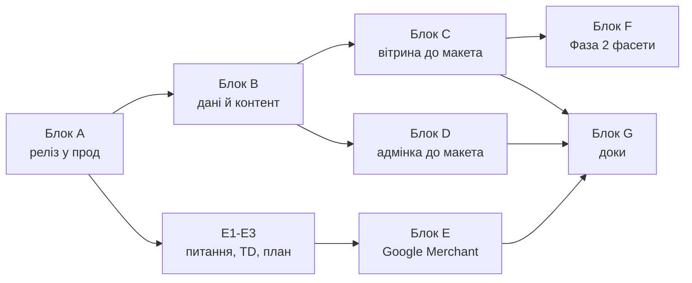

# Plan-0005 — Цільовий стан каталогу: трекер приймання

- **Status:** In Progress
- **Owner:** vvbogdanovih
- **Date:** 2026-09-05
- **Target:** макет «Оновлений каталог Fillando» повністю в проді
- **Design (TD):** [макет цільового стану](https://claude.ai/code/artifact/d6200740-5fe3-4edc-9461-b4fdf1ad08f0) ·
  [TD-0002](../designs/TD-0002-catalog-taxonomy-and-landings.md) ·
  [TD-0005](../designs/TD-0005-catalog-category-isolation.md) ·
  [TD-0006](../designs/TD-0006-google-merchant-feed-and-structured-data.md)
- **Components:** both (fillando-be, fillando-fe)

---

## 1. Навіщо цей документ

Це не план робіт, а **визначення готовності**. Він існує тому, що звіти про
прогрес почали звучати як фініш: «код змерджено», «гілка мержиться чисто»,
«готові до релізу» — при тому, що покупець не бачить із макета нічого.

Одиниця готовності — не гілка, не PR і не план, а **екран із макета, який
працює в проді на реальних даних**. Доки трекер не зелений, робота не
завершена, і жоден звіт не має права називати її завершеною.

Макет складається з чотирьох джерел змін (артборд «Огляд змін»):

| Джерело | Що приносить | Де спроєктовано |
|---|---|---|
| **TD-0002** | таксономія, словник кольорів, 14 лендінгів, рефіл | TD-0002 → Plan-0004 |
| **Фаза 0** | SEO-гігієна: пагінація, breadcrumbs, сортування, sitemap | Plan-0002 §3 → Plan-0004 |
| **TD-0006** | Google Merchant: фід, вага, бренд, GA4, архівний товар | TD-0006 (Draft) → плану немає |
| **Аудит** | воронка замовлення + security | Plan-0003 |

---

## 2. Чотири стани, які не можна плутати

| Стан | Значення | Скільки зараз |
|---|---|---|
| `код у dev` | написано й змерджено в `dev`, покупець не бачить | 60 із 212 обіцянок (28%) |
| `у проді` | `dev → main` задеплоєно | **0** |
| `дані готові` | міграції прогнані на проді, контент написаний | **0** |
| `видно покупцю` | усе разом; лише це рахується | **0** |

Звірка макета з кодом виконана 2026-09-05: 8 незалежних аудиторів по кластерах
екранів, кожен звіт перевірено окремим скептиком (22 корекції, 35 проґавлених
обіцянок дописано). Розкладка 212 обіцянок: **60 закрито в коді**, 67 зроблено
частково, 56 не розпочато, 29 упираються в дані, а не в код.

---

## 3. Матриця приймання — 14 екранів макета

`%` — частка обіцянок екрана, повністю закритих у коді на `dev`.
**У проді жоден екран не досягнутий**, бо реліз не робився.

| # | Екран | Код на dev | Головне, чого бракує |
|---|---|---|---|
| 1 | Категорія `/filament` | 36% | плитки «Популярні види» без крапки й лічильника; фільтрів немає до міграції; лічильники товарів; чипи над сіткою |
| 2 | Лендінг `/filament/pla-silk` | 43% | усі 14 лендінгів — чернетки без тексту → сторінка віддає 404; компонування (вступ під H1, дві картки) |
| 3 | Сторінка товару | 15% | бренд виробника, доставка за вагою, `sku`/`productGroupID`, swatch-перемикач, курована таблиця характеристик |
| 4 | Товар-рефіл | 11% | рефіл — варіант усередині чужого товару, не окремий товар; бейдж, ціна спуленого, посилання |
| 5 | Архівний товар | 20% | `by-slug` віддає 404 на ARCHIVED; окремого режиму сторінки немає |
| 6 | Чекаут: помилки | 38% | складська помилка не привʼязана до позиції, англійською, без скролу до неї |
| 7 | Оплата не пройшла | 50% | «обрати інший спосіб оплати» веде на контакти; «товари зарезервовані» — неправда |
| 8 | Адмінка: кольори | 28% | список замість таблиці; немає колонок Slug, Порядок, **Варіантів** |
| 9 | Діалог кольору | 44% | split-view замість модалки, немає підказок під полями |
| 10 | Адмінка: лендінги | 33% | немає колонок «Товарів» і «Контент» — саме тих, що показують незаповнені |
| 11 | Лендінг: редагування | 56% | одна колонка замість двох, немає секцій, пар «Атрибут/Значення», поля зображення |
| 12 | Нові поля у формах | **0%** | `weight_g` і `google_product_category` не існують у жодному репо |
| 13 | Статус Google-фіда | **0%** | модуля `feed/` немає, екрана немає, GA4-подій немає |
| 14 | Огляд змін | 18% | зведення чотирьох блоків; закрито лише те, що закрито нижче |

---

## 4. Блоки залишкової роботи

Кожен блок можна свідомо зняти з обсягу — але знімає **власник**, і тоді пункт
викреслюється з макета. Мовчазне «не зробили, бо дрібниця» тут заборонене.

Порядкові деталі кожного пункту з доказами в коді — у
[додатку](plan-0005-appendix-gap-list.md): усі 152 незакриті обіцянки, згруповані
за екранами макета.

### Блок A — Вивести в прод те, що вже написано

Без цього блоку решта не має сенсу: увесь код Plan-0003 і Plan-0004 лежить у
`dev` і не працює. Процедура — [`CATALOG_RELEASE.md`](../../repos/fillando-be/src/docs/CATALOG_RELEASE.md).

| # | Дія | Хто | Блокує |
|---|---|---|---|
| A1 | Перевірити real-IP у Nginx Proxy Manager (прод за Cloudflare — інакше ліміти спільні для всіх) | власник | A2 |
| A2 | `dev → main` fillando-be + перевірки після деплою | власник | усе |
| A3 | `dev → main` fillando-fe + перевірки після деплою | власник | A4, B |
| A4 | Міграції однією командою: `node scripts/migrations/run-catalog-migrations.js --dry-run`, потім без прапорця; крок кольорів окремо через `--colors-only` після A3. Відрепетирувано на дампі прода 2026-09-05, ланцюг проходить і сходиться | власник | Блок B |
| A5 | Ручні LiqPay-сценарії в sandbox (4 штуки) | власник | приймання екрана 7 |

### Блок B — Дані й контент

Код без цих даних не показує нічого нового. Жодна з цих робіт не покрита
задачею в наявних планах — це головна причина, чому «код готовий» ≠ «працює».

| # | Дія | Обсяг | Наслідок, поки не зроблено |
|---|---|---|---|
| B1 | ~~Написати~~ тексти написані й лежать у `scripts/migrations/landing-copy.js`, застосовує їх крок 3f. Сторінка для рецензії: https://claude.ai/code/artifact/85680548-363b-4021-939b-4bebf26e7621 Лишається: прочитати, виправити й опублікувати по одному | M | усі 14 адрес віддають 404, доки лендінги не опубліковані |
| B2 | ~~Розібрати 49 написань~~ 48 із 49 покриті словником (56 → 103 записи), перевірено на дампі: 83% → **99%**. Лишились два варіанти «Candy», їх розсудить лише людина за фото | S | два варіанти невидимі для swatch-фільтра |
| B3 | ~~Винести рефіл вручну~~ автоматизовано міграцією `split-refill-products.js` (крок 3c). Лишається переписати опис нового товару, він успадкований від батьківського | S | без прогону міграції екран 4 неможливий, `/filament/refill` матчить 0 |
| B4 | ~~Проставити Матеріал вручну~~ автоматизовано міграцією `fix-known-data-defects.js` (крок 3a): матеріал і тип `category_id` виправляються разом | — | закрито |
| B5 | Розвести дублікати «Candy» FL-000157 / FL-000162 | S | товар Kingroon PLA Silk Rainbow неможливо перейменувати (409) |
| B6 | ~~Дубльований `finish`~~ це не дефект даних: багатозначні виміри так і задумані, і лендінги на них спираються. Виправляти треба форму адмінки, див. блок D | — | перенесено в D |
| B7 | Перейменувати товари під короткі назви макета («Sunlu PLA Silk») | L | H1 і картки лишаються довгими SEO-рядками; тягне зміну слагів без 301 |

### Блок C — Довести вітрину до макета

Розрив між тим, що написано, і тим, що намальовано. Не покрито жодним планом.

| # | Дія | Обсяг |
|---|---|---|
| C1 | Формат «Чорний (Black)» скрізь, де видно колір: картка каталогу, кошик, лист, прайс (зараз лише сторінка товару) | M |
| C2 | Плитки «Популярні види»: кольорова крапка, лічильник товарів, коротка назва, «Ще N видів», поле `image` | M |
| C3 | Лічильник товарів біля H1 і рядок «Знайдено N за фільтром «Чорний»» | S |
| C4 | Чипи активних фільтрів над сіткою: назва виміру, іконка замка на закріплених, знімні для решти | M |
| C5 | Swatch-перемикач кольору на сторінці товару, над кнопкою купівлі, а не під нею | M |
| C6 | Курована таблиця характеристик: allowlist + фіксований порядок, «Котушка в комплекті» першим | M |
| C7 | Людські підписи значень фільтрів («Вуглеволокно (CF)» замість «CF») | S |
| C8 | Компонування лендінга: вступ під H1, дві картки внизу, сітка на всю ширину без сайдбара | M |
| C9 | Рефіл: бейдж «Без котушки» на фото, ціна спуленого варіанта, клікабельне посилання на нього | M |
| C10 | Сітка в 4 колонки на xl | S |

### Блок D — Довести адмінку до макета

| # | Дія | Обсяг |
|---|---|---|
| D1 | Кольори: таблиця замість списку; колонки Slug, Порядок, per-stop чипи | M |
| D2 | Колонка «Варіантів» у словнику кольорів — агрегація по `color_id` (BE + FE); без неї 49 написань розбирати наосліп | M |
| D3 | Лендінги: колонки «Товарів» і «Контент» — саме вони показують, де тексту ще немає | M |
| D4 | Лендінги: людські назви атрибутів у чипах замість сирих ключів | S |
| D5 | Форма лендінга: дві колонки, секції, пари «Атрибут / Значення», поле зображення плитки | M |
| D6 | Заборонити публікацію лендінга з 0 товарів | S |
| D7 | Заголовки екранів, пояснювальні абзаци, підказки під полями, бейджі «нове» | S |

### Блок E — Фаза 5: Google Merchant (TD-0006)

**Не розпочато. 36 обіцянок макета, 0 закритих.** Два екрани макета (12 і 13)
існують лише на папері, плюс половина сторінки товару.

| # | Дія | Хто |
|---|---|---|
| E1 | Відповісти на 4 відкриті питання TD-0006 §8 (див. §6 нижче) | власник |
| E2 | TD-0006 Draft → рецензія → Approved | обидва |
| E3 | Написати plan-0006 за TD-0006 §9 (15 кроків) | — |
| E4 | Реалізація: `weight_g`, `google_product_category`, модуль `feed/`, XML-фід, GA4, бренд, доставка за вагою, архівний товар 200, екран статусу фіда | — |
| E5 | Операційні кроки в кабінетах Google: Search Console, Merchant Center, GA4, Ads-лінк, PMax | власник |

### Блок F — Фаза 2: фасети і UX фільтрів

Намальована на артборді категорії (акордеон, «показати ще», лічильники «(24)»,
чипи «очистити все», sticky-кнопка на мобілці, range-фільтри), але **не має ні
TD, ні плану**. Або пишемо TD і план, або власник свідомо викреслює ці елементи
з макета.

### Блок G — Документація і закриття планів

| # | Дія |
|---|---|
| G1 | FRD не знає про половину Plan-0003: немає «429», «Retry-After», `orders/lookup`, «Оплата не пройшла». Оновити після A2/A3 |
| G2 | FRD §10 (адмінка, товари) не знає про `color_id` і нову форму атрибутів |
| G3 | Синхронізувати `docs/plans/README.md` зі статусами самих планів |
| G4 | TD-0003 → `Implemented` (реалізовано); TD-0005 і TD-0006 провести через рецензію до `Approved` |
| G5 | Закрити Plan-0003 і Plan-0004 за правилом CONTRIBUTING (Status Done → оновити FRD → видалити файли) — лише після приймання, не після мержу |

---

## 5. Послідовність

Блок A — послідовний і робить його власник. Блоки C і D можна вести паралельно
з B, але приймати їх можна лише на живих даних. Блок E не блокує C/D і навпаки.

---

## 6. Рішення власника, які блокують роботу

| # | Питання | Що блокує |
|---|---|---|
| 1 | `custom_label_2` (бакет маржі) буде публічно видимий у фіді — залишаємо? | E3 |
| 2 | Вагові діапазони доставки: реальний лише якір ~1.3 кг / ₴97, решта — плейсхолдери | E4, C-доставка |
| 3 | Конкретний `google_product_category` (id + path) для «Філамент» | E4 |
| 4 | Архівний товар: 200 + `Discontinued` чи простий 404? Зараз код віддає 404 — це суперечить макету | екран 5 |
| 5 | ~~Рефіл~~ вирішено: розділяє міграція 3c, репетиція на одноразовій базі пройдена | закрито |
| 6 | Блок F (Фаза 2) — лишається в макеті чи викреслюємо? | F |
| 7 | B7 (перейменування товарів під короткі назви) — робимо? Тягне зміну слагів без 301 | B7, екран 1 і 3 |

---

## 7. Правило звітності

Записане також у [`CLAUDE.md`](../../CLAUDE.md) мета-репо, щоб діяло в кожній сесії.

- Слова «готово», «завершено», «фінал» — тільки з явною вузькою областю
  («PR-3 готовий»). Ніколи про роботу загалом, доки §3 не зелений.
- Кожен звіт про прогрес починається з позиції в §3, а не з обсягу коду.
- `код у dev` ≠ `у проді` ≠ `дані готові` ≠ `видно покупцю`.
- Цей файл оновлюється разом із кожним прийнятим блоком; він видаляється
  останнім, коли всі 14 екранів зелені в проді.
