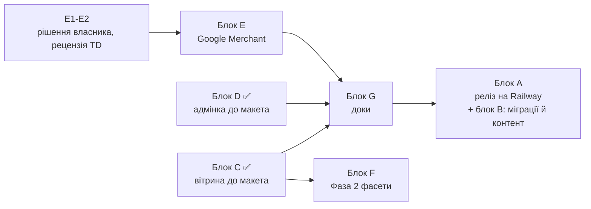

# Plan-0005 — Цільовий стан каталогу: трекер приймання

> Оновлення інструментів, 2026-09-11: одноразові скрипти переходу каталогу та `yarn migrate*` видалено після виконання. Згадки нижче описують історичний план. Актуальні інструменти й відновлення історичного коду: [список скриптів](../../repos/fillando-be/scripts/README.md).

- **Status:** In Progress — код блоків C, D, E, F, G6, H1, **I** у `dev`; **у проді 0 з 14 екранів**. Блок I (список незалежного аудиту) закритий у коді 2026-09-08/09 за словом власника «код на 100 % перед деплоєм» — 22 коміти, усі перевірки зелені, не запушено. Далі не код: приймання екранів на dev, реліз (блок A), дані на проді (A4), контент (B1/B3), кабінети Google (E5). Ціль розгортання — Railway, гілка `prod`
- **Owner:** vvbogdanovih
- **Date:** 2026-09-05
- **Target:** макет «Оновлений каталог Fillando» повністю в проді
- **Design (TD):** [макет цільового стану](https://claude.ai/code/artifact/d6200740-5fe3-4edc-9461-b4fdf1ad08f0) ·
  [TD-0002](../designs/TD-0002-catalog-taxonomy-and-landings.md) ·
  [TD-0005](../designs/TD-0005-catalog-category-isolation.md) ·
  [TD-0006](../designs/TD-0006-google-merchant-feed-and-structured-data.md)
- **Components:** both (fillando-be, fillando-fe)

---

## 1. Навіщо цей документ

Це не план робіт, а **визначення готовності**. Він існує тому, що звіти про
прогрес почали звучати як фініш: «код змерджено», «гілка мержиться чисто»,
«готові до релізу» — при тому, що покупець не бачить із макета нічого.

Одиниця готовності — не гілка, не PR і не план, а **екран із макета, який
працює в проді на реальних даних**. Доки трекер не зелений, робота не
завершена, і жоден звіт не має права називати її завершеною.

Макет складається з чотирьох джерел змін (артборд «Огляд змін»):

| Джерело | Що приносить | Де спроєктовано |
|---|---|---|
| **TD-0002** | таксономія, словник кольорів, 14 лендінгів, рефіл | TD-0002 → Plan-0004 |
| **Фаза 0** | SEO-гігієна: пагінація, breadcrumbs, сортування, sitemap | Plan-0002 §3 → Plan-0004 |
| **TD-0006** | Google Merchant: фід, вага, бренд, GA4, архівний товар | TD-0006 (Approved 2026-09-06) → [Plan-0006](plan-0006-google-merchant.md) |
| **Аудит** | воронка замовлення + security | Plan-0003 |

---

## 2. Чотири стани, які не можна плутати

| Стан | Значення | Скільки зараз |
|---|---|---|
| `код у dev` | написано й змерджено в `dev`, покупець не бачить | **119 із 152 рядків додатка (78%)** на 2026-09-08; з них 31 — і дані на dev. Решта 5 рядків — не код: 3 доки після релізу (G), 1 релізний день (A4), 1 кабінети Google (E5) |
| `у проді` | `dev → main` задеплоєно | **0** |
| `дані готові` | міграції прогнані на проді, контент написаний | **0** на проді. На dev — весь ланцюг з 11 кроків прогнано 2026-09-07, словник кольорів звірено з інвойсами, серія Basic (§3); у додатку це стан **дані на dev** |
| `видно покупцю` | усе разом; лише це рахується | **0** |

Звірка макета з кодом виконана 2026-09-05: 8 незалежних аудиторів по кластерах
екранів, кожен звіт перевірено окремим скептиком (22 корекції, 35 проґавлених
обіцянок дописано). Розкладка 212 обіцянок: **101 закрито в коді**, 46 зроблено
частково, 36 не розпочато, 29 упираються в дані, а не в код. Сорок один пункт
зрушено після звірки: блок D (адмінка кольорів і лендінгів) і блок C (вітрина).
**Оновлення 2026-09-06:** блок E (Plan-0006), G6, H1 і два пункти чекауту зрушили ще 31
обіцянок; за додатком тепер **135 закрито в коді** (64%), 28 частково, 19 не розпочато,
29 упираються в дані. **Того ж вечора блок F (Фаза 2 фільтрів) закрито в коді** за TD-0008 і
Plan-0007 — ще 3 обіцянки: **138 закрито в коді** (65%), 28 частково, 16 не розпочато (кабінети
Google та те, що чекає на рішення власника, §6), 29 упираються в дані. Поіменно — у додатку, з позначкою **код у dev**.
**Оновлення 2026-09-08 — переглянуто кожен рядок додатка проти коду й dev-бази:** 152 рядки,
**119 у коді** (78%), з них **31 «дані на dev»** (міграції 2026-09-07 закрили те, що чекало на дані:
таксономія, кольори 293/293 зі словником 122, рефіл, ваги, 14 лендінгів із текстами). Сімнадцять
рядків виявились застарілими з 2026-09-05 (breadcrumbs, FAQ-редактор, архів, фід, бренд і доставка на
сторінці товару, степер кількості) — код був. Чотири справжні хвости макета закрито D8 (fe `d0dbc52`):
«Показано N з M» — пошук у таблицях, підзаголовок діалогу кольору й правило стопів, «Google Feed»
верхньорівнево, власний текст VOIDED. Ті, що були «наполовину свідомо» («Показано N з M», плитка
зображення), закриті — D8 і C2. Лишається 5 рядків, і жоден із них не код: три доки після релізу
(блок G), релізний день (A4: dry-run проти проду), кабінети Google (E5).

**Незалежний аудит того ж дня (2026-09-08, свіжі очі).** Перегляд вище робив той самий агент, що
писав код, тому власник попросив звірку свіжими очима. 17 агентів (6 аудиторів + 6 скептиків +
критик повноти + 4 доперевірки), яким заборонили читати трекер і додаток; 324 обіцянки макета,
194 підтверджено доказом у коді. Результат — блок I у §4 і розділ «Незалежний аудит коду
2026-09-08» у додатку: **великих кодових прогалин у макеті немає**, натомість 21 справжній дефект
(з них 8 у рядках, які додаток уже вважав закритими), 17 розбіжностей формулювань і одна наскрізна
прогалина поза макетом — ревалідація кешу вітрини покриває лише лендінги. Механічні перевірки
зелені: BE 949 юніт + 73 інтеграційні, FE 436, `tsc --noEmit` і прод-збірка FE.
**Позиція трекера не змінилась: у проді 0.** Аудит нічого не закриває і нічого не відкочує — він
дав перелік, за яким власник вирішив, що робити.

**Того ж вечора власник відповів: «реліз не головне, головне щоб код був закритий на 100 %, тільки
тоді я буду заливати».** Блок I закритий у коді за 2026-09-08/09: 22 коміти (по 11 у кожному репо),
чотири хвилі по неперетинних файлах, повна перевірка після кожної. Розкладка — у §4, блок I.
Тестів додано: BE +335 (949 → 1284), FE +131 (436 → 567). **І це так само не рухає число «у проді»:**
код у `dev`, релізу не було, і рядки I-40…I-44 блоку впираються не в код, а в релізний день, дані
на проді й кабінети Google.

---

## 3. Матриця приймання — 14 екранів макета

`%` — частка обіцянок екрана, повністю закритих у коді на `dev`, станом на звірку
2026-09-05; поіменний стан кожного пункту живе в додатку й точніший за це число.
**У проді жоден екран не досягнутий**, бо реліз не робився.

**Дані на dev — 2026-09-07 (за словом власника):** повний ланцюг `yarn migrate --include-colors`
застосовано на dev-базі: 11 кроків, два проходи, другий без змін, `yarn migrate:verify` exit 0.
Підсумок: 44 товари (рефіл окремим товаром), 301 варіант, 293/293 варіантів на осі кольору вказують на
словник (105 записів на той момент; 122 після звірки з інвойсами того ж дня), 43 товари з короткими назвами, 301 slug перегенеровано без 301-редиректів,
0 колізій, 0 порушень цілісності. На локальній збірці FE проти dev-бекенда: короткі назви й swatch-и
на `/filament`, обидва «Candy» з різними кольорами, рефіл на власній сторінці, sitemap із новими slug-ами
після `POST /api/revalidate {"resource":"landings"}`. **Тепер усі 14 екранів можна приймати на dev на
реальних даних.** Це `дані готові` лише для dev — на проді те саме робиться на релізі (A4).
Того ж дня за словом власника серію `Standard` перейменовано на `Basic` («Базова (Basic)» у фільтрі): словник
кроку 3c і підпис у FE (be `992045b`, fe `3263a07`), крок 3c перезапущено на dev — 39 товарів. На проді
значення з'явиться одразу правильним, бо 3c пише зі словника.

**Приймання екранів на dev тепер має другий вхід — блок I у §4.** Незалежний аудит 2026-09-08
знайшов по екранах: прозорий колір, який не відрізнити від білого (екрани 1, 3, 8), зелений бейдж
на архівному товарі (5), 500 на сміттєвому `?limit=` (1), підміну сторінки товару на «Товар не
знайдено» при збої рефетчу (3), клейм LiqPay-сесії до реквізитів і застиглий годинник cooldown (7),
порожній обовʼязковий атрибут без попередження у звіті та роздуті лічильники (12, 13),
неперекладені англійські помилки на чекауті (6), а також 17 розбіжностей формулювань, які власник
побачить під час звірки з макетом. Відсотки нижче від цього не змінюються: вони міряють обіцянки,
закриті в коді, і всі перелічені екрани лишаються «код у dev».

| # | Екран | Стан на dev | Головне, чого бракує |
|---|---|---|---|
| 1 | Категорія `/filament` | 36% → **код у dev** | плитки, лічильники, чипи над сіткою, 4 колонки, людські підписи фільтрів — у коді (dev). **Фаза 2 (блок F) — код у dev 2026-09-06 (Plan-0007 PR-1, PR-2):** фасетні лічильники «(N)» без власного виміру, акордеон, «Показати ще», пошук у групі, «Очистити все», sticky «Показати N товарів» у drawer, виміри з одним значенням приховані. **2026-09-07 (прохання власника): над чипами кольору — випадний мультивибір із пошуком за назвою (`ColorSearchDropdown`), чипи лишаються; код у dev.** **Серія «Стандарт» → «Базова (Basic)»** (власник, той самий день; значення `Basic` у словнику 3c, на dev перезаписано). **Підписи родин кольору двомовні — «Червоний (Red)»**, пошук у дропдауні розуміє grey/clear/violet/magenta/rainbow (власник, той самий день: інвойси постачальників називають кольори лише англійською). Дані на dev прогнано 2026-09-07; відкрито реліз |
| 2 | Лендінг `/filament/pla-silk` | 43% → див. додаток | компонування (вступ під H1, дві картки, сітка без сайдбара) і чипи — у коді (dev). Дані на dev: 13 із 14 опубліковані з текстами (B1), `/filament/refill` — чернетка, після сплиту 2026-09-07 матчить 1 варіант і готова до публікації (власник). На проді — на релізі |
| 3 | Сторінка товару | 15% → див. додаток | swatch-перемикач, таблиця характеристик, **чип виробника, блок доставки за вагою, повна JSON-LD (`sku`, `inProductGroupWithID`, `brand`)** — у коді (dev, Plan-0006 PR-1/PR-4/PR-6, 2026-09-06). Дані на dev: 3c/3e/3i прогнано 2026-09-07 (вага 301/301, таблиця характеристик з новими рядками); ставки NP зняті 06.09. Відкрито: реліз |
| 4 | Товар-рефіл | 11% → див. додаток | бейдж, ціна спуленого й посилання — у коді (dev), і парність переживає сплит через `spooled_product_id`. Дані на dev: сплит виконано 2026-09-07 — товар «Bambu Lab PETG Translucent (напівпрозорий) (без котушки)» з FL-000253, `spool_included` = «Ні (рефіл)», сторінка рендериться. Лишається B3 (опис успадкований) і публікація `/filament/refill`; на проді — міграцією 3d на релізі |
| 5 | Архівний товар | 20% → **код у dev** | `by-slug` віддає 200 зі `status: archived`, сторінка в режимі «Знято з продажу» (пілл, знебарвлене фото, перекреслена ціна, вимкнена кнопка, `noindex,follow`, `Discontinued`) — Plan-0006 задачі 3 і 27, 2026-09-06. У dev-базі архівних варіантів нема — перевірено int- і компонентними тестами |
| 6 | Чекаут: помилки | 38% → **код у dev** | складська помилка тепер 409 `INSUFFICIENT_STOCK` з `variant_id`; на чекауті — під своєю позицією, українською, з червоною сумою й скролом до неї (2026-09-06). Підпис «Знижковий купон» / плейсхолдер «Введіть код купона» — код у dev (перевірено 2026-09-08). Відкритого не лишилось |
| 7 | Оплата не пройшла | 50% → **код у dev** | текст з номером дій, іконка повтору — у коді (dev, 2026-09-06). **Рішення 10 закрито того ж вечора** (TD-0009, Plan-0008 PR-1 be `a4d78ed` + PR-2 fe `d7813d6`): «товари зарезервовані» прибрано з тексту; «Обрати інший спосіб оплати» — діалог, що переводить замовлення на накладний платіж / IBAN / готівку (публічний PATCH за токеном і `me`-маршрут у кабінеті); застрягле PENDING можна оплатити з success-сторінки й кабінету за годинником cooldown-у (одна жива сесія LiqPay на замовлення). 2026-09-08 (D8): VOIDED — скасоване замовлення — отримав власний текст «Замовлення скасовано» без повтору оплати (шлюз віддає 400), «Банк відхилив платіж» лишається за FAILED. Відкрито: ручні LiqPay-сценарії в sandbox (A5) і реліз |
| 8 | Адмінка: кольори | 28% → див. додаток | таблиця з 9 колонок, Slug, Порядок, Варіантів, Name EN і per-stop чипи — у коді (dev). «Показано N з M» — пошук у таблиці за назвами/slug/родиною (D8, 2026-09-08); абзац і порядок меню — D7; капсула «новий екран» — анотація макета, не UI (власник, 2026-09-08). Дані словника на dev — 122 записи, звірені з інвойсами, 293/293 варіантів прив'язано (2026-09-07). Відкритого не лишилось |
| 9 | Діалог кольору | 44% → **код у dev** | модалка 512px, підказки, порядок полів, прев'ю (D1, D7); drag-and-drop стопів і українське повідомлення про дубль — 2026-09-06. Відкритого не лишилось |
| 10 | Адмінка: лендінги | 33% → див. додаток | таблиця з колонками «Товарів» і «Контент», людські назви атрибутів у чипах, заборона публікації порожнього лендінга — у коді (dev). «Показано N з M · активних K» — пошук у таблиці (D8, 2026-09-08). Дані на dev: 14 лендінгів із текстами, 13 опубліковано; відкрито публікація `/filament/refill` (власник) |
| 11 | Лендінг: редагування | 56% → див. додаток | дві колонки, п'ять секцій, картки «Фільтр N» із парами «Атрибут / Значення», поле зображення плитки — у коді (dev). C2 закрито — плитка рендериться в «Популярних видах». Відкритого не лишилось |
| 12 | Нові поля у формах | **код у dev** | `weight_g` (схема, DTO, картка й модалка варіанта, колонка в таблиці) і `google_product_category` (схема, DTO, секція «SEO та Google Merchant» з кнопкою «Підставити для філаменту» = `499682`) — Plan-0006 PR-1, PR-5, 2026-09-06. Дані: вага проставлена бекфілом на dev (301/301); на проді — міграцією 3i на релізі. Артборд показував `2496` — виправлено. Підпис поля змінено з «Вага, г» на «Повна вага для пошти, г» з підказкою про посилку (власник, 2026-09-07): поруч стоїть атрибут «Вага (кг)», і два підписи плутались; формулювання без «філаменту», бо каталог не лише філамент (TD-0005) |
| 13 | Статус Google-фіда | **код у dev** | модуль `feed/` (RSS 2.0, генерація на bootstrap + щогодини, 503 до першої генерації), екран `/admin/feed` (статус, KPI, виключення, попередження, «Перегенерувати»), GA4 (4 події) — Plan-0006 PR-2, PR-4, PR-5, 2026-09-06. На dev-сервері: 301 позиція, 0 виключень, бренди Kingroon/Bambu Lab/Sunlu. Відкрито: кабінети Google після релізу (E5) |
| 14 | Огляд змін | 18% | зведення чотирьох блоків; закрито лише те, що закрито нижче |

---

## 4. Блоки залишкової роботи

Кожен блок можна свідомо зняти з обсягу — але знімає **власник**, і тоді пункт
викреслюється з макета. Мовчазне «не зробили, бо дрібниця» тут заборонене.

Порядкові деталі кожного пункту з доказами в коді — у
[додатку](plan-0005-appendix-gap-list.md), згрупованих за екранами макета; там само —
розділ «Незалежний аудит коду 2026-09-08» із рядками I-01…I-44 і доказами.

### Блок A — Реліз (остання фаза)

**Ціль розгортання змінюється: Railway, нова гілка `prod`** (власник, 2026-09-05). Рунбуки
`deploy-backend-lxc.md` і `deploy-frontend-lxc.md` описують поточний LXC і будуть замінені, коли
дійде до цієї фази; тоді ж переписуються GitHub Actions, спосіб запуску міграцій і розділ про
env. Дві речі перевірити на Railway окремо: чи MongoDB там replica set, бо весь ланцюг міграцій
написаний під **відсутність** транзакцій на standalone (dev-Mongo на 195.72.145.206 — standalone, перевірено `hello` 2026-09-07), і як вирішується питання real-IP для
рейт-лімітера, яке на поточному проді стоїть через Cloudflare.

**Оновлення 2026-09-11:** перехід каталогу й production-міграції завершені,
Plan-0004 видалено. Старі `yarn migrate*` також прибрано; актуальна процедура —
[`CATALOG_RELEASE.md`](../../repos/fillando-be/src/docs/CATALOG_RELEASE.md).
Нижче збережено непідтверджені перевірки релізу та приймання; старі згадки LXC,
`dev` і «0 з 14 екранів» описують стан аудиту 2026-09-08, а не перевірений стан сьогодні.

| # | Дія | Хто | Блокує |
|---|---|---|---|
| A1 | Перевірити real-IP у Nginx Proxy Manager (прод за Cloudflare — інакше ліміти спільні для всіх) | власник | A2 |
| A2 | `dev → main` fillando-be + перевірки після деплою | власник | усе |
| A3 | `dev → main` fillando-fe + перевірки після деплою | власник | A4, B |
| A4 | **Міграції каталогу виконано на production (2026-09-11)**; старі runner і Plan-0004 прибрано. Окремо лишається перевірка легасі `CASH + NOVA_POST` (TD-0009 §8.5) та приймання актуального sitemap | власник | приймання |
| A5 | Ручні LiqPay-сценарії в sandbox (4 штуки) | власник | приймання екрана 7 |

### Блок B — Дані й контент

Код без цих даних не показує нічого нового. Жодна з цих робіт не покрита
задачею в наявних планах — це головна причина, чому «код готовий» ≠ «працює».

| # | Дія | Обсяг | Наслідок, поки не зроблено |
|---|---|---|---|
| B1 | ~~Написати~~ тексти написані (`scripts/fillando_v_2/landing-copy.js`), застосовує їх крок `fill-landing-copy`. **На деві залито й опубліковано 13 із 14** (2026-09-05); `refill` лишалась чернеткою, бо матчила 0 товарів до сплиту; **після сплиту на dev 2026-09-07 матчить 1 варіант, `verify` каже «14 ready to publish»** — публікація за власником. На проді повториться під час релізу. Сторінка для рецензії: https://claude.ai/code/artifact/85680548-363b-4021-939b-4bebf26e7621 Лишається: прочитати, виправити й опублікувати по одному | M | усі 14 адрес віддають 404, доки лендінги не опубліковані |
| B2 | ~~Розібрати 49 написань~~ 48 із 49 покриті словником (56 → 103 записи), перевірено на дампі: 83% → **99%**. Лишались два варіанти «Candy» — розсуджено (B5). **На dev 2026-09-07: 293/293 (100%), 0 нерозпізнаних написань.** Того ж дня **звірено з інвойсами Kingroon і Sunlu** (власник): 11 кольорів Sunlu/Kingroon були злиті в записи Bambu з іншою назвою (Sunny Orange → Sunflower, Cherry Red → Burgundy Red, Sky Blue → Cyan, Transparent → Clear…); словник 105 → 122, два точкові виправлення за артикулами Kingroon (NPETG002 → Sky Blue, HCGS004 → Cyan), нормалізатор матчить по оригінальному написанню; на dev перепризначено 25 варіантів, verify чистий (be `72241d7`). Далі того ж дня: **HC187** (FL-000127, у полі кольору стояв чужий код «HC186») → «Жовто-зелений (Yellow Green Silk)» за порядком кодів, підтверджено власником за фото; на dev застосовано. Kingroon Matte MPLA319/320 — назви з іншого інвойса, якого нема під рукою: стоять Lilac Purple / Grass Green, перевірити, коли інвойс знайдеться. Дуал/трі-силки: українська назва первинна й лишається звичною для покупця (власник) | S | два варіанти невидимі для swatch-фільтра |
| B3 | ~~Винести рефіл вручну~~ автоматизовано міграцією `split-refill-products.js` (крок 3c). **На dev застосовано 2026-09-07.** Лишається переписати опис нового товару, він успадкований від батьківського | S | без прогону міграції екран 4 неможливий, `/filament/refill` матчить 0 |
| B4 | ~~Проставити Матеріал вручну~~ автоматизовано міграцією `fix-known-data-defects.js` (крок 3a): матеріал і тип `category_id` виправляються разом | — | закрито |
| B5 | ~~Розвести дублікати «Candy» FL-000157 / FL-000162~~ **вирішено власником 2026-09-07 за фото й артикулами Kingroon**: FL-000157 (B01889) — «Candy», FL-000162 (HC258) — «Rainbow Candy». Код у dev: третє виправлення в кроці 3a і два записи словника (105); крок 3k більше не зупиняється. **На dev застосовано 2026-09-07**: «Карамельний перелив (Candy)» і «Пастельна веселка (Rainbow Candy)» — різні кольори, різні slug-и. На проді — на релізі | S | до релізу обидва варіанти лишаються «Candy» у базі |
| B6 | ~~Дубльований `finish`~~ це не дефект даних: багатозначні виміри так і задумані, і лендінги на них спираються. Виправляти треба форму адмінки, див. блок D | — | перенесено в D |
| B7 | ~~Перейменувати товари під короткі назви макета («Sunlu PLA Silk»)~~ **код у dev** (2026-09-06): крок 3k `rename-products-short.js` + словник `short-names.js` (44 назви, вичитано), пошук за назвою категорії, `<title>` з «філамент 1,75 мм»; dry-run на dev — 42 товари, 295 переміщень slug-ів, 1 колізія (B5). **Застосовано на dev 2026-09-07**: 43 товари (44 з рефілом), 301 slug, 0 колізій; `/filament` і сторінки товарів на локальній збірці — короткі назви. Важливе для релізу: після 3k sitemap **не оновлюється сам** — memo ключується на кількості варіантів, а вона не змінилась; потрібен `POST /api/revalidate {"resource":"landings"}` із `x-revalidate-secret` (перевірено: 301 старий slug → 301 новий). На проді — на релізі | L | до релізу H1 і картки лишаються довгими; slug-и зміняться без 301 — підтверджено власником |

### Блок C — Довести вітрину до макета

**Блок закритий у коді (`dev`), 2026-09-05.** Десять пунктів із десяти. Покупець
цього ще не бачить: релізу не було, а частина екранів додатково впирається в
дані — тексти 14 лендінгів, прогін міграцій, 5 товарів без кольору.

Три речі варто знати про те, як це зроблено:
- **C1 вирішено в джерелі, а не на кожній поверхні.** Формат «Чорний (Black)»
  тепер зберігається в назві варіанта, тож кошик, замовлення й лист отримують
  його без жодного приєднання словника. Міграція ще не бігала на проді — саме
  тому це зроблено зараз, а не другим проходом по даних.
- **C9 переживає сплит рефілу.** З'явилося поле `Product.spooled_product_id`,
  яке пише сама сплит-міграція. Без нього ціна спуленого варіанта й посилання
  на нього зламалися б рівно тоді, коли міграція відпрацює.
- **Дві обіцянки виконані не буквально** і названі в трекері поіменно: коротка
  назва плитки виводиться з H1 (окремого поля ніхто не проєктував), а таблиця
  характеристик прибирає лише `material` замість строгого allowlist.

| # | Дія | Обсяг |
|---|---|---|
| C1 | ~~Формат «Чорний (Black)» скрізь~~ **код у dev**: вирішено в джерелі — `variantName` і міграція пишуть цю форму в саму назву варіанта, тож кошик, снапшот замовлення й лист успадковують її, нічого не приєднуючи. Прайс уже віддавав окрему колонку; картка каталогу переписує стару збережену форму й кладе в кошик той самий рядок, що й сторінка товару | M |
| C2 | ~~Плитки «Популярні види»~~ **код у dev**: `PopularLandings.tsx` — зображення або стабільна крапка, `product_count` із публічного `GET /landings`, коротка назва, «Ще N видів». Коротка назва виводиться з H1 (мінус хвостова згадка категорії): для 8 із 14 лендінгів дає точно те, що в артборді, решта друкуються цілком. Окреме поле короткої назви ніхто не проєктував | M |
| C3 | ~~Лічильник товарів біля H1 і рядок «Знайдено N за фільтром»~~ **код у dev**; українська множина винесена в одну перевірену функцію, бо в 11–14 останній розряд бреше | S |
| C4 | ~~Чипи активних фільтрів над сіткою~~ **код у dev**: `ActiveFilterChips.tsx`; на мобілці це єдине місце, де закріплені фільтри взагалі видно | M |
| C5 | ~~Swatch-перемикач кольору над кнопкою купівлі~~ **код у dev**: `VariantSwitcher.tsx`; випадайка лишається там, де вісь не кольорова або словник не покрив усі варіанти | M |
| C6 | ~~Курована таблиця характеристик~~ **код у dev**: фіксований порядок, злиття багатозначних вимірів в один рядок, акцент на «Ні (рефіл)». Замість строгого allowlist — прибрано лише `material` (з нього ці виміри й виведені), а нерозпізнані атрибути лишаються: мовчки ховати дані гірше, ніж показати зайвий рядок | M |
| C7 | ~~Людські підписи значень фільтрів~~ **код у dev**: `filter-labels.ts` — одне місце, де це переписати; невідоме значення проходить як є, тож новий матеріал не зникає з фільтра. Формулювання варто вичитати власнику | S |
| C8 | ~~Компонування лендінга~~ **код у dev**; фільтри лендінга лишились досяжні через drawer на будь-якій ширині — без цього чипи могли б лише знімати фільтри, але не додавати | M |
| C9 | ~~Рефіл: бейдж, ціна спуленого, посилання~~ **код у dev**; парність більше не евристика по `v_value`: сплит-міграція пише `Product.spooled_product_id`, `by-slug` віддає `spooled_counterpart` того самого кольору. Сторінка працює і до сплиту (через siblings), і після | M |
| C10 | ~~Сітка в 4 колонки на xl~~ **код у dev** | S |

### Блок D — Довести адмінку до макета

**Блок закритий у коді (`dev`), 2026-09-05.** Сім пунктів із семи; покупця це не
стосується — адмінку бачить лише власник, і до релізу вона лишається на `dev`.
Два пункти макета всередині блоку були зроблені наполовину свідомо: «Показано N з M»
(без фільтра завжди «N з N») і плитка зображення (поле є, рендер у «Популярних
видах» — це C2). **Обидва закриті:** плитка — C2 (2026-09-06), лічильник — D8 (2026-09-08,
рішення 11: пошук у таблиці замість викреслення з макета).

| # | Дія | Обсяг |
|---|---|---|
| D1 | ~~Кольори: таблиця замість списку; колонки Slug, Порядок, per-stop чипи~~ **код у dev**: картка на всю ширину з таблицею на 9 колонок (`ColorTable.tsx`), Name EN окремою колонкою, per-stop чипи з hex у `title`. Форма кольору переїхала в модалку 512px — окремим пунктом блоку не значилася, але таблиця на всю ширину й бічна панель не співіснують. Свідомо не робив «Показано N з M»: без фільтра це завжди «103 з 103» | M |
| D2 | ~~Колонка «Варіантів» у словнику кольорів~~ **код у dev**: `GET /colors/admin` (ADMIN-only) віддає словник із `variant_count` — один `$group` по `color_id`, що рахує ті самі варіанти, що й guard видалення, тож 0 у колонці завжди означає «можна видаляти». Колонка стоїть праворуч у списку кольорів. Покупця не стосується, але без неї 49 написань розбирали б наосліп | M |
| D3 | ~~Лендінги: колонки «Товарів» і «Контент»~~ **код у dev**: `product_count` у `GET /landings/admin` (один `$facet`, гілка на лендінг), «Контент» — похідне від текстів і FAQ, міряє текст, а не розмітку. Плюс таблиця замість списку — без неї колонок нікуди покласти | M |
| D4 | ~~Лендінги: людські назви атрибутів у чипах~~ **код у dev**: мапа `attrKey → label` із `required_attributes` категорії, спільна для таблиці й для карток фільтрів | S |
| D5 | ~~Форма лендінга: дві колонки, секції, пари «Атрибут / Значення», поле зображення плитки~~ **код у dev**: п'ять секцій у двох колонках, картки «Фільтр N», завантаження плитки через `UploadEntityType.LANDING`. «Значення» лишається мультивибором — у даних є `reinforcement: CF, GF`, чого один випадайок не виражає. Рендер плитки на вітрині — це C2 | M |
| D6 | ~~Заборонити публікацію лендінга з 0 товарів~~ **код у dev**: сервер відповідає 409, перевіряючи стан, який лишить збереження (звуження фільтрів уже опублікованого теж не пройде); форма блокує кнопку раніше за тим самим лічильником | S |
| D7 | ~~Заголовки екранів, пояснювальні абзаци, підказки під полями, бейджі «нове»~~ **код у dev**: бейджі й порядок пунктів у сайдбарі, абзаци над обома таблицями, хінти під полями назв кольору й під текстами лендінга, блок «Прев'ю на сайті» зі slug | S |
| D8 | ~~Хвости макета після звірки 2026-09-08~~ **код у dev** (fe `d0dbc52`): пошук над таблицями кольорів (name_uk/name_en/slug/родина, нечутливий до апострофа) і лендінгів (H1/адреса/статус) з правдивим «Показано N з M»; підзаголовок діалогу кольору й правило порядку стопів (Dual-Silk два, Tri-Silk три, до 6); «Google Feed» — верхньорівневий пункт сайдбара; VOIDED на екрані 7 — «Замовлення скасовано» без повтору оплати. Капсула «новий екран» — анотація макета, не UI | S |

### Блок E — Фаза 5: Google Merchant (TD-0006)

**Код блоку закритий у `dev` 2026-09-06 (E1–E4, PR-1…PR-7 Plan-0006).** Лишається
E5 — кабінети Google після релізу й міграцій. Рецензія TD-0006 зранку того ж дня
знайшла блокер, який інакше поїхав би в код: бренд у TD брався з `Vendor.name`, а
`Vendor` у базі — постачальник («Filando», «NicePrice»), не виробник; усі 301
позиція пішли б у Google з чужим брендом. Покупець із цього не бачить нічого:
релізу не було.

| # | Дія | Хто |
|---|---|---|
| E1 | ~~Відповісти на 4 відкриті питання TD-0006 §8~~ **закрито 2026-09-06**: усі чотири — дефолт рецензії (§6 нижче) | власник |
| E2 | ~~TD-0006 Draft → рецензія → Approved~~ **Approved 2026-09-06**; рецензія — [`TD-0006-review.md`](../designs/TD-0006-review.md), внесено блокер Б1, М1–М3, S1–S5 | обидва |
| E3 | ~~Написати plan-0006~~ **написаний** — [Plan-0006](plan-0006-google-merchant.md): 7 PR-ів, 29 задач коду, 5 дій власника | — |
| E4 | ~~Реалізація за Plan-0006~~ **код у dev** (2026-09-06, PR-1…PR-6, 7 локальних комітів у fillando-be і 3 у fillando-fe, не запушено): `weight_g`, `google_product_category` + форми, ARCHIVED у `by-slug`, модуль `feed/`, JSON-LD, GA4, бренд з атрибута, доставка за ставками NP, «Знято з продажу», `/admin/feed`. Лишається PR-7 (fast-follow `custom_label_4`) | — |
| E5 | Операційні кроки в кабінетах Google (Plan-0006 задачі 30–34): Search Console, Merchant Center із shipping з таблиці скрипта, GA4, Ads-лінк без подвійного обліку `purchase`, PMax | власник |

### Блок F — Фаза 2: фасети і UX фільтрів

Намальована на артборді категорії (акордеон, «показати ще», лічильники «(24)»,
чипи «очистити все», sticky-кнопка на мобілці, range-фільтри). **Власник вирішив
2026-09-06: лишається в макеті.** Того ж вечора: [TD-0008](../designs/TD-0008-catalog-facets-and-filter-ux.md)
Approved після рецензії ([TD-0008-review.md](../designs/TD-0008-review.md)),
[Plan-0007](plan-0007-catalog-facets.md) написаний, **код обох PR-ів у `dev`** (be `62b1a59`:
`$facet`-лічильники з виключенням власного виміру, числове сортування, `facets` у відповіді;
fe: акордеон, «(N)», «Показати ще», пошук у групі, «Очистити все», sticky «Показати N товарів»,
приховані виміри з одним значенням). Не запушено, не в проді. Range-фільтрів немає свідомо —
у даних немає числового розкиду (TD-0008 §3.3). Після релізу — PR-3 (прибрати `filter_options`).

### Блок G — Документація і закриття планів

| # | Дія |
|---|---|
| G1 | ~~FRD не знає про половину Plan-0003~~ **оновлено 2026-09-06** за кодом у `dev`: §7.3 стани оплати й «Оплата не пройшла», §7.4 помилки й ліміти (429/Retry-After), §8.3 `orders/lookup`, «Безпека» в додатку. Перечитати після A2/A3 на розбіжності з продом |
| G2 | ~~FRD §10 не знає про `color_id` і нову форму атрибутів~~ **оновлено 2026-09-06**: §10.2 (`color_id`, `weight_g`, `prom_id`), §11.1 (`google_product_category`), §18.6 (`color_id`, `color_family`, `weight_g`), §19.3 (`/admin/colors`, `/admin/landings`, `/admin/feed`). Форма атрибутів описана лише на рівні полів |
| G3 | Синхронізувати `docs/plans/README.md` зі статусами самих планів |
| G4 | ~~TD-0003 → `Implemented`; TD-0005 і TD-0006 провести через рецензію до `Approved`~~ **закрито 2026-09-06**: обидва Approved, рецензії — `docs/designs/TD-0005-review.md`, `TD-0006-review.md` |
| G5 | Plan-0004 закрито: міграції виконано, FRD актуалізовано, файл видалено 2026-09-11. Plan-0003 закрити після ручних LiqPay-перевірок і приймання |
| G6 | ~~Regression-тест ізоляції категорій для `findCatalogItems`~~ **код у dev** (2026-09-06): `product-variant-catalog-isolation.int-spec.ts` — дві категорії з однаковим `polymer`, усі чотири під-пайплайни (список, фасети, ціни, swatch-опції) лишаються в межах категорії |

### Блок H — Поза макетом: ревалідація вітрини в проді

Не рухає жоден пункт §3 — цього немає на артбордах. Записано, бо без нього
операційна петля «відредагував лендінг в адмінці → покупець бачить» у проді не
замикається, і це виявиться рівно тоді, коли власник правитиме 14 текстів після
релізу.

| # | Дія | Хто |
|---|---|---|
| H1 | ~~Ревалідація кешу вітрини в проді~~ **код у dev** (2026-09-06): `LandingService` після create/update/delete викликає `${FRONTEND_URL}/api/revalidate` з `x-revalidate-secret` (fire-and-forget, помилка лише в лог); `REVALIDATE_SECRET` доданий в env-схему бекенду й у `docs/runbooks/env-template.env`. **Лишається на релізі:** задати той самий ≥32-символьний секрет в env обох сервісів на Railway — без нього прод-фронт відповідає 503 і кеш живе годину | env на релізі |

### Блок I — Знахідки незалежного аудиту 2026-09-08

Поіменно, з доказами — розділ «Незалежний аудит коду 2026-09-08» у
[додатку](plan-0005-appendix-gap-list.md), рядки I-01…I-44.

**Рішення власника 2026-09-08: закриваємо все, що є кодом** («реліз не головне, головне щоб код
був закритий на 100 %»). Обсяг — усі рядки блоку, крім I-g (колірні лендінги: фічі в макеті немає,
зробили лише узгодження лічильника адмінки з вітриною) і крім свідомих відхилень із §І.4 додатка.
Розбіжності формулювань (I-o, поіменно §І.2) увійшли в обсяг: власник звіряє екран із макетом
дослівно.

### Стан блоку I — **код у dev, 22 коміти, 2026-09-08/09**

Виконано чотирма хвилями по неперетинних файлах (18 агентів), кожна з повною перевіркою й
окремими комітами. **Усі 15 рядків I-a…I-o закриті в коді**; таблиця нижче лишається як опис
кожного пункту, а колонка «Пропозиція» — як історія обговорення.

| Хвиля | Що закрито | Комітів |
|---|---|---|
| 1 | I-a прозорий swatch, I-b порожній фід, I-c порожній обовʼязковий атрибут, I-d стерта сторінка товару, I-e клейм LiqPay, I-i архівний бейдж, I-j `?limit=abc`, I-k публічні читання постачальника, I-m українські помилки, I-n ліміт каталогу | be 3, fe 3 |
| 2 | I-l лічильники фіда, I-o решта формулювань (17 рядків §І.2), I-4 порожні значення у фасетах, I-21 стабільна емблема родини, I-g лічильник лендінга з кольором, I-33 годинник у кабінеті, `unit` у публічній відповіді + міграція одиниць + пін ключа «Вага філаменту», `X-Internal-Token` для SSR | be 4, fe 6 |
| 3 | I-f перепис назв варіантів при перейменуванні кольору, I-h ревалідація для товарів і категорій (включно з Prom-синком і пʼятьма нетегнутими читаннями тих самих URL) | be 1, fe 1 |
| 4 | §І.8 прогалини тестів: перемикач варіантів, крон фіда, RBAC-спеки `category`, `order`, `payment-details`, `users`, `wholesale-inquiry`, тротлер входу. Плюс два дефекти, знайдені самими тестами: ліміт на оптову форму й недосяжна підказка «немає в наявності» | be 3, fe 1 |
| 5 (2026-09-09) | Хвіст §І.8: метадані сторінки товару, механіка стопів у діалозі кольору, кілька значень одного виміру у закріплених фільтрах з боку FE, RBAC-спеки `payment-providers`, `discount-coupon`, `cart`, `liqpay`, `nova-post`, `prom`. Плюс два дефекти, знайдені самими тестами: порожній `<meta description>` і `payment-provider.schema.ts` без `type: String` | be 1, fe 3 |

**Заразом закрито поза списком:** I-39 (тротлер ключував за edge-IP, а не за викликачем — код тепер
відповідає власній доці) і дірка, якої аудит не бачив: `POST /wholesale-inquiries` був єдиним
неавтентифікованим записом без ліміту.

**Перевірки після хвиль 1–4 (2026-09-09):** BE 56 сюїт / 1284 юніт-тести, 8 сюїт / 80
інтеграційних, `tsc --noEmit` чисто; FE 51 файл / 567 тестів, прод-збірка проходить. Нових
помилок лінту не додано (у `order.service.ts` навіть на 24 менше). Тестів за сесію додано:
BE +335, FE +131.

**Перевірки після хвилі 5 (2026-09-09, кінець дня):** BE 62 сюїти / 1400 юніт-тестів, 8 сюїт /
80 інтеграційних, `tsc -p tsconfig.build.json --noEmit` чисто, `npx eslint` на нових спеках і
зміненій схемі чистий; FE 54 файли / 610 тестів, `tsc --noEmit` чисто. Тестів додано за хвилю:
BE +116, FE +43.

**Чого блок I не змінює:** у проді як було 0, так і лишається 0. Реліз — окремий крок (блок A),
і власник його ще не давав.

**Лишилось у блоці I не кодом:** I-40 (доказ прогону міграцій проти прод-бази — релізний день A4),
I-41 (`/filament/refill` лишається чернеткою — B1), I-42 (GA4-property — E5), I-43 (`REVALIDATE_SECRET`
і досяжність `FRONTEND_URL` — реліз), I-44 (кількість реплік API на Railway — реліз).

| # | Що | Вплив / Обсяг | Пропозиція |
|---|---|---|---|
| I-a | Прозорий колір не відрізнити від білого (одна гілка в `swatchBackground` + тест; лікує фільтр, адмінку й перемикач варіантів, де swatch — єдиний носій кольору) | M / S | **до релізу** — покупець клікає «на вигляд білий» кружечок і потрапляє на Natural |
| I-b | Фід із нуля позицій публікується як порожній канал — Merchant знімає весь асортимент | M / S | **до релізу** — запобіжник дешевий, наслідок дорогий |
| I-c | Порожній обовʼязковий атрибут не дає попередження у звіті фіда (ключ є, значення порожнє) і додатково стає порожнім значенням фільтра в сайдбарі | M / S | **до релізу** — це та сама одна перевірка на порожній рядок у двох місцях |
| I-d | Збій клієнтського рефетчу підміняє сторінку товару на «Товар не знайдено» | M / S | **до релізу** — рендерити з наявних даних |
| I-e | Клейм LiqPay-сесії ставиться до отримання реквізитів провайдера — покупець отримує 15-хвилинний годинник замість «оплату не розпочато» | M / S | **до релізу** — перенести клейм після побудови payload |
| I-f | Перейменування кольору в адмінці не доходить до збережених назв варіантів: картка, кошик, прайс і снапшоти показують стару назву, сторінка товару — нову | M / M | **рішення власника** — або bulk-relabel у `ColorService.update`, або свідомо «перейменування кольору вимагає перезбереження товарів» |
| I-g | Колір не можна закріпити за лендінгом через адмінку (форма бере лише `required_attributes`); через API можна, але лічильник і guard дадуть 0 | M / M | **рішення власника** — чи потрібні колірні лендінги («Чорний філамент») у Фазі 3 |
| I-h | Ревалідація вітрини покриває лише лендінги — ціна, наявність, архівація, категорії й кольори відстають у SSR-HTML до години; краулер і Merchant бачать старе | M / M | **рішення власника** — закрити до релізу чи прийняти годинне вікно як ціну; звужено доками FE, не рішенням у TD |
| I-i | Архівний товар із залишком показує зелений бейдж «Знято з продажу»; лічильник кількості лишається живим | S / S | до релізу — одна умова, тест правити разом |
| I-j | Сміттєвий `?limit=abc` дає 500 замість дефолту | S / S | до релізу — DTO або `\|\| default` |
| I-k | Публічні `GET /products/:id` і `GET /vendors` розкривають постачальника попри правило рішення 1 | S / S | до релізу — ADMIN-гард, вітрина їх не викликає |
| I-l | Лічильники на екрані фіда рахують не те, що підписано («40 категорій» замість однієї, KPI сумує позиції замість видів, множина 2–4) | S / S | після релізу — бачить лише власник |
| I-m | Англійські помилки бекенду на чекауті й у платіжних діях (архівований товар у гостьовому кошику, 429, 404 токена) | S / S | до релізу — покупець бачить технічний текст у момент оплати |
| I-n | Немає ліміту запитів на `GET /products/catalog` | S / S | після релізу, разом з A1 (real-IP) |
| I-o | Решта: 17 розбіжностей формулювань з макетом (I-22…I-38), вага 0 і понад 10 кг, тупик при нульовому залишку, друга сесія LiqPay після FAILED, застиглий годинник cooldown, активний пункт меню | S / S | **рішення власника поіменно** — це те, що він побачить, звіряючи екран з макетом |

Поза кодом, у реліз: real-IP за Cloudflare (A1, і `API_AND_SWAGGER.md:255` описує поведінку,
якої код не має), доказ прогону міграцій проти **прод**-бази (A4 — усі звіти досі
`fillando-dev`), маршрут `${FRONTEND_URL}/api/revalidate` проти Nginx-префікса `/api`
(суперечність у `docs/environments.md`), кількість реплік API на Railway (кожна тримає власний
XML фіда).

Борг, зафіксований числами: `yarn lint` у BE падає — 361 помилка в 29 файлах (135 рядків
успадковані, 99 додані в `dev`), скрипти міграцій не лінтяться зовсім; у FE лінтера немає. Цей
борг **свідомо не закривався**: він не рухає жодного пункту макета, і `--fix` зачепив би
преіснуючі чужі файли. **Прогалини в тестах §І.8 закриті повністю** — хвилею 4 і сесією
2026-09-09 (чотири останні пункти: метадані сторінки товару, механіка стопів у діалозі кольору,
кілька значень одного виміру у закріплених фільтрах з боку FE, RBAC-спеки шести модулів
`payment-providers`, `discount-coupon`, `cart`, `liqpay`, `nova-post`, `prom`). Кожне твердження
доведене мутацією: поведінку ламали в коді й дивилися, що падає саме той тест. Числа після:
BE 62 сюїти / 1400 юніт + 8 / 80 інтеграційних, FE 54 файли / 610 тестів, обидва `tsc` чисті,
нових помилок лінту нема. Знайдено й виправлено два справжні дефекти (порожній `<meta
description>` у `generateMetadata`; `payment-provider.schema.ts` без `type: String`, через що
модуль не імпортувався жодною спекою). Лишаються два записані, не закриті: `handleCallback`
LiqPay без тесту взагалі й слабке твердження про `Retry-After` в `auth.controller.throttle.spec.ts`
— обидва в `src/docs/RBAC.md`.

---

## 5. Послідовність

**Рішення власника 2026-09-05: деплой — остання фаза.** Спершу дописуємо код, і лише потім
викочуємо все разом. Це переставляє блок A з початку в кінець, а блок B, тобто дані й контент,
їде разом із ним: міграції все одно виконуються під час релізу.

**Блоки C і D закриті в коді 2026-09-05; проєктування блоку E — 2026-09-06.** Лишається:
блок E — **код у dev з 2026-09-06** (PR-1…PR-6; PR-7 — fast-follow), лишаються кабінети Google
після релізу; блок F — одне рішення власника (лишається в макеті чи ні); блок G — доки після
релізу (G6 закрито); блок H — закрито в коді, секрет задається на релізі; блок B — тексти й
міграції; блок A — сам реліз.

**Чого коштує відкладений деплой, щоб це було сказано вголос.** У проді лишається відкритою
RBAC-дірка: будь-який зареєстрований покупець може видаляти товари й S3-медіа. Фікс написаний і
лежить у `dev` із 4 вересня. Плюс ручні LiqPay-сценарії й перевірки з блоку A неможливо
провести до деплою, тож приймання цих екранів переїжджає в кінець разом із ним.

---

## 6. Рішення власника, які блокують роботу

| # | Питання | Що блокує |
|---|---|---|
| 1 | ~~`custom_label_2` (бакет маржі) публічно у фіді?~~ **Ні** (2026-09-06): замінено на глибину залишку; правило про supplier-поля без винятків | закрито |
| 2 | ~~Вагові діапазони доставки~~ **Дві сходинки × дві зони** (2026-09-06), числа знімає скрипт із NP API за реальним договором — Plan-0006 задача 16 | закрито |
| 3 | ~~`google_product_category` для «Філамент»~~ **`499682` — Electronics > Print, Copy, Scan & Fax > 3D Printer Accessories** (2026-09-06). Артборд показував `2496` (Business & Industrial > Medical) — виправлено в макеті | закрито |
| 4 | ~~Архівний товар: 200 чи 404?~~ **200 + `Discontinued`** (2026-09-06); бекенд-крок першим, security-частина Plan-0003 не відкочується | закрито |
| 5 | ~~Рефіл~~ вирішено: розділяє міграція 3c, репетиція на одноразовій базі пройдена | закрито |
| 6 | ~~Блок F (Фаза 2) — лишається в макеті чи викреслюємо?~~ **Лишається** (власник, 2026-09-06 увечері). Далі: TD-0008 → plan-0007 → 2 PR — план наступної сесії | закрито |
| 7 | ~~B7 (перейменування товарів під короткі назви) — робимо? Тягне зміну слагів без 301~~ **Так, без 301, як записано двічі** (власник, 2026-09-06 ніч). Реалізація — крок 3k ланцюга міграцій (`rename-products-short.js`) зі словником коротких назв; ефект у проді лише після `yarn migrate` на релізі | закрито; B7 — код у роботі |
| 8 | G6 — regression-тест ізоляції категорій зараз (рекомендація рецензії TD-0005) чи у Фазі 4? Записано як «зараз»; одне слово скасовує | G6 |
| 10 | ~~Екран 7: «товари зарезервовані» — прибрати з тексту чи робити резерв стоку? «Обрати інший спосіб оплати» — робити зміну способу оплати чи лишити контакти?~~ **Прибрати текст; зміну способу оплати і доплату PENDING — робити** (власник, 2026-09-06 ніч). TD-0009 Approved після рецензії, Plan-0008 PR-1 і PR-2 у `dev` | закрито |
| 11 | ~~«Показано N з M» у адмінках — пошук у таблиці чи викреслити з макета? Капсула «новий екран»? «Google Feed» у групі чи верхньорівнево? VOIDED — свій текст?~~ **Пошук у таблиці; капсула — анотація макета; Google Feed верхньорівнево; VOIDED — свій текст** (власник, 2026-09-08) — D8 у dev | закрито |
| 12 | ~~Серія «Standard» і назви кольорів~~ **Серія → `Basic` («Базова (Basic)»); підписи родин двомовні «Червоний (Red)»; словник звірити з інвойсами постачальників, помилки джерел не копіювати** (власник, 2026-09-07) — код у dev, дані на dev | закрито |
| 13 | ~~**Список незалежного аудиту 2026-09-08 (блок I §4):** що робимо до релізу, що після, що викреслюємо?~~ **Закрито власником того ж дня: «реліз не головне, головне щоб код був закритий на 100 %, тільки тоді я буду заливати».** Тобто закриваємо все, що є кодом, включно з розбіжностями формулювань — власник звіряє екран із макетом дослівно. Три винесені окремо пункти трактовано так: масовий перепис назв варіантів при перейменуванні кольору (I-f) — робимо; ревалідація вітрини поза лендінгами (I-h) — робимо; колірні лендінги (I-g) — фічі в макеті немає, тож лише узгодження лічильника адмінки з вітриною. Реліз не обговорюється, доки блок I не закритий | закрито; робота почалась 2026-09-08 |
| 9 | Чи `Vendor` — постачальник назавжди? Дизайн TD-0006 бере бренд з атрибута в будь-якому разі; відповідь потрібна лише щоб знати, чи колись буде міграція | нічого |

---

## 7. Правило звітності

Записане також у [`CLAUDE.md`](../../CLAUDE.md) мета-репо, щоб діяло в кожній сесії.

- Слова «готово», «завершено», «фінал» — тільки з явною вузькою областю
  («PR-3 готовий»). Ніколи про роботу загалом, доки §3 не зелений.
- Кожен звіт про прогрес починається з позиції в §3, а не з обсягу коду.
- `код у dev` ≠ `у проді` ≠ `дані готові` ≠ `видно покупцю`.
- Цей файл оновлюється разом із кожним прийнятим блоком; він видаляється
  останнім, коли всі 14 екранів зелені в проді.
