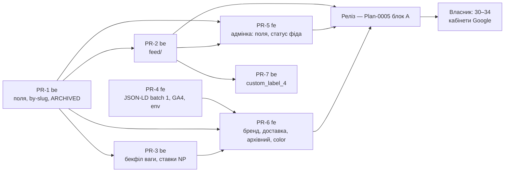

# Plan-0006 — Google Merchant: фід, structured data, GA4, нові поля

> Оновлення інструментів, 2026-09-11: одноразові скрипти переходу каталогу та `yarn migrate*` видалено після виконання. Згадки нижче описують історичний план. Актуальні інструменти й відновлення історичного коду: [список скриптів](../../repos/fillando-be/scripts/README.md).

- **Status:** In Progress — увесь код (PR-1…PR-7) у `dev` обох репо (2026-09-06: 8 локальних комітів у fillando-be, 4 у fillando-fe, **не запушено**); лишаються дії власника 30–34 після релізу і 35–36 після приймання. Покупець цього ще не бачить. `☐` = не почато; `☑` = код у `dev`; `☐ прод` = чекає на реліз або на дію власника
- **Owner:** vvbogdanovih
- **Date:** 2026-09-06
- **Target:** екрани 12 і 13 макета та решта екранів 3 і 5 — **видно покупцю** в проді (Plan-0005 §3); фід прийнятий Merchant Center без item-level disapproval за `brand`, `availability`, `image_link`
- **Design (TD):** [TD-0006](../designs/TD-0006-google-merchant-feed-and-structured-data.md) (Approved 2026-09-06) · контракт ізоляції — [TD-0005](../designs/TD-0005-catalog-category-isolation.md)
- **Components:** both (fillando-be, fillando-fe)
- **Tracker:** [Plan-0005 §4, блок E](plan-0005-catalog-target-state.md) — E4 і E5 цього плану; готовність визначає трекер, не цей файл

## 1. Objective

Дати Google Merchant Center публічний XML-фід і чесну structured data на
сторінці товару, довести сторінку товару й архівного товару до макета
(бренд виробника, доставка за вагою, «Знято з продажу»), додати два нові поля
з формами адмінки (`weight_g`, `google_product_category`) і GA4-сигнали для
Performance Max.

Definition of done — за Plan-0005 §3, у проді на реальних даних:

- `GET /feeds/google-shopping.xml` віддає валідний RSS 2.0 з `g:`-полями для
  всіх ACTIVE-варіантів; `brand` — виробник з атрибута, `availability` —
  `in_stock`/`out_of_stock`, зображення — ті самі URL, що на сторінці;
- Merchant Center фетчить фід за розкладом; після рестарту сервісу фід доступний
  без ручного кроку;
- сторінка товару: чип «Виробник» над H1, блок доставки з оцінкою за вагою,
  Product JSON-LD з `brand`/`sku`/`inProductGroupWithID`/`itemCondition`/
  `offers.url`/`priceValidUntil`;
- архівний товар віддає 200 у режимі «Знято з продажу» з `Discontinued`;
  чернетка — 404, як і сьогодні;
- адмінка: поле «Вага, г» у картці варіанта, секція «SEO та Google Merchant» у
  формі категорії; екран статусу фіда (`GET /feeds/google-shopping/status`);
- GA4: `view_item`, `add_to_cart`, `begin_checkout`, `purchase` поверх наявного
  Ads-пікселя; GA4 `purchase` **не** імпортовано в Ads як конверсія.

## 2. Scope

Обсяг, рішення, альтернативи й ризики — у TD-0006. Тут лише розбиття на PR-и
й порядок. Чотири рішення власника, що визначали обсяг, прийняті 2026-09-06
(TD-0006 §8): маржі у фіді немає, доставка — таблиця 2 сходинки × 2 зони з
числами з NP API, `google_product_category = 499682`, архівний товар — 200.

**Що цей план свідомо не робить:**

- `gtin`/`mpn`, Content API, TSV — non-goals TD-0006 §2.
- Перехід зображень фіда на деривативи `-1280.webp` — після чистого
  VERIFY-прогону `generate-image-derivatives.js`, окремим кроком і одночасно
  для фіда та JSON-LD (TD-0006 §5.3, М2).
- Кошик і чекаут вагу не читають — §5 TD для них нічого не проєктує.
- Реліз і міграції — блок A Plan-0005; цей план їде в тому ж релізі.

**Передумови.** Plan-0004 у `dev` (є `color_id`, `polymer`, `landings`) —
виконано. Доступ до NP API з ключем магазину (є, `nova-post-sync.service.ts`).
GA4-property й Merchant-акаунт — створює власник, код без них не активується і
не ламається.

## 3. Work breakdown

Правило «один PR = один репо». Номери кроків TD-0006 §9 вказані в дужках.

### PR-1 (be) — нові поля, `by-slug`, архівний товар

| # | Task | Component | Depends on | Status |
|---|------|-----------|------------|--------|
| 1 | `ProductVariant.weight_g: number \| null` (default `null`) у схемі, create/update DTO варіанта, `PUBLIC_VARIANT_FIELDS`; валідація — ціле ≥ 0 (§9 крок 1) | fillando-be | — | ☑ |
| 2 | `Category.google_product_category: { id: number, path: string } \| null` (embedded, `_id:false`), DTO категорії; валідація `id` — ціле > 0 (§9 крок 1) | fillando-be | — | ☑ |
| 3 | `findVariantWithProduct`: `status ∈ {ACTIVE, ARCHIVED}`, DRAFT лишається невидимим; `siblings` і `spooled_counterpart` — без змін, `ACTIVE`-only. Int-тест `it.each(['draft-slug','archived-slug'])` → лише `draft-slug`, плюс новий кейс «archived → знайдено зі `status: 'archived'`» (§9 крок 2, TD §5.4) | fillando-be | — | ☑ |
| 4 | Оновити чотири доки, що фіксують стару заборону: `DATA_MODELS.md:321-323`, `API_AND_SWAGGER.md`, `RBAC.md`, `CATALOG_RELEASE.md:74`. Явно записати: supplier-поля (`prom_*`, `vendor_product_sku`) лишаються прихованими, `SUPPLIER_FIELDS`-тести не чіпаються | fillando-be | 3 | ☑ |
| 5 | `manufacturer` у відповіді `by-slug` через наявний `pickAttr(attributes, MANUFACTURER_PATTERNS)` — та сама функція, що в прайс-листі; `weight_g` у тій самій відповіді. `null`, коли атрибута немає — без фолбеку на назву магазину (§9 крок 3, Б1) | fillando-be | 1 | ☑ |
| 6 | `yarn spec:export`; юніт на `manufacturer` у мапері публічної відповіді (`product-public.mappers.spec.ts`) | fillando-be | 1, 2, 5 | ☑ |

### PR-2 (be) — модуль `feed/`

| # | Task | Component | Depends on | Status |
|---|------|-----------|------------|--------|
| 7 | `findActiveForFeed()` поруч із `findPriceListRows`: `$match {status: ACTIVE}` → `$lookup products/categories/colors` (`preserveNullAndEmptyArrays`) → проєкція. Без supplier-полів у проєкції — int-тест на це обов'язковий (TD §7) | fillando-be | PR-1 | ☑ |
| 8 | `google-shopping-feed.builder.ts` — чисті функції: `<item>` з мапінгу TD §5.3, `availability` з підкресленням, `brand` з атрибута, `custom_label_0..3` (label 2 = глибина залишку), `xmlEscape`/`cdata`, `identifier_exists=false`, `condition=new`. Юніти на кожну гілку, у т.ч. `missing_brand` | fillando-be | 7 | ☑ |
| 9 | `product-type.resolver.ts`: `"{Category.name} > {Landing.h1}"` для опублікованого лендінга, чиї `filters` матчить товар; кілька збігів → найбільше збігів, потім менший `order` (TD-0002 §5.2.3). Юніт на правило вибору | fillando-be | 7 | ☑ |
| 10 | `FeedService`: оркестрація, виключення й `FeedGenerationSummary` (виключення + м'які попередження: немає `google_product_category`, опису, ваги, невиконаний `required_attributes`); in-memory `cachedXml`/`lastSummary`/`generatedAt`; невдала генерація не затирає попередній XML | fillando-be | 8, 9 | ☑ |
| 11 | `FeedController`: `GET /feeds/google-shopping.xml` (публічний; `503` + `Retry-After: 60` до першої генерації; `200` з `Last-Modified`), `POST /feeds/google-shopping/regenerate` (ADMIN, синхронний), `GET /feeds/google-shopping/status` (ADMIN). RBAC-spec за патерном `product.controller.rbac.spec.ts` | fillando-be | 10 | ☑ |
| 12 | `FeedCronService`: `onApplicationBootstrap` → генерація у фоні; щогодини під `RUN_CRON` з overlap-guard як у `PromSyncService`. e2e: `GET` до першої генерації → 503; після → 200 і валідний XML; товар із `weight_g=null` не ламає рядок | fillando-be | 10 | ☑ |
| 13 | Реєстрація `FeedModule` в `app.module.ts`; `endpoints.constant.ts`; `yarn spec:export` | fillando-be | 11, 12 | ☑ |
| 14 | `src/docs/MERCHANT_FEED.md` за патерном `PROM_AVAILABILITY_SYNC.md`: формат, мапінг, виключення, холодний старт, звідки числа доставки (задача 16), застереження про подвійний облік конверсій (§9 крок 16) | fillando-be | 13 | ☑ |

### PR-3 (be) — скрипти: вага і ставки доставки

| # | Task | Component | Depends on | Status |
|---|------|-----------|------------|--------|
| 15 | `scripts/fillando_v_2/backfill-variant-weight.js`: dry-run → звіт → apply, за патерном решти каталогу; джерело ваги — атрибут «Вага філаменту»/нетто з назви товару (1 кг / 0.5 кг / 0.25 кг) + константа котушки для `spool_included = Так`, рефіл — без неї; незматчені → у звіт, не в базу. Додати в `run-catalog-migrations.js` як необов'язковий крок (§9 крок 4) | fillando-be | PR-1 | ☑ |
| 16 | `scripts/shipping-rates.js`: `InternetDocument.getDocumentPrice` через наявний NP-клієнт для 2 ваг («до 2 кг», «до 10 кг») × 2 зон («по місту», «по Україні») → `shipping-rates.json` із датою й параметрами запиту. Це єдине джерело чисел для задачі 24 і кроку 14 §9 — вручну константу не правити (§9 крок 6, S5.3) | fillando-be | — | ☑ |

### PR-4 (fe) — Batch 1: JSON-LD, GA4, env

| # | Task | Component | Depends on | Status |
|---|------|-----------|------------|--------|
| 17 | Винести `buildProductJsonLd(data, displayName)` у `product-jsonld.utils.ts`; додати `sku`, `offers.itemCondition = NewCondition`, `offers.url` = canonical, `offers.priceValidUntil` (+90 днів), `inProductGroupWithID = product.id` лише при `siblings.length > 1` (**не** `productGroupID`, М1), `itemDefectReturnFees: FreeReturn` у `hasMerchantReturnPolicy`. Юніти на всі гілки деградації (§9 крок 7) | fillando-fe | — | ☑ |
| 18 | `metadata.verification.google` з `NEXT_PUBLIC_GOOGLE_SITE_VERIFICATION` у `layout.tsx` — не рендериться, доки значення немає | fillando-fe | — | ☑ |
| 19 | GA4: `gtag('config', GA_ID)` поруч з Ads у `Analytics.tsx` під тим самим consent-гейтом; `src/common/lib/ga4-events.ts` — `trackViewItem`/`trackAddToCart`/`trackBeginCheckout`/`trackPurchase` через наявний `gtag()` (ніколи `window.gtag` напряму — правило CLAUDE.md fe). Точки виклику: `ProductPage.tsx` (`useEffect` по `variant.id`; після успішного `addItem()`), `CheckoutPage.tsx` (раз за візит), `CheckoutSuccessContent.tsx` (агреговано, без `items[]`) | fillando-fe | — | ☑ |
| 20 | `NEXT_PUBLIC_GOOGLE_ANALYTICS_ID`, `NEXT_PUBLIC_GOOGLE_SITE_VERIFICATION` у `Dockerfile.prod` (ARG+ENV) і `docker-compose.prod.yml` (`args:`); `docs/runbooks/env-template.env` у мета-репо. Ads-args уже прокинуті — не дублювати | fillando-fe | — | ☑ |

### PR-5 (fe) — адмінка: нові поля (екран 12) і статус фіда (екран 13)

| # | Task | Component | Depends on | Status |
|---|------|-----------|------------|--------|
| 21 | Поле «Вага, г» у картці варіанта форми товару (число, порожнє = `null`, підказка «живить доставку і Google-фід»); тип і Zod-схема (§9 крок 9) | fillando-fe | PR-1 | ☑ |
| 22 | Секція «SEO та Google Merchant» у формі категорії: `google_product_category.id` (число) і `.path` (текст), підказка з правильним значенням для філаменту `499682 — Electronics > Print, Copy, Scan & Fax > 3D Printer Accessories` і посиланням на таксономію. Значення `2496` з артборда — помилка, у підказці його немає (§9 крок 9) | fillando-fe | PR-1 | ☑ |
| 23 | Сторінка `/admin/feed` (екран 13): `GET /status` — час останньої генерації, кількість позицій, виключення за причинами, попередження; кнопка «Перегенерувати» → `POST /regenerate`; посилання на публічний URL фіда. Пункт у сайдбарі адмінки | fillando-fe | PR-2 | ☑ |

### PR-6 (fe) — Batch 2 і 3: сторінка товару до макета

| # | Task | Component | Depends on | Status |
|---|------|-----------|------------|--------|
| 24 | `SHIPPING_RATE_TABLE` у `seo.constants.ts` з `shipping-rates.json` (задача 16), із коментарем «згенеровано скриптом, дата»; `shippingDetails` у JSON-LD за зоною «по Україні» з `weight_g`; товар без ваги → без `shippingDetails`, не ₴97. Прибрати `OFFER_SHIPPING_DETAILS` з константою (§9 крок 8) | fillando-fe | PR-1, 16, 17 | ☑ |
| 25 | Блок доставки на сторінці товару (екран 3): «Нова Пошта — орієнтовно ₴N, 1–3 дні» з підписом про вагу; коли `weight_g` немає — блок без суми | fillando-fe | 24 | ☑ |
| 26 | `brand` у JSON-LD з `product.manufacturer`, без `SITE_NAME`-фолбеку (відсутній → поля немає); чип «Виробник» над H1 з того самого поля (§9 крок 8, Б1) | fillando-fe | PR-1, 17 | ☑ |
| 27 | Режим «Знято з продажу» (екран 5) при `variant.status === 'archived'`: сірий пілл, знебарвлене фото, перекреслена ціна, вимкнена кнопка «У кошик», без перемикача на архівний варіант, `availability: Discontinued`, `robots: {index:false, follow:true}`, посилання на категорію. DRAFT — `notFound()` як і сьогодні. Компонентний тест на обидві гілки (§9 крок 8) | fillando-fe | PR-1, 17 | ☑ |
| 28 | Batch 3: `color` у JSON-LD з `variant.color.name_uk` (лише коли колір резолвлений бекендом), `material` з атрибута `k === 'polymer'`; без евристик на фронті (§9 крок 10) | fillando-fe | 17 | ☑ |

### PR-7 (be) — fast-follow, не блокер

| # | Task | Component | Depends on | Status |
|---|------|-----------|------------|--------|
| 29 | `custom_label_4`: `OrderRepository`-агрегат продажів за 90 днів `PAID`-замовлень → `bestseller`/`popular`/`standard`; пороги в `MERCHANT_FEED.md` (§9 крок 12) | fillando-be | PR-2 | ☑ |

### Власник — кабінети Google (поза кодом, після релізу)

| # | Task | Component | Depends on | Status |
|---|------|-----------|------------|--------|
| 30 | Через адмінку встановити `google_product_category = 499682` для «Філамент» (§9 крок 11) | owner | 22, реліз | ☐ прод |
| 31 | Search Console: верифікація, значення в `NEXT_PUBLIC_GOOGLE_SITE_VERIFICATION` (§9 крок 13) | owner | 18, 20 | ☐ прод |
| 32 | Merchant Center: акаунт, верифікація домену, URL фіда, розклад фетчу ≥ щогодини, account-level shipping **із `shipping-rates.json`**, return-policy 14 днів (§9 крок 14) | owner | реліз, 16 | ☐ прод |
| 33 | Ads ↔ Merchant лінк; GA4-property, `NEXT_PUBLIC_GOOGLE_ANALYTICS_ID`; GA4 ↔ Ads лінк **без імпорту GA4 `purchase` як конверсії**; запуск PMax (§9 крок 15) | owner | 19, 20 | ☐ прод |
| 34 | Перевірити вагу перших ~20 варіантів після бекфілу в адмінці й виправити (задача 21) — бекфіл вгадує з назви | owner | 15, 21, реліз | ☐ прод |

### Після приймання

| # | Task | Component | Depends on | Status |
|---|------|-----------|------------|--------|
| 35 | FRD: §4.3, §5 (сторінка товару, архівний товар), §10 і §11 (нові поля форм), §18.3, §18.5, §18.6; новий підрозділ про фід і `/admin/feed` (§9 крок 17) | meta | приймання | ☐ |
| 36 | Plan-0005: зняти E4/E5, оновити матрицю екранів 3, 5, 12, 13 за фактом у проді | meta | приймання | ☐ |

## 4. Sequencing & milestones

**Порядок:**

1. **PR-1** і **PR-4** паралельно — не залежать одне від одного. PR-4 повністю
   без бекенду.
2. **PR-2** і **PR-3** після PR-1 (обидва читають `weight_g`; PR-3 задача 16 —
   без залежностей, можна раніше).
3. **PR-5** після PR-1 (поля) і PR-2 (статус фіда); **PR-6** після PR-1, PR-3
   (задача 16 → 24) і PR-4 (задача 17 — спільна функція JSON-LD).
4. **Реліз** — блок A Plan-0005, разом із міграціями Plan-0004. Бекфіл ваги —
   у ланцюг міграцій як необов'язковий крок; фід реєструється в Merchant
   **після** релізу й міграцій, інакше перший фетч побачить каталог до
   стандартизації кольорів (TD-0006 §9, останній абзац).
5. **Власник (30–34)** — після релізу. **PR-7** — коли завгодно після PR-2.

**Найризиковіший крок** — задача 3 (ARCHIVED у `by-slug`): це відкат частини
Plan-0003 із тестом і чотирма доками, і лише він міняє поведінку публічного
API. Робиться першим у PR-1, щоб рецензент PR бачив саме його, а не нове поле.

## 6. Testing & rollout

- **PR-1** — int-тест `findVariantWithProduct`: archived → знайдено, draft →
  `null`; `PUBLIC_VARIANT_FIELDS` не змінився (supplier-поля відсутні у
  відповіді — наявні `SUPPLIER_FIELDS`-тести мають лишитися зеленими без
  правок). Юніт на `manufacturer` з атрибута.
- **PR-2** — юніти білдера (усі гілки `availability`, `xmlEscape` на `&`, `<`,
  кирилиці, `missing_brand`, кожен custom label); юніт резолвера
  `product_type`; int — `findActiveForFeed` не тягне DRAFT/ARCHIVED і
  supplier-полів; e2e — 503 до генерації, 200 після, XML парситься, рядок з
  `weight_g=null`/без `google_product_category` присутній без цих полів.
  Ручна перевірка: згенерований XML пропустити через Merchant Center
  «Діагностика» на тестовому акаунті — єдине місце, де видно item-level
  disapproval.
- **PR-3** — бекфіл: dry-run на дампі прода → звіт → apply; незматчені лишаються
  `null` і йдуть у звіт. Скрипт ставок: результат кладеться в репо як
  `shipping-rates.json` із датою; у PR видно, з якими параметрами знято.
- **PR-4** — юніти `buildProductJsonLd` на кожну гілку; ручна перевірка в Rich
  Results Test, що `inProductGroupWithID` присутній (`productGroupID` там
  мовчки зникав би — саме так помилка й ховалась). GA4 — DebugView з
  тестовим property, перевірка, що події не йдуть без consent.
- **PR-5/PR-6** — компонентні тести форм (порожнє поле ваги → `null`;
  `google_product_category` без `id` не надсилається), архівного режиму
  (кнопка вимкнена, `Discontinued`, `noindex,follow`), блоку доставки з вагою
  і без.
- **Rollback**: фід — прибрати URL із Merchant (позиції живуть 30 днів) або
  `RUN_CRON=false` + останній XML лишається; ARCHIVED — повернути `$match` на
  `ACTIVE` і тест; нові поля — nullable, відкату не потребують.
- **Деплой**: разом із блоком A Plan-0005 на Railway. Перевірити після
  деплою: `GET /feeds/google-shopping.xml` → 200 протягом хвилини після
  старту; `by-slug` архівного варіанта → 200; чернетки → 404.

## 7. Open questions

Немає, що блокують. Записано під час реалізації (2026-09-06):

- Вага котушки в бекфілі — припущення 220 г; на dev проставлено 301/301 варіантів з атрибута
  «Вага», один 3-кілограмовий рулон (FL-000302) позначений для ручної перевірки (задача 34).
- Ставки Нової Пошти зняті 2026-09-06 з Львова (реквізити магазину): до 2 кг — ₴73 по місту /
  ₴93 по Україні (до Києва), до 10 кг — ₴118 / ₴138; оголошена вартість ₴600. Перезняти
  `yarn shipping:rates`, якщо зміниться договір або місто відправки.
- Пороги `custom_label_4`: `bestseller` ≥10 одиниць за 90 днів, `popular` ≥3 — пороги орієнтовні
  для поточного обороту, лежать у `MERCHANT_FEED.md`.
- `REVALIDATE_SECRET` (H1) треба задати на релізі в env обох сервісів — без нього прод-фронт
  відповідає 503 і кеш лендінгів живе годину. Одне лишається в [TD-0006 §8](../designs/TD-0006-google-merchant-feed-and-structured-data.md):
чи `Vendor` — постачальник назавжди. На жодну задачу цього плану відповідь не
впливає.

Поза планом, але з того ж контексту: артборд «Нові поля у формах» показує
`google_product_category = 2496` — виправити в макеті (Plan-0005 §6), інакше
перше, що скопіює адмін, буде «Business & Industrial > Medical».
