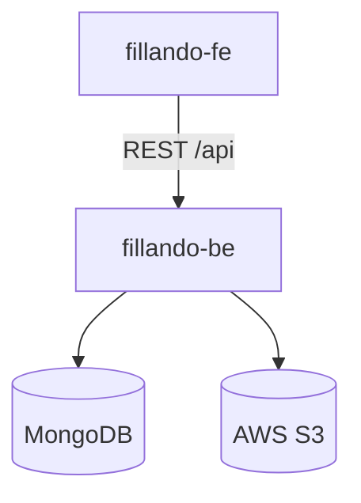
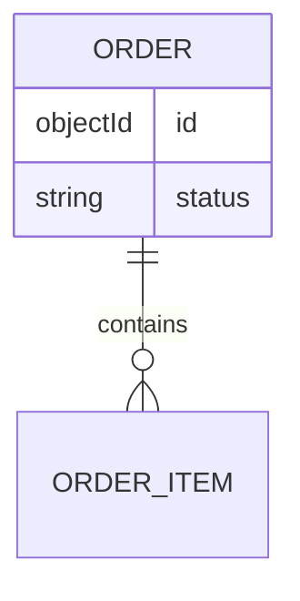
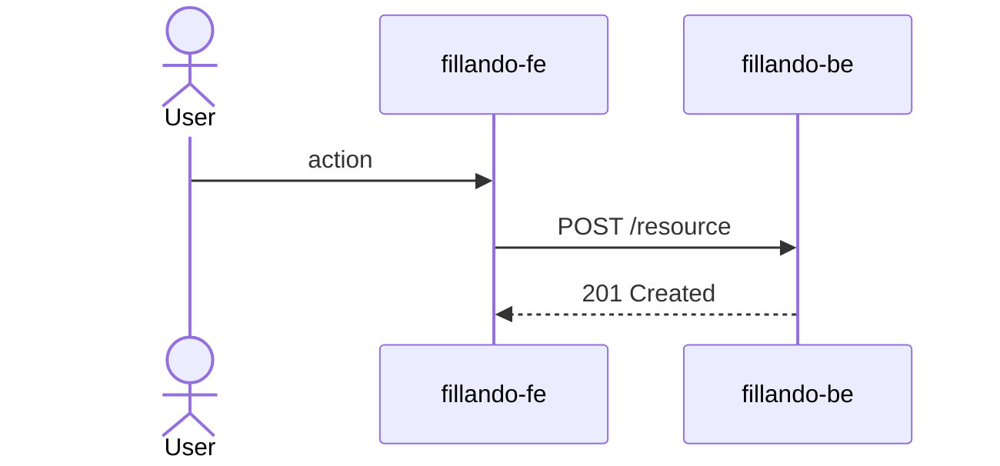

<!--
  Technical Design (TD) template.
  Copy into ../designs/ as NNNN-short-slug.md and fill it in. Aim for clarity
  over completeness — omit sections that genuinely do not apply and say so.
-->

# TD-NNNN — <Title>

- **Status:** Draft  <!-- Draft | In Review | Approved | Implemented | Superseded -->
- **Author:** <name>
- **Reviewers:** <names>
- **Date:** YYYY-MM-DD
- **Components:** <fillando-be | fillando-fe | both>
- **Related:** <links to ADRs, plans, FRD sections>

## 1. Summary

One short paragraph: what is this, and why are we building it?

## 2. Goals / Non-goals

**Goals**
- ...

**Non-goals** (explicitly out of scope)
- ...

## 3. Background & context

What exists today, what problem we are solving, what constraints apply.

## 4. Requirements

- **Functional:** what the system must do (link FRD sections).
- **Non-functional:** performance, security, scale, localization.

## 5. Proposed design

Use **Mermaid** for diagrams so they render and stay diff-friendly.

### 5.1 Architecture / components
How this fits the existing components; what changes in each repo.

### 5.2 Data model
Entities, relationships, Mongoose schema changes, migrations/backfills.

### 5.3 API / interfaces
New or changed endpoints, request/response shapes, OpenAPI updates.

### 5.4 Key flows
Walk through the important sequences (happy path + main error paths).

## 6. Alternatives considered

For each: brief description and why it was not chosen.

## 7. Cross-cutting concerns

- **Security & privacy:** authn/authz, data handling, secrets.
- **Performance & scale:** expected load, hot paths, limits.
- **Migration / compatibility:** rollout, data migration, rollback.
- **Observability:** logging, metrics.
- **Testing strategy:** unit, integration, e2e.

## 8. Open questions

- ...

## 9. Rollout

How this ships: phases, environments, dependencies.
